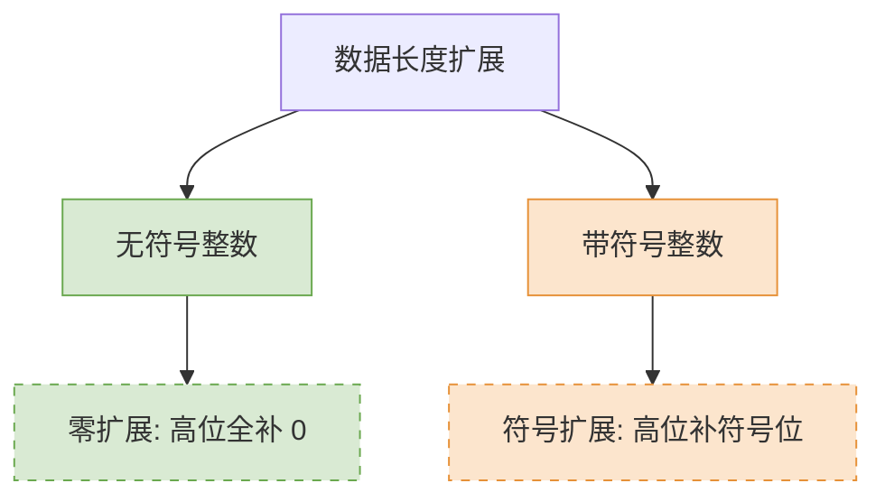

# 数据的表示与运算：零扩展与符号扩展

> **导语**
> 在这个视频中，我们要探讨一个非常重要的考点：**零扩展 (Zero Extension)** 和 **符号扩展 (Sign Extension)**。
> 什么是扩展？简单来说，就是把一个短数据（例如 8 bit）变长为一个长数据（例如 16 bit）。
> 本节将深入解析为什么需要扩展，以及无符号数和有符号数分别适用哪种扩展方式。

---

## 一、 为什么需要对数据进行扩展？

数据长度的扩展在计算机硬件和软件层面都有着必然的需求。

### 1. 硬件层面的需求：寄存器与 ALU 的位宽限制

- **机器字长固定**：一台计算机的机器字长决定了其内部通用寄存器的位宽，以及算术逻辑单元（ALU）支持的运算位宽（例如 32 位机器的寄存器和 ALU 都是 32 位）。
- **主存数据长度不一**：在内存中，存储着各种长度的数据，例如：
  - `char`: 8 位
  - `short` / `unsigned short`: 16 位
  - `int` / `unsigned int`: 32 位
- **运算机制**：当这些短数据（如 8 位的 `char`）需要进入通用寄存器，然后传给 ALU 进行运算时，就必须将短数据**“强行拉长”**以匹配 32 位的寄存器和运算器。

### 2. 软件层面的需求：变量赋值与类型转换

在编写程序时，我们经常会遇到不同数据类型之间的隐式或显式转换。

```c
short b = 100;    // 16 位短整型
int a = b;        // 32 位整型
// 此时发生类型提升，需要将 16 位的 b 扩展为 32 位赋给 a
```

在这种情况下，软件层面同样需要对数据的长度进行扩展。

---

## 二、 如何进行扩展？（以 8 bit 扩展为 16 bit 为例）

扩展的核心问题在于：**多出来的高位比特，到底应该用 `0` 填补，还是用 `1` 填补？**
根据数据是否有符号，我们分为两种扩展方式：**零扩展**和**符号扩展**。



### 1. 无符号整数的扩展：零扩展 (Zero Extension)

- **适用对象**：无符号整数（如 C 语言中的 `unsigned int`, `unsigned short` 等）。
- **扩展规则**：由于无符号数的每一个比特都是数值位，没有符号位，因此直接在多出来的高位**全部补 0** 即可。
- **效果**：高位补 0 绝对不会影响这个数的真值。

**示例：**
| 真值 | 8 bit 原数据 | 16 bit 扩展后数据 (零扩展) | 说明 |
| :---: | :--- | :--- | :--- |
| **90** | `0101 1010` | `<mark style="background-color: #e0f7fa">0000 0000</mark> 0101 1010` | 高位补 8 个 `0`，真值仍为 90 |
| **166** | `1010 0110` | `<mark style="background-color: #e0f7fa">0000 0000</mark> 1010 0110` | 高位补 8 个 `0`，真值仍为 166 |

---

### 2. 带符号整数的扩展：符号扩展 (Sign Extension)

- **适用对象**：带符号整数（在计算机内部统一使用**补码**表示）。
- **扩展规则**：**原符号位保持在最高位不变，原数值位保持在最低位不变，中间多出来的位置，全部用原来的“符号位”去填补。**
  - 如果是正数（符号位为 0），中间全部补 0。
  - 如果是负数（符号位为 1），中间全部补 1。

#### (1) 正数的扩展 (补 0)

正数的补码和原码相同。

- **真值**：`+90`
- **8 bit 补码**：`0 1011010`
- **16 bit 扩展后**：`0` **`0000000`** `01011010`
- **说明**：符号位 `0` 保持不变，在符号位和数值位中间填充了 8 个 `0`。

#### (2) 负数的扩展 (补 1) - ⚠️ 易错点

复数的扩展如果像无符号数一样盲目补 0，会导致真值发生错误变化。

- **真值**：`-90`
- **8 bit 补码**：`1 0100110`
- **❌ 错误的尝试（补0）**：`1` **`0000000`** `0100110`
  - 将该错误的补码转回原码，发现其真值根本不是 -90。
- **✅ 正确的做法（符号扩展补1）**：`1` **`1111111`** `0100110`
  - 将符号位 `1` 和数值位拉开，中间多出来的 8 个比特，**全部用符号位 `1` 去填补**。

**验证为什么正确的方法要全补 1？**
我们可以将正确扩展后的 16 位补码转回原码进行验证：

1.  **16位补码**：`1 1111111 0100110`
2.  **转原码规则**：符号位不变；从右往左找到第一个 `1`，该 `1` 及其右边的位保持不变，该 `1` 左边的数值位全部取反。
3.  **转得 16位原码**：`1 0000000 1011010`
4.  **计算真值**：$-(2^6 + 2^4 + 2^3 + 2^1) = -(64 + 16 + 8 + 2) = -90$
5.  **结论**：真值没有发生改变，证明符号扩展对于负数补码是正确的。

---

## 三、 本节总结速记口诀

- 看到 **“无符号整数” (unsigned)** 扩展 ➔ 无脑使用 **【零扩展】** ➔ 高位全补 `0`。
- 看到 **“带符号整数”** 扩展（计算机内默认为补码） ➔ 必须使用 **【符号扩展】** ➔ 符号是什么，多出的位就补什么（正数补 `0`，负数补 `1`）。
