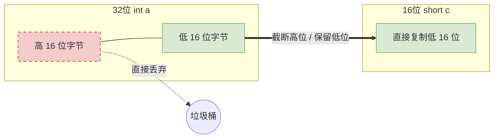

# C语言：定点整数的强制类型转换

> **导语**
> 本小节我们要探讨一个相对简单但非常重要的考点：**C语言中的定点整数是如何进行强制类型转换的**。
> 在 C 语言中，所有的定点整数（如 `int`、`short`、`long`）在底层都是采用**补码**的形式存储的；而带有 `unsigned` 关键字修饰的则是无符号数。强制类型转换主要分为三种情况，下面我们逐一拆解。

---

## 一、 等长数据转换：有符号与无符号互相转换

当数据的字节长度相同，只是在有符号数（如 `short`）和无符号数（如 `unsigned short`）之间转换时。

**【转换规则】**

- **底层不变**：不改变数据的二进制机器数（原封不动地直接复制）。
- **解释改变**：只改变计算机对这一串二进制机器数的**解析方式**（按补码解析 还是 按无符号数解析）。

**【示例解析】**
假设 `short x = -4321;` （占 16 位，即 2 个字节）

- **底层机器数**：`x` 在底层的 16 位补码被固定下来。
- **强转为无符号**：将其强转并赋值给 `unsigned short y`。
- **结果**：`y` 的二进制机器代码和 `x` **一模一样**。但由于 `y` 是无符号短整型，计算机不再将最高位视作符号位，而是将整体作为纯数值计算，这就导致它对应的十进制真值会发生巨大的变化。

---

## 二、 长数据转短数据：高位截断

将占用字节数更多的数据类型转换为占用字节数更少的数据类型（例如从 32 位的 `int` 强转为 16 位的 `short`）。

**【转换规则】**

- **高位截断，保留低位**：处理方式非常“残暴”，计算机直接把多出来的高位字节全部砍掉，只保留新类型所需长度的低位字节。

**【示例解析】**
假设有 32 位有符号 `int a`，将其强转为 16 位有符号 `short c`。

- 若 `a` 的 16 进制机器数为 `0x123486A1`。
- 强转给 `c` 后，高位 `0x1234` 被无情丢弃，`c` 的底层机器数变为 `0x86A1`。
- 随后，计算机再按照 16 位有符号数补码的规则去解析 `0x86A1`，得到一个新的真值。

---

## 三、 短数据转长数据：符号扩展与零扩展

将占用字节数较少的数据转换为字节数较多的数据类型（例如 16 位 `short` 变 32 位 `int`）。这种情况下，数值的**真值能够保持不变**，只是整体长度变长了。

**【转换规则】**
根据**源数据**的符号属性决定扩展方式：

1.  **有符号数 ➔ 符号扩展**：在原有的符号位和数值位之间，补充与原符号位相同的比特（正数补 `0`，负数补 `1`）。
2.  **无符号数 ➔ 零扩展**：直接在多出来的高位全部补充 `0`。

**【示例解析】**

| 转换场景            | 变量类型变化                                        | 底层操作                                          | 真值变化 |
| :------------------ | :-------------------------------------------------- | :------------------------------------------------ | :------- |
| **有符号 ➔ 有符号** | `short x` (16位) ➔ `int y` (32位)                   | **符号扩展**：若 `x` 是负数，则在高位全部填补 `1` | 保持不变 |
| **无符号 ➔ 无符号** | `unsigned short n` (16位) ➔ `unsigned int p` (32位) | **零扩展**：在高位全部填补 `0`                    | 保持不变 |

> **💡 复合说明示例**：
> 如果先把带符号的 `short x` 强制转换为 `unsigned short n`，再将其扩展为 `unsigned int p`：
>
> - 第一步（等长转换）：机器数原封不动，改变解释规则。
> - 第二步（短转长）：由于源数据现在是 `unsigned short`（无符号），所以适用**零扩展**（高位补 `0`），此时真值保持不变。

---

## 四、 本节核心总结速查表

| 转换类型                                     | 底层数据变化 | 真值是否改变 | 核心动作                                 |
| :------------------------------------------- | :----------- | :----------- | :--------------------------------------- |
| **等长互转** (如 `short` ↔ `unsigned short`) | **不变**     | **可能巨变** | 机器数原样复制，仅改变**解析规则**       |
| **长变短** (如 `int` ➔ `short`)              | **改变**     | **可能巨变** | 暴力**高位截断**，仅保留低位字节         |
| **短变长** (如 `short` ➔ `int`)              | **改变**     | **不变**     | 有符号用**符号扩展**，无符号用**零扩展** |
