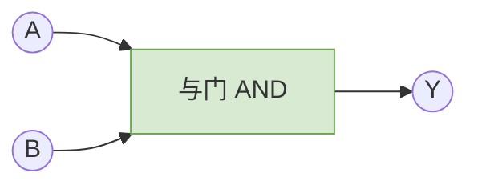
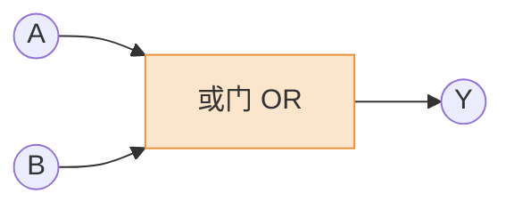
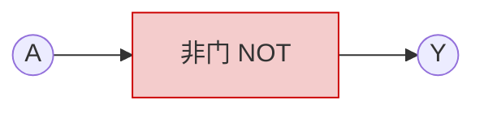

# 操作系统/计算机组成原理基础：逻辑门电路入门

> **导语**
> 各位跨考和零基础的同学大家好，在这个小节中，我们将补充数字电路相关的基础知识。
> 本文将带你了解**逻辑门电路**的作用：它是如何处理二进制逻辑运算的？我们将从最基本的“与、或、非”开始，一步步组合出复杂的“与非、或非、异或、同或”逻辑，并探讨这些逻辑在电路设计中的实际意义。

---

## 一、 算术运算与逻辑运算的区别

为了方便理解，我们将逻辑运算与大家熟知的算术运算进行对比：

| 比较维度     | 算术运算                              | 逻辑运算                                  |
| :----------- | :------------------------------------ | :---------------------------------------- |
| **运算对象** | 实数 (如 1, 2, 3.14)                  | 二进制逻辑值：**真 (1)** 和 **假 (0)**    |
| **基本运算** | 加、减、乘、除                        | **与 (AND)**、**或 (OR)**、**非 (NOT)**   |
| **复合运算** | 幂次方 (如 $x^3 = x \cdot x \cdot x$) | 与非、或非、异或、同或等                  |
| **输入输出** | 有输入实数，输出计算结果              | 有输入逻辑值，输出逻辑结果 (由门电路实现) |

> _注：专门研究逻辑运算的数学学科称为**离散数学**。它是计算机科学的重要数学基础。_

---

## 二、 三种基本逻辑运算与门电路

### 1. 与运算 (AND)

- **数学表达式**：$Y = A \cdot B$ (中间的点可以省略，写为 $Y = AB$)
- **运算逻辑**：只有当 $A$ 和 $B$ **同时为真 (1)** 时，输出 $Y$ 才为真 (1)。相当于 C 语言中的逻辑与 `&&`。

**【真值表】**
| A | B | Y (A AND B) |
| :---: | :---: | :---: |
| 0 | 0 | **0** |
| 0 | 1 | **0** |
| 1 | 0 | **0** |
| 1 | 1 | **1** |

**【门电路符号】**
_特征：输入端是一条**直线**，输出端呈半圆形。_

### 2. 或运算 (OR)

- **数学表达式**：$Y = A + B$ (读作 A 或 B，不能读作 A 加 B)
- **运算逻辑**：只要 $A$ 和 $B$ 中**有任意一个为真 (1)**，输出 $Y$ 就为真 (1)。只有全为 0 时才输出 0。相当于 C 语言中的逻辑或 `||`。

**【真值表】**
| A | B | Y (A OR B) |
| :---: | :---: | :---: |
| 0 | 0 | **0** |
| 0 | 1 | **1** |
| 1 | 0 | **1** |
| 1 | 1 | **1** |

**【门电路符号】**
_特征：输入端是一条**弧线**，输出端较尖。_

### 3. 非运算 (NOT)

- **数学表达式**：$Y = \overline{A}$ (A 上方画一条横线)
- **运算逻辑**：只有一个输入。输入 1 则输出 0，输入 0 则输出 1。即**取反**。相当于 C 语言中的逻辑非 `!`。

**【真值表】**
| A | Y (NOT A) |
| :---: | :---: |
| 0 | **1** |
| 1 | **0** |

**【门电路符号】**
_特征：一个三角形，输出端带有一个**小圆圈**。小圆圈代表“取反”。_

---

## 三、 四种复合逻辑运算与门电路

利用上述三种基本运算，可以组合出复杂的复合逻辑。

### 1. 与非 (NAND = NOT AND)

- **表达式**：$Y = \overline{AB}$
- **逻辑**：先进行与运算，再对结果取反。运算逻辑和“与门”**刚好相反**。
- **门电路画法**：在与门的输出端加一个**小圆圈**。

### 2. 或非 (NOR = NOT OR)

- **表达式**：$Y = \overline{A + B}$
- **逻辑**：先进行或运算，再对结果取反。运算逻辑和“或门”**刚好相反**。
- **门电路画法**：在或门的输出端加一个**小圆圈**。

### 3. 异或 (XOR = Exclusive OR)

- **表达式**：$Y = A \oplus B$
- **逻辑**：当两个输入值**相异（不一样）时，输出为 1**；相同时，输出为 0。
  - _等价逻辑式_：$Y = \overline{A}B + A\overline{B}$
- **门电路画法**：在或门的基础上，输入端前面多画一条**双层弧线**。
- **💡 拓展属性**：如果有 $n$ 个比特进行异或，若其中有**奇数个 1**，结果必为 1；若有**偶数个 1**，结果必为 0。常用于**奇偶校验**和二进制加法器设计。

### 4. 同或 (XNOR)

- **表达式**：$Y = A \odot B$
- **逻辑**：与异或唱反调。当两个输入值**相同（一样）时，输出为 1**；相异时输出 0。
- **门电路画法**：在异或门的输出端加一个**小圆圈**。

---

## 四、 逻辑表达式的优先级与三大定律

### 1. 运算优先级

逻辑运算的优先级为：**非 (NOT) > 与 (AND) > 或 (OR)**。

> **记忆技巧**：
>
> 1.  把“与”看作乘法，把“或”看作加法。乘法先于加法计算。
> 2.  括号 `()` 可以提升优先级。
> 3.  如果“非”的横线覆盖了多个变量（如 $\overline{A \cdot B}$），相当于下面隐藏了括号，必须先算出横线下方整体的结果，最后再取反。

### 2. 逻辑运算重要定律 (离散数学核心)

利用以下定律，可以对复杂的逻辑表达式进行化简等价变换。

| 定律名称                | 数学表达式                                                                                            | 意义解析                                                     |
| :---------------------- | :---------------------------------------------------------------------------------------------------- | :----------------------------------------------------------- |
| **分配律**              | $AC + AD = A(C + D)$                                                                                  | 类似加法与乘法分配律。提取公因式可简化电路。                 |
| **结合律**              | $A(BC) = (AB)C$   $A+(B+C) = (A+B)+C$                                                              | 多个连续相与/相或，计算顺序可随意调整。                      |
| **反演律 (德摩根定律)** | $\overline{AB} = \overline{A} + \overline{B}$   $\overline{A+B} = \overline{A} \cdot \overline{B}$ | 长杠变短杠，与变或，或变与。用于处理非运算与组合运算的转化。 |

### 💡 思考：学这些数学公式有什么用？（硬件优化的本质）

如果让你设计一个电路实现 $Y = AC + AD$：

- **方案 1 (直接实现)**：需要 2 个与门（算 AC 和 AD），1 个或门。共计 **3 个门电路**。
- **方案 2 (利用分配律化简)**：化简为 $Y = A(C + D)$。只需要 1 个或门（算 C+D），1 个与门。共计 **2 个门电路**。

**结论**：用离散数学化简逻辑表达式，本质上就是对电路设计的简化。少用一个门电路，就节约了一分制造成本、减小了芯片面积、降低了功耗！

---

## 五、 课外拓展：芯片“制程”到底是什么？

我们常在新闻中听到“10纳米(nm)”、“3纳米”工艺芯片。

- 这些门电路在物理底层是由**晶体管**实现的。
- 所谓的芯片制程（如 10nm），通常指的是晶体管内部关键结构（**栅极**）的宽度。
- 制程数字越小，代表单个晶体管的体积越小。这就意味着在同样大小的一块硅片上，可以塞入成倍增加的晶体管（进而组成更多的门电路），从而实现更强悍的计算性能和更低的功耗。
- _参考概念：人类头发丝直径约为 0.1 毫米 (100,000 纳米)。10nm 芯片的精度相当于头发丝的万分之一。而实现这种极端微观制造的核心设备，就是著名的**光刻机 (ASML)**。_
