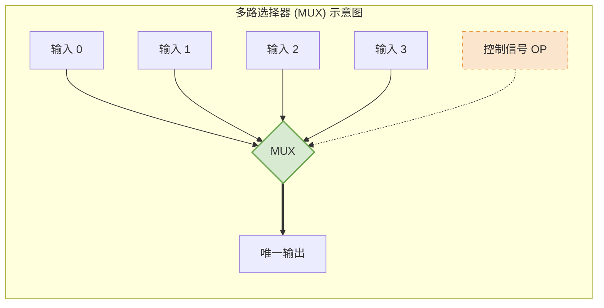
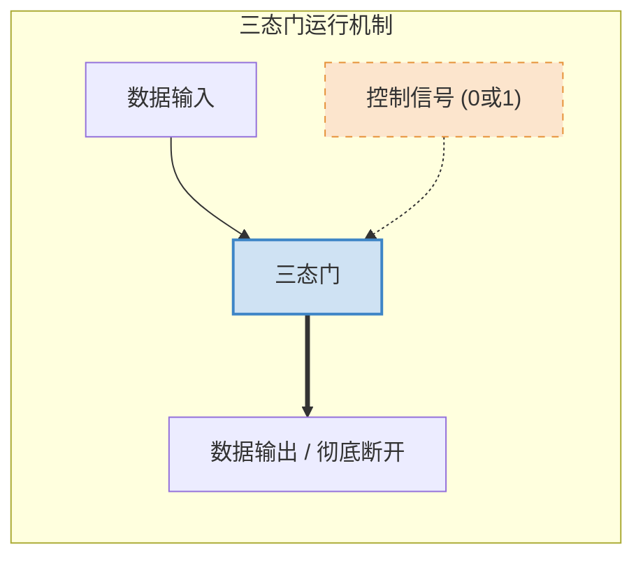

# 数字电路基础补充：多路选择器与三态门

> **导语**
> 各位跨考和零基础的同学大家好，在这个小节中，我们将补充一些数字电路的基础知识。
> 具体来说，我们要认识数字电路中非常常用的两个“守门员”小部件：**多路选择器 (Multiplexer)** 和 **三态门 (Tri-state Gate)**。它们在计算机底层硬件中发挥着极其重要的数据筛选与控制作用。

---

## 一、 多路选择器 (MUX, Multiplexer)

### 1. 核心概念与作用

- **英文缩写**：MUX (Multiplexer)
- **角色比喻**：它就像一个拥有“三头六臂的守门员”。
- **核心功能**：拥有**多个输入，一个输出**以及**一个控制信号**。根据控制信号的值，多路选择器会在多个输入值中**选择其中的某一个**放行并输出，同时将其他所有的输入信号拦截阻断。

### 2. 电路图符号特征

- **图形**：通常用**梯形**表示。
  - **宽边**：输入端（多个数据输入）。
  - **窄边**：输出端（唯一数据输出）。
  - **腰部**：控制信号输入端。
- **连线规则**：表示控制信号的线通常用**虚线**（带有 OP, Operation 缩写），而表示运算数据的信号通常用**实线**。

### 3. 控制信号的位数计算 (数学规律)

假设多路选择器有 $k$ 个输入信号，那么控制信号的位数 $m$ 必须满足以下数学公式（向上取整）：

$$
m \ge \lceil \log_2 k
ceil
$$

> **举例说明**：
>
> - **4 选 1 多路选择器** ($k=4$)：需要 $m=2$ 个比特的控制信号。状态为 `00, 01, 10, 11`，分别对应放行第 0, 1, 2, 3 个输入。
> - **2 选 1 多路选择器** ($k=2$)：只需要 $m=1$ 个比特的控制信号。状态 `0` 放行左边数据，状态 `1` 放行右边数据。
> - **8 选 1 多路选择器** ($k=8$)：需要 $m=3$ 个比特的控制信号 ($2^3 = 8$)，状态从 `000` 到 `111`。

### 4. ⚠️ 补充拓展：预留“全拦截”状态

在某些特殊设计中，多路选择器除了正常的“多选一”外，可能还会预留出一种特殊的控制状态，用于**拦截所有的输入**（即任何输入都不让通过）。
此时，为了多表示这一种“全不选”的状态，控制信号位数 $m$ 的计算公式变为：

$$
m \ge \lceil \log_2 (k+1)
ceil
$$

---

## 二、 三态门 (Tri-state Gate)

### 1. 核心概念与作用

- **角色比喻**：它就像一个普通的“单线守门员”，只负责看守一条线路。
- **核心功能**：有一个数据输入、一个数据输出以及一个控制信号。
  - 当控制信号 `= 0` 时：**拦截**输入数据，不让其通过。
  - 当控制信号 `= 1` 时：**放行**输入数据，顺利通过并输出。

### 2. 电路图符号特征

- **图形**：通常用**小三角形**表示。
  - **底部**：输入端。
  - **尖端**：输出端。
  - **腰部**：控制信号端。

### 3. 高阻态 (High Impedance) 概念解析

当三态门的控制信号为 `0` 时，它不仅是拦截数据，更准确地说，此时输出端处于**“高阻态”**。

- **常规状态**：电路通常用高电平（如 5V，代表 1）和低电平（如 1V，代表 0）来表示二进制。
- **高阻态**：相当于 0V，它**既不是高电平，也不是低电平**。从物理效果上看，高阻态就相当于**直接用剪刀把这根导线给剪断了**。

### 4. 易混淆点：三态门 vs 非门

对于初学者来说，带有小圆圈的三态门极易与**非门 (NOT Gate)** 混淆。

| 门电路类型           | 核心判断依据                             | 运行逻辑与效果                                              |
| :------------------- | :--------------------------------------- | :---------------------------------------------------------- |
| **非门 (NOT)**       | 🚫 **无控制信号**                        | 数据无条件通过，必定进行**按位取反** (0变1，1变0)。         |
| **普通三态门**       | 🔑 **有控制信号**                        | 控制为1时直接放行，控制为0时断开 (高阻态)。不改变数据本身。 |
| **带小圆圈的三态门** | 🔑 **有控制信号**   ➕ 输出端有小圆圈 | 控制为1时放行数据，并且**按位取反**；控制为0时断开。        |

> **关键秘诀**：区分它们的唯一核心看**有没有控制信号接入（腰部有没有线）**！有控制信号的就是三态门，没有的就是非门。

---

## 三、 本节核心总结

| 部件名称             | 核心作用                   | 输入线数量 | 输出线数量 | 控制信号                     |
| :------------------- | :------------------------- | :--------: | :--------: | :--------------------------- |
| **多路选择器 (MUX)** | 三头六臂守门员：**多选一** | 多条 ($k$) |    1 条    | 多位 ($m \ge \lceil \log_2 k |
| ceil$)               |
| **三态门**           | 单线守门员：**通/断控制**  |    1 条    |    1 条    | 1 位 (控制通断)              |
