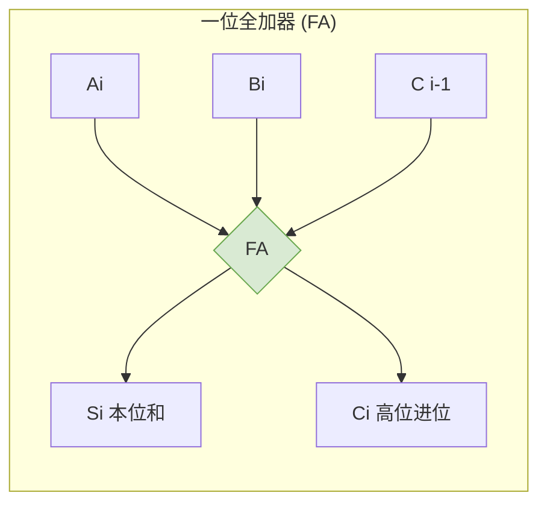

# 计算机组成原理：加法器的设计与标志位

> **导语**
> 各位同学大家好，在这个视频中我们要学习**怎么设计一个加法器**。
> 加法器是计算机算术逻辑单元 (ALU) 的核心部件。我们将从最基础的**一位全加器**开始，一步步构建出支持 n 比特的**并行加法器**，最后为其增加**标志位 (Flags)**，打造出加法器的终极形态。

---

## 一、 一位全加器 (1-bit Full Adder)

加法器的基本功能是实现加法运算。我们先从最低位开始，思考如何用门电路实现 **1 个比特**的加法。

### 1. 输入与输出分析

在进行一位相加时，我们需要考虑三个**输入**：

1.  $A_i$：被加数的本位。
2.  $B_i$：加数的本位。
3.  $C_{i-1}$：来自更低位的进位信息。

经过电路处理后，我们希望得到两个**输出**：

1.  $S_i$：本位和。
2.  $C_i$：向更高位的进位。

### 2. 逻辑表达式推导

- **本位和 $S_i$ 的逻辑**：
  观察发现，当三个输入值 ($A_i, B_i, C_{i-1}$) 中有**奇数个 1** 时，本位和 $S_i$ 必定为 1；若有**偶数个 1**，本位和为 0。
  这完美的契合了**异或运算**的特性。
  **表达式**：$S_i = A_i \oplus B_i \oplus C_{i-1}$

- **进位 $C_i$ 的逻辑**：
  当三个输入值中**有两个或两个以上 1** 的时候，向高位的进位 $C_i$ 才为 1。
  情况 1：$A_i$ 和 $B_i$ 同时为 1。
  情况 2：$A_i$ 和 $B_i$ 中只有一个 1，且低位进位 $C_{i-1}$ 为 1。
  **表达式**：$C_i = A_iB_i + (A_i \oplus B_i)C_{i-1}$

### 3. 一位全加器 (FA) 的封装

我们将实现上述逻辑的门电路封装成一个模块，屏蔽内部细节，仅对外暴露输入和输出的引脚，这就构成了一个**一位全加器 (FA)**。

---

## 二、 多位并行加法器

n 比特的加法可以拆解为 n 次 1 比特的加法。我们把 n 个一位全加器连起来，就可以实现 n 比特数的相加。

### 1. 串行进位的并行加法器 (行波进位加法器)

**实现方式**：将 n 个一位全加器串联起来。

- **并行**：它属于并行加法器，因为两个 n 比特的输入操作数可以**并行（同时）输入**到加法器中。
- **串行**：它的进位方式是**串行**的。前一个全加器产生的进位信息，是下一个全加器得出正确结果的前提。进位信息像波浪一样（行波），一级一级地往高位传递。

**【缺陷】**
整个加法器的运算速度完全取决于**进位产生和传递的速度**。加法器的位数越多，运算速度越慢。

### 2. 并行进位的并行加法器 (先行进位加法器)

为了解决行波进位速度慢的问题，引入了 **CRA (Carry Look-ahead Adder) 部件**。

- **原理**：通过增加额外的逻辑电路，使得各个位的进位信息**同时（并行）产生**，不再需要等待低位的进位信号一级级传过来。
- **优势**：大幅提升了加法器的运算速度。

---

## 三、 带标志位的加法器 (终极形态)

加法器的运算结果不一定是正确的（比如超出了表示范围产生溢出）。为了让计算机硬件能识别运算结果的状态（是否溢出、是否为零、是正还是负），我们需要在加法器的输出端增加**四个关键的标志位 (Flags)**。

### 四大核心标志位详解

| 标志位 (缩写)          | 英文全称      | 核心作用描述                                                             | 逻辑表达式 / 硬件生成方式                                                | 适用数据类型                 |
| :--------------------- | :------------ | :----------------------------------------------------------------------- | :----------------------------------------------------------------------- | :--------------------------- |
| **OF (溢出标志)**      | Overflow Flag | 判断运算是否发生了**溢出**。 `1`表示溢出，`0`表示未溢出。             | $OF = C_n \oplus C_{n-1}$  _(最高位进位 异或 次高位进位)_             | 仅适用于**有符号数 (补码)**  |
| **SF (符号标志)**      | Sign Flag     | 判断运算结果的**正负**。 `1`表示负，`0`表示正。                       | $SF = S_n$  _(直接取运算结果的最高位)_                                | 仅适用于**有符号数 (补码)**  |
| **ZF (零标志)**        | Zero Flag     | 判断运算结果**是否为零**。 `1`表示全零，`0`表示非零。                 | $ZF = \overline{S_1 + S_2 + ... + S_n}$  _(所有结果位经过一个或非门)_ | **无符号数、有符号数均适用** |
| **CF (进位/借位标志)** | Carry Flag    | 判断加减运算是否产生了**进位或借位**(即溢出)。 `1`表示有，`0`表示无。 | $CF = C_{out} \oplus C_{in}$  _(加法器输出进位 异或 输入进位)_        | 仅适用于**无符号数**         |

> **⚠️ 高频考点避坑指南：**
>
> 1.  **OF 和 CF 区分**：`OF` 专门管**有符号数（补码）**的溢出；`CF` 专门管**无符号数**的溢出。两者千万不能混淆！
> 2.  **ZF 的通用性**：无论是有符号数还是无符号数，只要结果每一位都是 0，`ZF` 就会等于 1。
> 3.  **表达式记忆**：务必记住这四个标志位的逻辑表达式，它们在后续学习补码加减运算机制时还会反复出现。
