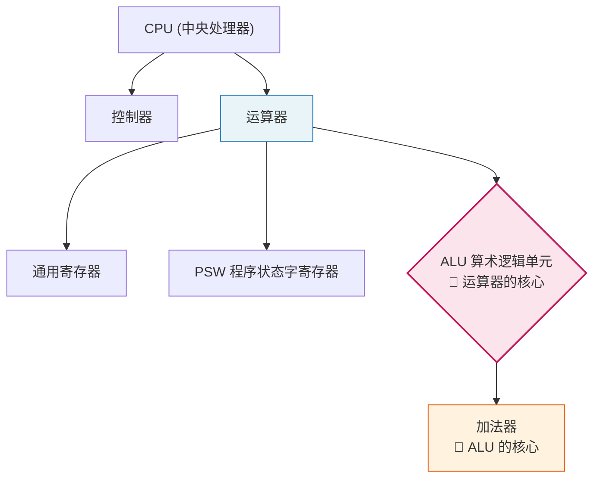
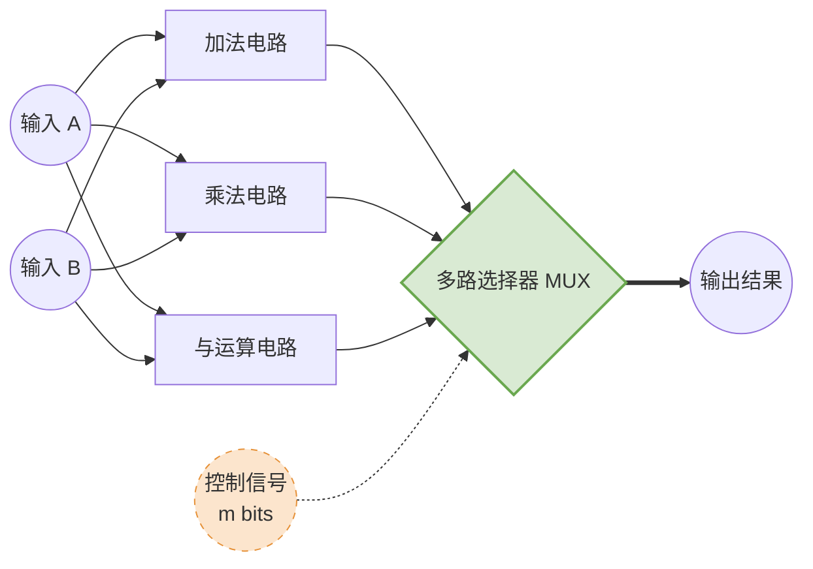

# 计算机组成原理：算术逻辑单元 (ALU) 详解

> **导语**
> 各位同学大家好！在这个视频中，我们将学习**算术逻辑单元 (ALU)**。
> 本节重点梳理 ALU 在计算机内部的作用、需要支持的核心功能、内部实现原理，并重点教大家**如何看懂考研真题中的 ALU 电路图示**。理解这些部件及其连线，对解答综合题至关重要。

---

## 一、 ALU 在计算机内部的作用与地位

ALU 的全称是 **Arithmetic Logic Unit（算术逻辑单元）**。

我们知道，**CPU 主要由“控制器”和“运算器”两大部件组成**：

- **控制器**：负责解析指令。根据当前执行的指令功能，向主机内部的其他部件（包括运算器）发出控制信号。
- **运算器**：根据控制信号对数据进行处理（如加减乘除）。

在运算器内部，包含通用寄存器（暂存参与运算的数据）、PSW（程序状态字寄存器）以及 ALU。
其中，各种具体的运算动作都是交由 ALU 这个组合逻辑电路来完成的。因此，**ALU 是运算器的核心**。
而在后续的学习中我们会发现，无论是减法、乘法还是除法，底层都需要转化为加法来实现，因此，**ALU 的核心是加法器**。

### 💡 核心层级关系速记（常考选择题）

---

## 二、 ALU 需要支持的功能

ALU 需要对输入的数据进行处理，主要具备以下几类功能：

1.  **算术运算**：加、减、乘、除等基本算术操作。
2.  **逻辑运算**：与、或、非、异或、移位等。
3.  **辅助功能**：
    - **求补码**：将原码送入 ALU，同时给出求补码的控制信号，输出端即可得到对应的补码，方便后续进行加减运算。
    - **直送**：不对数据进行任何处理，“怎么进就怎么出”。（例：输入 `0001`，给出直送信号，输出也是 `0001`）。

---

## 三、 ⚠️ 核心考点：控制信号位数 ($m$) 的计算

ALU 在工作时，有两个 $n$ 比特的输入操作数（A 和 B），输出一个 $n$ 比特的结果，同时还需要接收来自控制器的 **$m$ 比特控制信号**。

**控制信号位数 $m$ 的取值，取决于 ALU 支持的功能总数 $k$。**
因为 $m$ 个比特必须能够表示 $k$ 种不同的状态，所以必须满足以下数学公式（向上取整）：

$$
m \ge \lceil \log_2 k
ceil
$$

> **举例说明：**
>
> - 如果某 ALU 支持 **8 种**功能，那么 $m$ 至少为 **3 比特** ($2^3 = 8$)。
> - 如果某 ALU 支持 4 种算术运算 + 5 种逻辑运算 + 求补码 + 直送 = **11 种**功能。那么 3 比特不够，此时 $m$ 至少需要 **4 比特** ($2^4 = 16 \ge 11$)。

---

## 四、 ALU 的简要实现原理

_注：此部分仅作简要了解，考试通常不考电路底层细节。_

ALU 内部是如何用一套电路实现多种功能的呢？一个简单的方法是利用**多路选择器 (MUX)**。

1.  ALU 内部并排设置 $k$ 个功能电路（如加法电路、乘法电路、与电路、移位电路等）。
2.  将输入数 A 和 B 同时送入所有这些功能电路。
3.  将这 $k$ 个功能电路的输出结果全部接入到一个**多路选择器 (MUX)** 的输入端。
4.  利用 $m$ 比特的控制信号控制 MUX，决定最终让哪一条电路的结果输出。

_(将上述整个结构封装起来，就是我们在外部看到的 ALU 部件)_

---

## 五、 如何看懂 ALU 的考研电路图示

在历年统考真题（如 2022 年真题）中，经常会出现 ALU 的系统框图。我们需要学会识别各个引脚和连线的含义：

### 1. 数据总线 (机器字长)

- **输入端**：通常有两个运算数 A 和 B。
- **输出端**：运算结果 F。
- **重要特性**：运算数和运算结果的位宽（长度 $n$ 比特）是相同的，这个长度**就是该计算机的机器字长**。

### 2. 控制信号 (ALUop)

- 通常用侧面的**虚线箭头**表示。
- 由控制器发出，位数为 $m$，决定当前 ALU 执行何种运算。

### 3. 进位信号

- **$C_{in}$**：进位输入信号。
- **$C_{out}$**：进位输出信号（可类比带标志位的加法器）。

### 4. 标志位输出 (连接至 PSW / FR)

ALU 运算结束后，除了输出运算结果，还会输出一组**标志位信息**，用于表示本次运算结果的特征。这些标志位会**自动被送入 PSW（程序状态字寄存器）**中。
_(注：在有的系统中，PSW 也被称为 **FR (Flag Register, 标志寄存器)**，做题时知道它们是同一个东西即可。)_

| 标志位 (缩写) | 全称          | 表示的含义                                    |
| :------------ | :------------ | :-------------------------------------------- |
| **ZF**        | Zero Flag     | 运算结果是否为零。                            |
| **OF**        | Overflow Flag | **有符号数**的运算是否发生了溢出。            |
| **SF**        | Sign Flag     | **有符号数**的运算结果为正还是为负。          |
| **CF**        | Carry Flag    | **无符号数**的运算是否发生了溢出（进/借位）。 |

**为什么需要保存标志位？**
因为计算机（控制器）可以通过检查 PSW 中的这些标志位（如判断 OF 是否为 1）来识别运算是否出错、是否发生溢出，从而及时进行异常处理或逻辑分支跳转。

---

## 六、 本节内容总结

- **层级定位**：CPU 包含运算器和控制器；ALU 是运算器的核心；加法器是 ALU 的核心。
- **机器字长**：ALU 的运算位数（输入/输出宽度）等于计算机的机器字长。
- **控制信号计算**：支持 $k$ 种功能，控制信号位数 $m$ 需满足 $m \ge \lceil \log_2 k 
ceil$。
- **标志位流向**：运算后生成的 `OF, ZF, SF, CF` 标志位会被送入 **PSW (程序状态字寄存器)** 或称 **FR (标志寄存器)**，用于后续的程序状态判断和异常处理。
