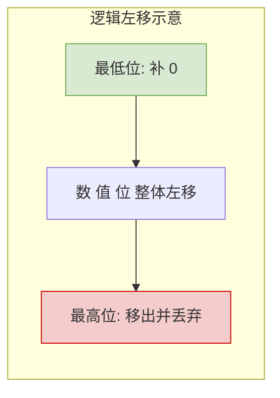
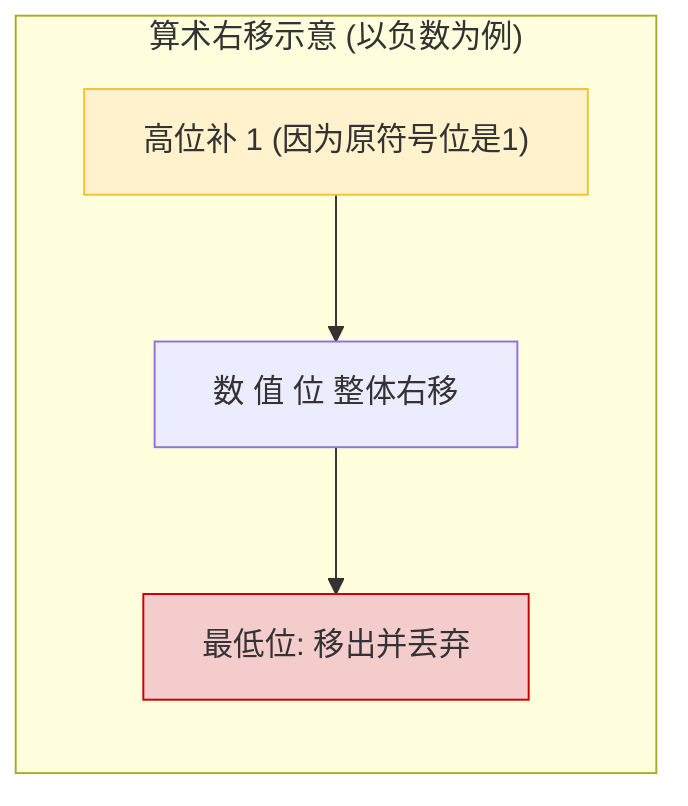

# 计算机组成原理：定点数的移位运算

> **导语**
> 各位同学大家好，在这个视频中，我们要探讨**定点数的移位运算**。
> 我们将从大家熟悉的十进制移位出发，带大家感受移位运算是如何改变数值权重的。进而深入到计算机底层，详细剖析无符号整数的**逻辑移位**和带符号整数的**算术移位**，这不仅是理解计算机底层运算逻辑的关键，也是考研中的高频考点。

---

## 一、 移位运算的思想引入 (十进制为例)

所谓移位运算，本质上就是**通过改变各个数码位和小数点的相对位置，从而改变各个数码位的位权**。

假设有一个十进制数：$985.211$

- **左移**：保持小数点不动，数值整体向左移动 1 位。结果变为 $9852.11$。
  - **效果**：相当于乘以 $10^1$。左移 $r$ 位，相当于乘以 $10^r$。
- **右移**：保持小数点不动，数值整体向右移动 1 位。结果变为 $98.5211$。
  - **效果**：相当于除以 $10^1$（或乘以 $10^{-1}$）。右移 $r$ 位，相当于除以 $10^r$。

在平时做数学题时，我们经常利用这种思想快速计算乘以或除以 $10$ 的整数幂。在计算机内部处理二进制数时，原理是相通的：**左移相当于乘以 $2^n$，右移相当于除以 $2^n$**。

---

## 二、 逻辑移位 (通常用于无符号整数)

在计算机中，**逻辑移位通常用于处理无符号整数**。

### 1. 逻辑左移

- **规则**：**高位移出丢弃，低位补 0**。
- **数学等效**：左移 1 位，相当于数值乘以 $2^1$；左移 $r$ 位，相当于乘以 $2^r$。
- **⚠️ 注意事项 (溢出风险)**：
  - 当寄存器容量有限（如 8 bit）时，如果不断左移，最高位的 `1` 可能会被丢弃。
  - 例如：无符号数 `160` (8位) 左移一位，期望结果是 $320$，但 8 位无符号数的最大表示范围是 255。此时左移会导致最高位的 `1` 被丢弃，结果变为 `64`。此时我们称**逻辑左移运算发生了溢出**。

### 2. 逻辑右移

- **规则**：**低位移出丢弃，高位补 0**。
- **数学等效**：右移 1 位，相当于数值除以 $2^1$。
- **⚠️ 注意事项 (精度丢失风险)**：
  - 如果右移时，最低位被丢弃的比特是 `1`，就会导致除法结果的小数部分被截断，从而造成**精度丢失**（如 $5 \div 2$ 计算机结果变为 $2$，丢弃了 $0.5$）。

---

## 三、 算术移位 (通常用于带符号整数/补码)

在计算机中，带符号整数通常用**补码**表示。算术移位就是针对这类数据设计的。

### 1. 算术左移

- **规则**：与逻辑左移**一模一样**。**高位移出丢弃，低位补 0**。
- **数学等效**：相当于乘以 $2$。
- **⚠️ 溢出判断方法**：
  - 由于带符号整数有符号位，若左移导致数值改变了正负性，即**左移前和左移后，符号位发生了改变**（如正数变成了负数），计算机硬件即可判断出**算术左移发生了溢出**。

### 2. 算术右移

- **规则 (与逻辑右移出现区别)**：**低位移出丢弃，高位补【符号位】**。
  - 如果原本是正数（符号位为 `0`），高位空缺补 `0`。
  - 如果原本是负数（符号位为 `1`），高位空缺补 `1`。
- **数学等效**：相当于除以 $2$。
- **⚠️ 注意事项**：同样存在精度丢失的风险（当移出的最低位为 `1` 时）。

---

## 四、 核心对比与真题实战

### 【规则对比速查表】

| 移位类型     | 适用数据类型 (常规) | 左移规则             | 右移规则                       |
| :----------- | :------------------ | :------------------- | :----------------------------- |
| **逻辑移位** | 无符号整数          | 高位丢弃，低位补 `0` | 低位丢弃，**高位补 `0`**       |
| **算术移位** | 带符号整数 (补码)   | 高位丢弃，低位补 `0` | 低位丢弃，**高位补【符号位】** |

> **💡 底层视角提示**：
> 从硬件层面看，“逻辑左移”和“算术左移”对二进制串的操作是完全一致的。机器并不关心数据是有符号还是无符号，它只会严格执行特定的移位指令。区别仅仅在于“右移”时，是否复制符号位。

### 【真题实战】 (2018年统考第16题改写)

**题目**：给定一个 8 比特机器数 `1010 1100`，若对其分别进行逻辑右移 1 位和算术右移 1 位，最终得到的机器数各是什么？

**解析**：

- **逻辑右移**：低位丢弃，高位补 `0`。
  - 原数：`1010 1100` ➔ 移位后：**`0`**`101 0110`
- **算术右移**：低位丢弃，高位补“符号位”。因为原数最高位是 `1`，所以补 `1`。
  - 原数：`1010 1100` ➔ 移位后：**`1`**`101 0110`

---

## 五、 本节总结

1.  **运算等效性**：无论是无符号数的逻辑移位，还是有符号数的算术移位，**左移都等效于乘以 $2^r$，右移都等效于除以 $2^r$**。这种技巧常用于程序优化和大题计算中。
2.  **移位风险**：
    - **左移**要时刻警惕**溢出**（超出数据类型表示范围）。
    - **右移**要时刻注意**精度丢失**（截断了有效位 `1`）。
3.  **核心差异**：逻辑右移与算术右移的唯一区别在于**高位补全规则**（补 0 还是补符号位）。
