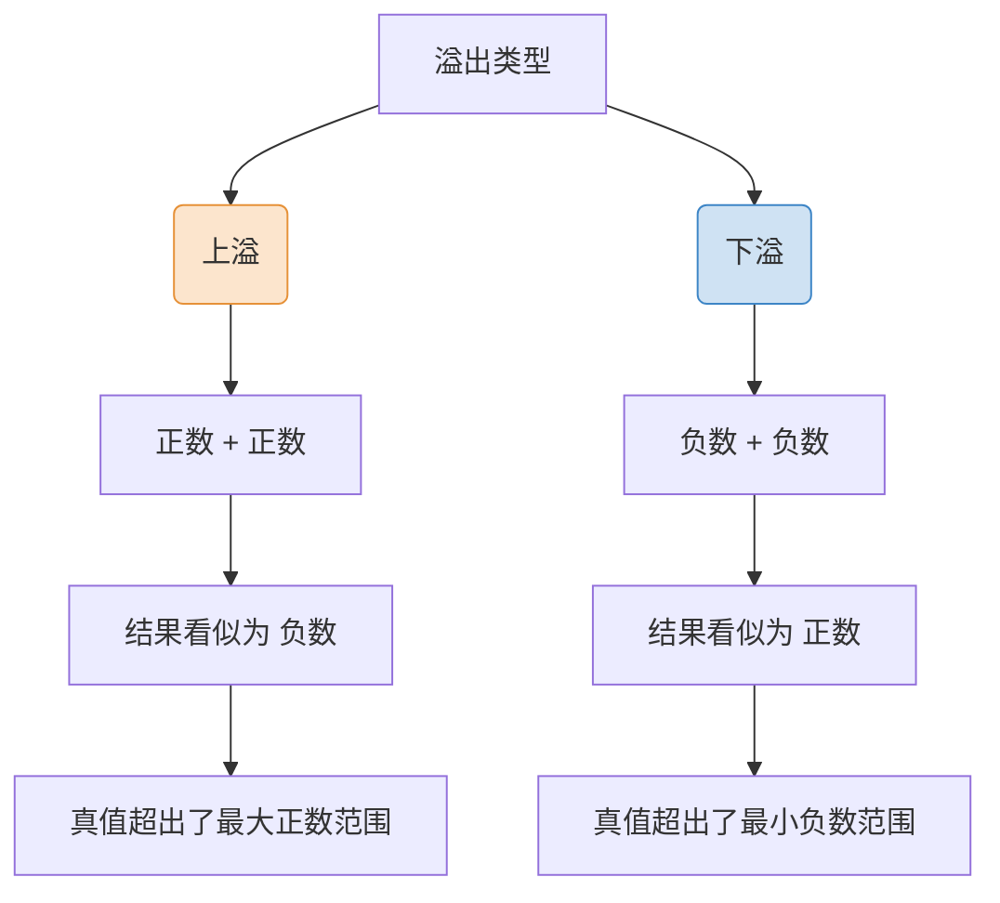

# 计算机组成原理：定点数的加减运算与溢出判断

> **导语**
> 本节我们将深入探讨定点数（原码和补码）的加减运算机制。由于原码的加减运算在硬件实现上过于复杂，现代计算机底层通常采用**补码**来进行加减运算。此外，运算过程中可能会出现“溢出”现象，我们将重点解析计算机硬件是如何通过三种不同的逻辑电路方法来判断溢出的。

---

## 一、 原码的加减运算（了解逻辑）

虽然计算机底层不常直接用原码做加减法，但我们需要理解其复杂的运算逻辑。

### 1. 原码的加法逻辑

原码的加法极其复杂，需要根据被加数和加数的符号位分为四种情况处理：

| 被加数符号 | 加数符号 | 运算逻辑                 | 符号位确定                 |
| :--------- | :------- | :----------------------- | :------------------------- |
| **正**     | **正**   | 绝对值相加               | 保持为正                   |
| **负**     | **负**   | 绝对值相加               | 保持为负                   |
| **正**     | **负**   | 绝对值大的减去绝对值小的 | 与绝对值**大**的数符号一致 |
| **负**     | **正**   | 绝对值大的减去绝对值小的 | 与绝对值**大**的数符号一致 |

> **⚠️ 注意：** 当两个符号相同的数相加时，结果有可能会超出表示范围，产生**溢出**。

### 2. 原码的减法逻辑

减法终归可以转化为等价的加法运算。我们只需要**将减数的符号位取反**，即可将减法操作转变为加法操作，然后再套用上述的加法逻辑即可。
由于原码加法硬件电路设计太难，计算机通常采用**补码**来实现加减运算。

---

## 二、 补码的加减运算（核心重点）

在补码运算中，**符号位同样参与运算**，无需像原码那样单独拉出来判断，这极大简化了硬件电路的设计。

### 1. 补码的加法

将 $A$ 和 $B$ 的补码直接丢给加法器，符号位一同参与相加，进位直接丢弃，得到的结果即为 $A+B$ 的补码。

### 2. 补码的减法：$A - B = A + (-B)$

减法运算需要先求出减数的相反数的补码，即将 $B$ 的补码转换为 $-B$ 的补码。

> **💡 技巧：由 $[B]_补$ 快速求 $[-B]_补$ 的方法**
>
> - **常规法**：包括符号位在内，所有位全部取反，末位加 1。
> - **快捷法**：从右往左找到补码中的**第一个 1**，以此为分界线：
>   - 分界线**右侧**（包括这个 1 本身）保持**不变**。
>   - 分界线**左侧**（包括符号位）全部**取反**。

---

## 三、 溢出的概念：上溢与下溢

补码能表示的范围是有限的（例如 8 位补码的范围是 -128 到 +127）。当运算结果超出这个合法范围时，就会发生溢出。

**溢出的前提：** 只有**两个符号相同的数相加**，才有可能发生溢出。一正一负相加绝对不可能溢出。

---

## 四、 硬件判断溢出的三种方法（重点必考）

既然溢出不可避免，计算机硬件就必须具备判断溢出的逻辑。无论是加法还是减法，底层都会转化为加法，因此我们只需要考虑补码加法如何判断溢出。

### 方法一：采用一位符号位的逻辑表达式

通过被加数符号 $A_S$、加数符号 $B_S$ 以及结果符号 $S_S$ 来判断。

- **逻辑表达式**：$V = A_S B_S \overline{S_S} + \overline{A_S} \overline{B_S} S_S$
- **判断标准**：$V = 0$ 表示无溢出；$V = 1$ 表示有溢出。

**逻辑解析（对应离散数学与数字电路）：**

- **乘法 (如 $A_S B_S$)**：代表逻辑**与 (AND / 且)**。必须全为 1（真），结果才为 1。
- **加法 (如 $+$)**：代表逻辑**或 (OR / 或)**。只要有一个为 1，结果就为 1。
- **上划线 (如 $\overline{S_S}$)**：代表逻辑**非 (NOT / 取反)**。0 变 1，1 变 0。

**公式物理意义：**

- 前半部分 $A_S B_S \overline{S_S}$：负数 + 负数 = 正数（发生下溢，结果为 1）。
- 后半部分 $\overline{A_S} \overline{B_S} S_S$：正数 + 正数 = 负数（发生上溢，结果为 1）。

### 方法二：采用数据位与符号位的进位情况

通过对比**符号位的进位 ($C_S$)** 和 **最高数值位的进位 ($C_1$)** 是否一致来判断。

- **逻辑表达式**：$V = C_S \oplus C_1$ （$\oplus$ 表示异或运算）
- **判断标准**：异或结果为 0（即 $C_S$ 与 $C_1$ 相同）表示无溢出；异或结果为 1（两者不同）表示有溢出。

| 符号位进位 $C_S$ | 最高数值位进位 $C_1$ | 异或结果 $V$ | 结论说明     |
| :--------------: | :------------------: | :----------: | :----------- |
|        0         |          1           |      1       | **发生上溢** |
|        1         |          0           |      1       | **发生下溢** |
|        0         |          0           |      0       | 无溢出       |
|        1         |          1           |      0       | 无溢出       |

### 方法三：采用双符号位（模 4 补码）

将补码的符号位扩展为两位。**正数符号位是 00，负数符号位是 11**。运算时两个符号位同时参与加法运算。

- **逻辑表达式**：$V = S_{S1} \oplus S_{S2}$ （结果的最高符号位 异或 结果的第二符号位）
- **判断标准**：结果为 0 表示无溢出，结果为 1 表示发生溢出。

| 双符号位结果 ($S_{S1}S_{S2}$) | 含义解析           | 结论         |
| :---------------------------: | :----------------- | :----------- |
|            **00**             | 结果为正数         | 无溢出       |
|            **11**             | 结果为负数         | 无溢出       |
|            **01**             | 本应为正，实际变负 | **发生上溢** |
|            **10**             | 本应为负，实际变正 | **发生下溢** |

> **🧠 拓展概念补充：**
>
> - **模 4 补码 (双符号位)**：将双符号位后面的逗号视作小数点，最高位的位权为 $2^1$（即 2），再往前的隐藏位权为 $2^2$（即 4）。计算相当于对 4 取模，因此得名。
> - **模 2 补码 (单符号位)**：同理，最高符号位前隐藏位权为 2，计算相当于对 2 取模。
> - **存储细节**：虽然运算时使用双符号位，但在计算机**内存中实际只存储 1 个符号位**以节省空间，只有在送入 ALU 运算前，硬件才会自动复制一次符号位。

---

## 五、 本节总结速览

1.  **运算策略**：原码加减法太复杂，计算机硬件统一采用**补码加法**来实现加减法。减法通过“连同符号位全部取反，末位加1”转为加法。
2.  **溢出本质**：超出了数据类型能表示的范围。上溢必是“正+正=负”，下溢必是“负+负=正”。
3.  **判断核心**：
    - **一位符号位公式**：使用与或非门实现。
    - **进位异或法**：$V = C_S \oplus C_1$ (符号位进位 异或 最高数据位进位)。
    - **双符号位法 (模4补码)**：`00` / `11` 正常，`01` 上溢，`10` 下溢。实际存储仅需 1 位。
