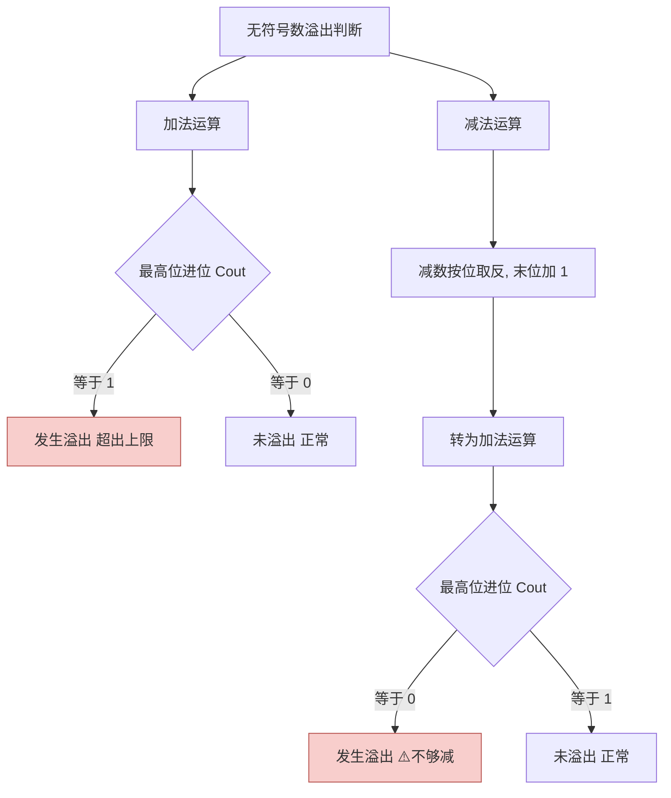

# 计算机组成原理：无符号数的加减运算（补充）

> **导语**
> 本节是对考研“王道书”的补充内容。王道书重点探讨了有符号数（补码）的加减运算，而本视频将详细剖析**无符号数**的加减运算底层硬件实现逻辑，以及其特有的溢出判断方法。

---

## 一、 无符号数加减运算的底层实现逻辑

**核心结论：** 对于计算机底层硬件来说，无符号数的加减运算规则与带符号数（补码）的加减运算逻辑是**完全一模一样**的。硬件并不区分数据有无符号，只执行相同的按位运算。

### 1. 无符号数的加法

- **规则**：与补码加法相同，从最低位开始逐位相加，向更高位产生进位。
- **示例**：$99 + 9 = 108$，直接按位求和即可。

### 2. 无符号数的减法

- **核心思想**：减法最终会被转变成与之等价的加法运算。
- **转换规则**：$A - B$ 等价于 $A + B_{补数}$。
  - 对减数 $B$ 的处理：**全部位按位取反，末位加 1**，从而得到 $B$ 的补数。
- **原理解析（以 8 比特为例）：**
  - 8 比特寄存器只能表示 $0 \sim 255$，天然实现了“模 256”（即 $2^8$）的运算。
  - 在模 256 体系下，满足 $B + B_{补数} = 256$。
  - 假设将 $B$ 按位取反得到 $C$，显然 $B + C = 255$（即二进制的 8 个 1）。
  - 那么 $B + C + 1 = 256$。这就证明了 $C + 1$（按位取反后加 1）就是 $B$ 的补数。
  - 因此，$A - B$ 也就等价于 $A + (B_{补数})$，减法完美转换为加法。

---

## 二、 无符号数加减运算的溢出判断

在考试中，我们需要掌握“手算”和“硬件判断”两种逻辑。

### 1. 手算判断法（适用于考试快速解题）

- **判断依据**：确定 $n$ 比特无符号数的合法表示范围：$0 \sim 2^n - 1$。
- **操作方法**：直接代入十进制数值进行计算，若结果超出了合法范围，则必定溢出。
- **实战例子 (以 8 比特为例，范围 $0 \sim 255$)**：
  - **下溢**：`127 - 128 = -1` ➔ 超出下限，**发生溢出**。
  - **上溢**：`200 + 100 = 300` ➔ 超出上限，**发生溢出**。

### 2. 计算机硬件判断法（底层电路逻辑）

计算机硬件是通过检查运算时**最高位向更高位产生的进位（我们记为 $C_{out}$）**来判断是否溢出的。
⚠️ **特别注意：加法和减法判断溢出的标准刚好相反！**

#### (1) 加法运算溢出判断

- **判断标准**：最高位产生的进位 $C_{out} = 1$ 时，**发生溢出**；$C_{out} = 0$ 时，没有溢出。
- **逻辑**：两个正数相加，如果往最高位之外还进了 1，说明结果超出了当前位数的表示极限（例如 8 位寄存器存不下第 9 位的 1）。

#### (2) 减法运算溢出判断 (易错点)

- **前提**：减法已通过“取反加一”转变成了加法。
- **判断标准**：最高位产生的进位 $C_{out} = 0$ 时，**发生溢出**；$C_{out} = 1$ 时，没有溢出。
- **逻辑说明**：
  - **无溢出（如 $99 - 9 = 90$）**：转换成加法相加后，最高位**一定会**产生进位 1。这个 1 在模运算中被硬件自然丢弃，留下的是正确结果。
  - **溢出（如 $99 - 100 = -1$）**：不够减时，转换成加法相加后，最高位**无法**产生进位（$C_{out} = 0$），这就相当于“借位”失败，硬件借此判定发生了溢出。

---

## 三、 核心考点速记图解

| 运算类型 | 硬件转换操作         | 硬件溢出判断条件 (最高位进位 $C_{out}$) |
| :------- | :------------------- | :-------------------------------------- |
| **加法** | 直接按位相加         | **$C_{out} = 1$ 时溢出**                |
| **减法** | 减数取反加 1，转加法 | **$C_{out} = 0$ 时溢出**                |
