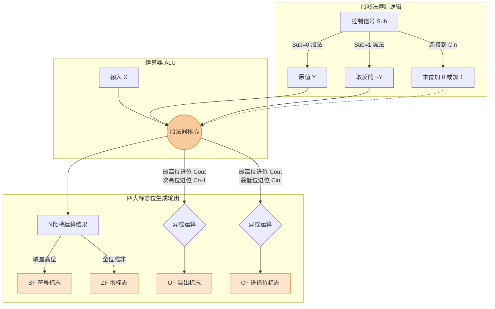

# 计算机组成原理：补码的加减运算电路与标志位详解

> **导语**
> 在本节视频中，我们将探讨**如何用电路硬件来实现补码的加减运算**。
> 我们将基于之前学过的 $n$ 比特加法器进行拓展，通过引入多路选择器和控制信号，使原本只能做加法的电路同时具备减法功能。同时，我们还将深入剖析四大核心标志位（`OF`, `SF`, `ZF`, `CF`）的硬件生成逻辑及其背后代表的数学意义。

---

## 一、 补码加减运算电路的实现原理

我们知道，加法器的核心功能是接收两个 $n$ 比特的输入数 $A$、$B$ 以及一个低位进位 $C_{in}$，输出 $n$ 比特的和以及高位进位 $C_{out}$。
为了让加法器支持减法，我们需要增加一个控制信号 **`Sub` (Subtraction)**。

### 1. 核心部件与控制信号 (`Sub`)

- **多路选择器 (MUX)**：用于根据控制信号选择不同的输入线路。
- **非门 (NOT)**：用于将信号按位取反。
- **控制信号 `Sub`**：
  - `Sub = 0`：表示当前执行**加法**运算。
  - `Sub = 1`：表示当前执行**减法**运算。

### 2. 加法运算执行流程 (`Sub = 0`)

假设要计算 $X + Y$ (补码)：

1.  控制信号 `Sub = 0`。
2.  **右侧输入 ($Y$)**：多路选择器选择将 $Y$ 的原值直接输送给加法器的右端口。
3.  **左侧输入 ($X$)**：$X$ 直接输入给加法器的左端口。
4.  **低位进位 ($C_{in}$)**：`Sub` 信号线直接连着 $C_{in}$ 引脚。既然 `Sub = 0`，则 $C_{in} = 0$。
5.  **结果**：加法器实际执行的是 $X + Y + 0$，直接输出 $X+Y$ 的正确补码结果。

### 3. 减法运算执行流程 (`Sub = 1`)

假设要计算 $X - Y$ (补码)：
_回顾数学原理：补码的减法 $X - Y$ 等价于 $X + (-Y)_{补码}$。而求 $(-Y)_{补码}$ 的方法是“全部位按位取反，末位加 1”。_

1.  控制信号 `Sub = 1`。
2.  **右侧输入 (取反)**：多路选择器选择经过**非门**的线路，将减数 $Y$ 的每一位都**按位取反**后，送入加法器右侧。
3.  **左侧输入 ($X$)**：$X$ 依然直接输入给加法器左端。
4.  **低位进位 (加 1)**：`Sub` 信号连着 $C_{in}$。既然 `Sub = 1`，则加法器最低位会**额外加 1**。
5.  **结果**：加法器实际执行的是 $X + (\overline{Y}) + 1$。这完美的在硬件层面实现了“按位取反，末位加一”的逻辑，输出了 $X - Y$ 的正确补码结果。

> 💡 **重点**：此加减运算电路不仅适用于带符号数（补码），**完全同样适用**于无符号数的加减法运算！

---

## 二、 核心标志位的生成逻辑与意义回顾

在运算结束后，除了得到 $n$ 比特的结果，硬件还会输出四个极其关键的状态标志位送入 PSW (程序状态字寄存器)。我们从底层电路设计的角度来重新理解它们。

### 1. OF (Overflow Flag) - 溢出标志位

- **作用**：专门用于判断**带符号数**（补码）加减运算是否发生溢出。
  - `OF = 1`：溢出。
  - `OF = 0`：未溢出。
- **底层电路生成逻辑**：$OF = C_{out} \oplus C_{n-1}$
  _(即：最高位向更高位的进位 `异或` 次高位向最高位的进位)_
- **原理解释**：在之前学补码溢出判断时，我们知道，如果符号位的进位和最高数值位的进位不同，就代表发生了上溢或下溢。电路中的异或门（相异为 1）完美的用硬件实现了这个判断。

### 2. SF (Sign Flag) - 符号标志位

- **作用**：反映**带符号数**运算结果的正负。
  - `SF = 1`：结果为负。
  - `SF = 0`：结果为正。
- **底层电路生成逻辑**：直接取加法器输出结果的**最高位（符号位）**。
- **原理解释**：带符号数用补码表示，补码的最高位本来就是符号位。直接把这一根线的信号拉出来作为 `SF` 即可。

### 3. ZF (Zero Flag) - 零标志位

- **作用**：判断加减运算的整体结果是否为 0。
  - `ZF = 1`：结果为 0（注意：结果全 0 时，ZF 反而是 1）。
  - `ZF = 0`：结果非 0。
- **底层电路生成逻辑**：将输出结果的全部 $n$ 个比特送入一个巨大的**或非门 (NOR)**。
- **原理解释**：只有当所有比特位全为 `0` 时，或运算的结果才是 `0`，再经过“非”，最终输出 `1`。只要结果中有任意一个 `1`，ZF 就会变成 `0`。

### 4. CF (Carry Flag) - 进位/借位标志位 (易错核心⚠️)

- **作用**：专门用于判断**无符号数**加减运算是否发生溢出（加法进位或减法不够减借位）。
  - `CF = 1`：发生溢出。
  - `CF = 0`：未发生溢出。
- **底层电路生成逻辑**：$CF = C_{out} \oplus C_{in}$
  _(即：加法器最高位输出进位 `异或` 最低位输入进位 Sub 信号)_
- **原理解释**：
  回忆上一节关于无符号数溢出的判断：
  - **做加法时 (`Sub = 0`，即 $C_{in} = 0$)**：只有当最高位进位 $C_{out} = 1$ 时才溢出。
    代入异或公式：$1 \oplus 0 = 1$ (CF 为 1，表示溢出)，符合逻辑！
  - **做减法时 (`Sub = 1`，即 $C_{in} = 1$)**：当最高位进位 $C_{out} = 0$ 时表示不够减，发生溢出。
    代入异或公式：$0 \oplus 1 = 1$ (CF 为 1，表示溢出)，同样完美符合逻辑！
    这就是为什么硬件工程师要用异或门和 $C_{in}$ 信号来生成 CF 标志位的精妙之处。

---

## 三、 本节总结流向图

