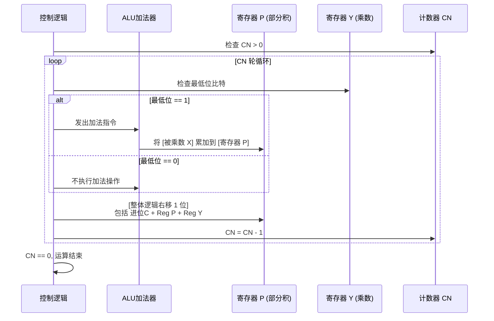

# 计算机组成原理：无符号整数的乘法运算

> **导语**
> 在这个视频中，我们将探讨**无符号整数的乘法运算原理**。
> 我们将从大家熟悉的十进制手算乘法出发，推导出二进制手算乘法的规则。在此基础上，我们将深入底层，了解计算机是如何通过“加法器 + 移位寄存器 + 计数器”构成的硬件电路来模拟这一过程的。最后，我们还会总结乘法溢出的判断与处理机制。

---

## 一、 手算乘法的原理解析 (十进制 $\rightarrow$ 二进制)

### 1. 十进制乘法的本质：错位相加

我们手算 $985 \times 211$ 时，实际上是将乘数拆解成了：$2 \times 10^2 + 1 \times 10^1 + 1 \times 10^0$。
然后将每一位与被乘数相乘，并进行**错位相加**。所谓“错位”，本质上就是省略了因为乘以 $10^r$ 而产生的尾数 0。

### 2. 二进制无符号数乘法：同样是错位相加

以 `1101` (被乘数, 13) $\times$ `1011` (乘数, 11) 为例。
乘数 `1011` 可以拆解为：$1 \times 2^3 + 0 \times 2^2 + 1 \times 2^1 + 1 \times 2^0$。

- **第 1 位 (最右 `1`)**：直接加上被乘数 `1101`。
- **第 2 位 (`1`)**：被乘数左移 1 位 (乘以 $2^1$)，即加上 `11010`。
- **第 3 位 (`0`)**：被乘数左移 2 位，但因为系数是 0，即加上 `000000`。
- **第 4 位 (最左 `1`)**：被乘数左移 3 位 (乘以 $2^3$)，即加上 `1101000`。

最终将这些结果进行相加，得到 `10001111` (143)。这就是二进制**逐位相乘，错位相加**的手算规则。

---

## 二、 计算机底层硬件实现：将乘法拆解为“多轮加法”

由于计算机的 ALU (算术逻辑单元) 每次只能完成**两个数**的加法，无法像人类那样一次性把多行数字加到一起。因此，硬件必须将上述过程拆解为 $n$ 轮处理（$n$ 为机器字长），每次只将一个**部分积**与新的结果相加。

### 1. 硬件电路初始化

在执行 $n$ 比特的乘法前，硬件需要进行以下准备：

- **寄存器 X**：存放**被乘数**。
- **寄存器 Y**：存放**乘数**。
- **寄存器 P (乘积寄存器)**：初始置为**全 0**（记录初始的“部分积 $P_0$”）。
- **计数器 CN**：初始值设为 **$n$** (乘数的位数，代表需要循环的轮数)。

### 2. 核心工作流：一轮完整的加法移位操作

控制逻辑 (指挥官) 会进行 $n$ 轮循环。每一轮循环包含以下固定步骤：

1.  **判断与加法 (ALU 核心动作)**：
    - 检查**寄存器 Y 的最低位 (最右边一比特)**。
    - **如果为 `1`**：控制逻辑命令 ALU 执行加法。将【寄存器 P 的当前值】加上【寄存器 X (被乘数) 的值】，结果写回寄存器 P。同时产生的进位保存在触发器 C 中。
    - **如果为 `0`**：ALU **不执行加法**（保持原样）。
2.  **整体逻辑右移 (错位动作)**：
    - 将 **触发器 C、寄存器 P、寄存器 Y 作为一个整体 (共 $2n+1$ 位)** 进行**逻辑右移 1 位**。
    - **右移的效果**：
      - 原本 Y 最低位的那个处理过的比特被丢弃。
      - 相当于让被乘数（虽然被乘数没动，但部分积整体右移了）相对于下一位乘数“向左错了一位”，完美实现了手算的“错位相加”效果。
3.  **计数器衰减**：
    - 计数器 `CN = CN - 1`。

**循环结束**：当计数器 `CN = 0` 时，循环停止。此时，乘法运算的结果（$2n$ 比特长）就保存在组合在一起的**寄存器 P 和寄存器 Y** 中。

---

## 三、 乘法运算的溢出判断与处理

### 1. 溢出的产生原因

两个 $n$ 比特数相乘，理论上需要 $2n$ 比特才能完整保存结果。
但在高级语言（如 C 语言中的 `unsigned int` 乘法 $Z = X \times Y$）中，变量长度固定，**最终系统只会截取低 $n$ 位作为结果赋给 $Z$**，而将高 $n$ 位强行舍弃。这就埋下了溢出的隐患。

### 2. 无符号数乘法的溢出判断 (硬件视角)

计算机如何知道舍弃掉的高 $n$ 位是不是导致了结果错误？

- **判断规则**：检查截取掉的**高 $n$ 位（保存在寄存器 P 中）是否全为 0**。
  - **全为 0**：高位没有有效数据被截断，**未发生溢出**。将 `OF` 标志位置为 `0`。
  - **不全为 0**：高位的有效数据被强行切除，结果错误，**发生溢出**。将 `OF` 标志位置为 `1`。

### 3. 对乘法溢出的两种处理方式 (软件/系统视角)

1.  **直接摆烂 (忽略溢出)**：程序不作任何检测，直接取走低 $n$ 位错误结果继续运行。（这在 C 语言中是常见的默认行为，如果程序员自己不留意，可能会导致严重的逻辑 Bug）。
2.  **不摆烂 (异常处理)**：在汇编代码的乘法指令之后，插入一条**溢出自陷指令 (Trap 指令，如 x86 的 `into`)**。
    - 该指令会自动检测 `OF` 标志位。若 `OF = 1`，则触发操作系统的**异常处理程序**，及时中断或报错。

---

## 四、 本节知识脉络速记

- **本质核心**：模拟手算，“逐位相加（累加被乘数），错位相加（整体逻辑右移）”。
- **三个关键寄存器**：X 存被乘数，Y 存乘数，P 存部分积（初始全 0）。
- **判断是否加法的依据**：只看乘数寄存器 **Y 的最低位**。
- **溢出的判断**：结果的高 $n$ 位（寄存器 P 的内容）**是否全为 0**。
