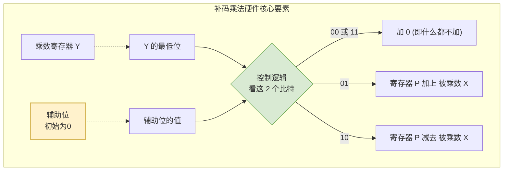

# 计算机组成原理：带符号整数 (补码) 的乘法运算

> **导语**
> 之前我们学习了无符号整数的乘法。本节视频，我们将深入探讨**带符号整数（在底层表现为补码）的乘法运算电路实现原理**。
> 为什么无符号数的电路不能直接给带符号数用？带符号数的乘法电路多了哪些“神秘”的设计？溢出又是如何判断的？我们将结合考研真题，一一解答这些底层逻辑。

---

## 一、 为什么不能共用无符号数的乘法电路？

- **无符号数乘法**：本质是**“逐位相乘，错位相加”**。
- **带符号数 (补码) 乘法**：如果把带符号数的补码直接扔进无符号数的乘法电路里，计算出的二进制结果，再按补码的规则去解析，得出的十进制真值是**完全错误**的（例如 $-3 \times -5$ 会算出 $-113$）。
- **结论**：因此，计算机硬件必须为带符号整数（补码）设计**另外一套专属的乘法电路**。

_(注：补码乘法的数学原理极其复杂，为了降低考研复习负担，我们只关注 How(怎么做)，不深究 Why(数学证明)，理解硬件执行流程即可。)_

---

## 二、 带符号数 (补码) 乘法电路的核心结构

带符号整数（补码）乘法电路（也称 **Booth 乘法器** 或 **补码的一位乘法**）与无符号数乘法电路相比，有两个最显著的特征区别：

1.  **增加了一个“辅助位”**：在乘数寄存器 Y 的最低位右侧，额外增加了一比特的辅助位（初始值为 `0`）。
2.  **双比特联合控制**：控制逻辑不再只看 Y 的最低位，而是**每次看末尾的 2 个比特**（即 `Y的最低位` 和 `辅助位`）来决定当前轮次执行加法还是减法。
3.  **算术右移**：位移操作不再是逻辑右移，而是**算术右移**（符号位参与，高位补符号位）。

---

## 三、 补码乘法的工作流程 (Booth 算法)

假设被乘数 X 和乘数 Y 均为 $n$ 比特。

### 1. 初始化阶段

- 将被乘数放入寄存器 **X**。
- 将乘数放入寄存器 **Y**。
- 乘积寄存器 **P** 置为全 `0`。
- **辅助位** 置为 `0`。
- 计数器 **CN** 置为 $n$（表示需要循环 $n$ 轮）。

### 2. 循环处理阶段 ($n$ 轮)

每轮执行以下三个子步骤：

- **步骤 1：判断与加减操作**
  提取寄存器 Y 的最低位和辅助位（记为 `Y_low, Aux`），查表执行：
  - `0 0`：加 0（保持原样）。
  - `1 1`：加 0（保持原样）。
  - `0 1`：执行 `P = P + X`（加上被乘数）。
  - `1 0`：执行 `P = P - X`（减去被乘数，底层通过补数转为加法）。
- **步骤 2：算术右移**
  将寄存器 **P、Y、辅助位** 作为一个总长度为 $2n+1$ 的整体，执行**算术右移 1 位**。
  _(⚠️ 注意：算术右移时，P 的最高位空出要补充原 P 的符号位；最低位移出即被丢弃)_
- **步骤 3：计数器衰减**
  计数器 `CN = CN - 1`。

当 `CN == 0` 时，循环结束。此时寄存器 `P` 和 `Y` 拼接成的 $2n$ 个比特，就是最终正确的补码乘积结果。

---

## 四、 乘法溢出的判断与处理 (重点必考)

无论无符号数还是有符号数，两个 $n$ 比特数相乘，结果理论上需要 $2n$ 比特。但在高级语言（如 C 语言的 `int Z = X * Y`）中，最终只会截取低 $n$ 位（即寄存器 Y 的内容），高 $n$ 位（寄存器 P 的内容）会被强行舍弃。这就可能导致结果错误，即**乘法溢出**。

### 1. 计算机底层如何判断补码乘法溢出？

- **无符号数**：看高 $n$ 位是否**全为 0**。
- **带符号数 (补码)**：看高 $n+1$ 位（即寄存器 P 的全部 $n$ 位，加上寄存器 Y 的最高位，共 $n+1$ 位）是否**完全相同**（即全 0 或全 1）。
  - **完全相同**：未发生溢出，`OF = 0`。
  - **不完全相同**：发生了溢出，`OF = 1`。

> 💡 **避坑提示：CF 与 OF 的分工**
> 有同学疑问：无符号数溢出不是看 `CF` 吗？为什么这里用 `OF`？
> _解答：`CF` 标志位一般仅用于记录无符号数的**加减法**溢出。而对于**乘法**，无论有符号还是无符号，只要乘法发生溢出，计算机硬件通常都会将 **`OF` (溢出标志位)** 置为 1，供程序员检查。_

### 2. 软件如何处理乘法溢出？

1.  **直接摆烂**：程序不加任何检测，带着被截断的错误结果继续运行（常见隐患）。
2.  **主动异常处理**：在汇编指令 `imul` (乘法指令) 之后，插入一条 **溢出自陷指令**（如 x86 架构的 `into` 指令）。
    - 该指令运行时会检查 `OF` 标志。若 `OF == 1`，则触发系统的异常处理程序，中断或报错。

---

## 五、 真题实战演练

### 1. 手算判断溢出法 (2010年统考第13题思路)

**题目情境**：判断给定的几个 8 比特补码（如 R2, R3）相乘是否会溢出。
**秒杀技巧**：千万不要用计算机底层算法去一步步模拟（会做不完）。直接**转化为人类的十进制**。

- 8 比特补码的合法范围是 **-128 到 +127**。
- 将 R2 和 R3 转为十进制真值，如果两者乘积的真值（如 1568）超出了 `[-128, 127]` 的范围，即可直接断定**必然溢出**。

### 2. 底层理论考察 (2019年统考第45题思路)

**题目情境**：32位 CPU 执行 `imul` (带符号整数乘法)，问溢出标志 `OF=1` 的条件，以及如何触发异常。
**答题要点**：

1.  **OF=1 的条件**：乘法器输出的 64 位乘积中，**高 33 位（即高 32 位加上低 32 位的最高位符号位）不完全相同**。
2.  **触发异常的方法**：编译器应在乘法指令后增加一条**溢出自陷指令 (如 `into`)**。
