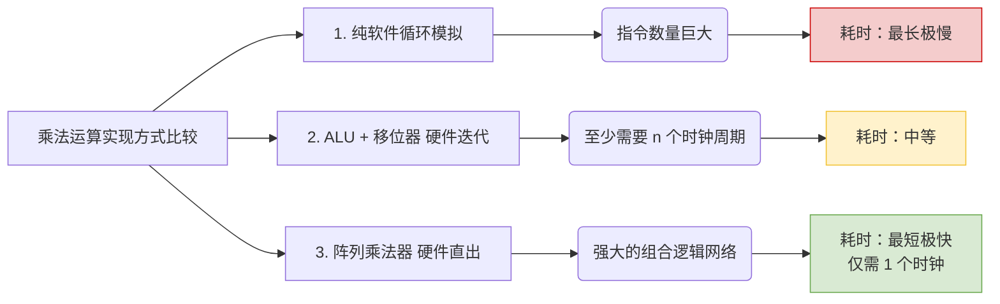

# 计算机组成原理：乘法运算的三种常见实现方式

> **导语**
> 各位同学大家好，在这个视频中，我们将以无符号整数的乘法为例，探讨**计算机实现乘法运算的三种常见方式**。
> 本节课内容主要在**选择题和简答题**中进行考察，重点在于理解不同实现方式在底层结构和运算速度上的差异。

---

## 一、 方式一：基于 ALU、移位器和寄存器的乘法电路

这是我们在上一节中深入探讨过的标准硬件乘法电路。

### 1. 电路核心部件

- **ALU (算术逻辑单元)**：负责进行两数相加。
- **移位寄存器**：由乘积寄存器 P 和乘数寄存器 Y 组成，既能暂存数据，又支持整体移位操作（即“移位器”）。
- **控制逻辑**：负责根据乘数的位发出控制信号。

### 2. 运算速度分析

- **基本原理**：对于两个 $n$ 比特的数相乘，如果每一轮只处理乘数的 1 个比特，那么至少需要 **$n$ 轮处理**（即至少 $n$ 个时钟周期）。
  - 例如：4 比特相乘需要 4 个时钟周期；32 比特相乘需要 32 个时钟周期。
- **优化思路（多位乘法）**：为了提升运算速度，可以对电路稍加改造，在每一轮中同时处理乘数的 **2 个比特**（甚至更多）。这样 $n$ 比特乘法就只需要 **$n/2$ 轮处理**，时钟周期缩短为原先的一半。

---

## 二、 方式二：阵列乘法器 (快速乘法器)

如果追求极致的运算速度，计算机硬件会采用专门的**阵列乘法器 (Array Multiplier)**。

### 1. 核心特点

- **极高的速度**：它属于**快速乘法器**的典型代表。完成两个 $n$ 比特数的相乘运算，**只需要 1 个时钟周期**！
- **工作原理**：只要将被乘数 $X$ 和乘数 $Y$ 的所有比特同时输入到阵列乘法器的引脚中，经过内部复杂的纯组合逻辑门电路网络传播，$2n$ 比特的乘积结果会“唰”的一下在一个时钟周期内直接从输出端输出。
- **缺点**：占用极大的芯片面积和制造成本。

> 💡 **考点速记**：在做题时，如果看到“快速乘法器”或“阵列乘法器”这样的术语，立刻反应过来：**这是一种极为强大的硬件电路，1 个时钟周期就能出乘法结果。**

---

## 三、 方式三：纯软件模拟等效实现乘法

思考一个问题：假如某台早期或者精简版的计算机，它的 CPU 内部**根本没有乘法器硬件（不支持乘法指令）**，只有加减运算和逻辑运算（包括移位），它还能做乘法吗？
答案是：**可以的，靠软件编译器等效转换。**

### 1. 实现原理 (C代码模拟)

当程序员写下 `Z = X * Y` 时，编译器发现 CPU 不支持 `*` 指令，就会将这句代码翻译成一段由**循环控制、位运算（`&`）、移位运算（`>>`, `<<`）和加法**组成的等价机器指令集合。

```c
// 纯软件等效实现 32位 无符号整数乘法
unsigned int multiply(unsigned int x, unsigned int y) {
    unsigned int result = 0;
    for (int i = 0; i < 32; i++) {
        if ((y & 1) == 1) {       // 提取 Y 的最低位，判断是否加 X
            result = result + x;
        }
        x = x << 1;               // X 相当于在错位
        y = y >> 1;               // Y 右移，准备处理下一位
    }
    return result;
}
```

### 2. 运算速度分析 (最慢)

- 在这种方式下，根本没有专属的乘法硬件。
- 如果执行 32 比特乘法，需要循环 32 次。在每一轮循环中，CPU 都要执行**好几条基础指令**（取数、位与、判断跳转、加法、左移、右移）。
- 假设每轮需要执行 $k$ 条指令，每条指令需要 1 个时钟周期，那么完成一次乘法至少需要 **$32k$ 个时钟周期**。
- **结论**：这是所有实现方式中**执行速度最慢、耗时最长**的。

---

## 四、 真题实战演练 (2020年统考第43题思路)

**题目情境**：
有一段 C 语言的整数乘法代码。假设某台计算机 M 的 ALU 只能进行加减和逻辑运算。问该程序在以下三种情况中的**执行时间最长**和**执行时间最短**的分别是哪个？

1.  计算机没有乘法指令。
2.  使用“ALU + 移位器”实现的乘法指令。
3.  使用“阵列乘法器”实现的乘法指令。

**答题解析**：

- **时间最长（情况 1）**：如果没有乘法指令，编译器只能把乘法翻译成一大串等效的加法和移位指令循环。执行这些海量的基础指令需要极长的时钟周期。
- **时间最短（情况 3）**：如果底层搭载了阵列乘法器，当遇到乘法指令时，硬件网络可以直接在 **1 个时钟周期**内输出结果，速度极快。
- _(处于中间的是情况 2，需要多个时钟周期完成迭代)_。

---

## 五、 本节总结速记流向图

无论是**无符号数**还是**带符号数 (补码)** 的乘法，这三种实现方式的执行速度规律是通用的：


