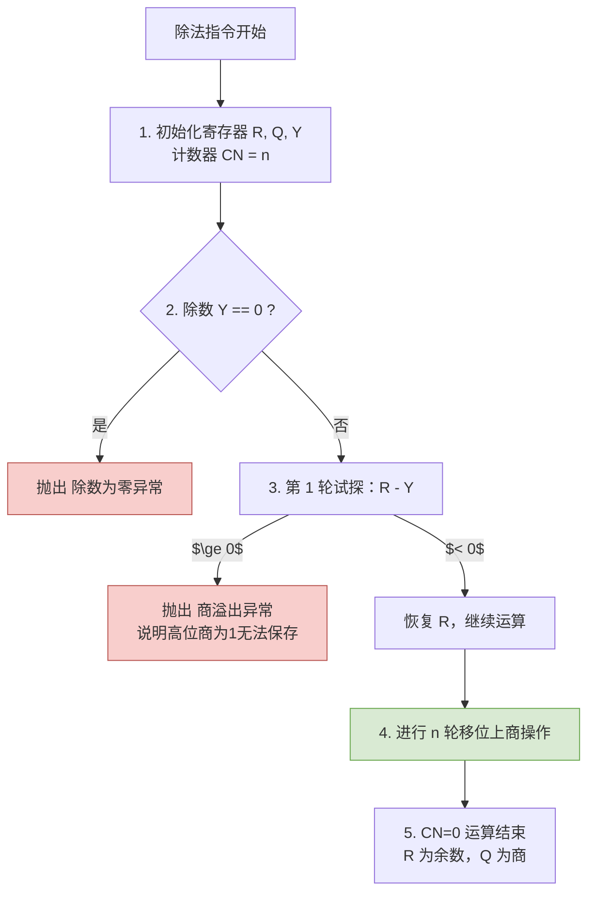

# 计算机组成原理：无符号整数的除法运算

> **导语**
> 除法运算在计算机组成原理中属于难度较高的考点。为了减轻备考负担，本节我们将聚焦于考试中最常考的核心内容：**除法电路的初始状态、结束状态，以及各种除法异常（如除数为 0、商溢出）的判断逻辑**。对于过于复杂的中间运算细节，大家在第一轮复习中只需做大致了解即可。

---

## 一、 二进制无符号除法的手算原理解析

要理解硬件如何做除法，首先要掌握二进制的手算除法。它与十进制手算除法非常相似，都是**“逐位上商，错位相减”**。

### 二进制上商的核心规则：

- **规则极简**：因为是二进制，每一位的商只能是 `0` 或 `1`。
- **判断条件**：对比当前“中间余数”与“除数”的大小。
  - 如果 **中间余数 $\ge$ 除数**：本位上商 `1`，并将中间余数减去除数，末尾再补下一位。
  - 如果 **中间余数 $<$ 除数**：本位上商 `0`，中间余数保持不变，末尾直接补下一位。

_(注：被除数 = 商 $ imes$ 除数 + 余数，这在二进制中同样完全成立)_

---

## 二、 无符号除法电路的核心架构与工作流

为了实现上述手算过程，计算机设计了专门的除法硬件电路。
电路支持 **$2n$ 比特的被除数** 除以 **$n$ 比特的除数**，最终得到 $n$ 比特的商和 $n$ 比特的余数。

### 1. 核心硬件寄存器

- **寄存器 Y ($n$位)**：存放**除数**。
- **寄存器 R ($n$位) + 寄存器 Q ($n$位)**：两者拼接使用，总计 $2n$ 位。
  - **初始状态**：存放**被除数**。
  - **结束状态**：R 存放最终的 **$n$ 位余数**，Q 存放最终的 **$n$ 位商**。
- **ALU (算术逻辑单元)**：负责比较（通过做减法实现）。
- **计数器 CN**：记录循环执行的轮数。

### 2. 运算前：初始化与特殊情况检查（重点必考）

在真正开始一轮一轮的移位上商之前，硬件会做以下准备和检查：

- **数据装载 (以 $n=32$ 为例)**：
  - $32$位除数装入 $Y$。
  - 如果被除数本来只有 $32$ 位（**单精度除法**），需要进行**零扩展**成 $64$ 位：高 $32$ 位全填 `0` 放入 $R$，低 $32$ 位放入 $Q$。
  - 计数器 $CN$ 初始化为 $n$（如 $32$）。
- **异常检查 1：除数为零异常 (Divide-by-Zero)**
  - 控制逻辑检查寄存器 $Y$ 是否为全 `0`。若是，直接触发异常（OS 的除法错异常），停止运算。
- **前置优化：被除数 $<$ 除数**
  - 如果一开始的高 $n$ 位 (寄存器 $R$) 就比除数 $Y$ 小（常见于扩展后的单精度除法），说明商肯定是 `0`，余数就是被除数本身，硬件直接出结果，不再繁琐计算。

### 3. 第一轮运算：商溢出判断（重点必考）

电路总共会进行 $1 + n$ 轮处理。其中第 $1$ 轮最为特殊，专门用于判断**商溢出**。

- **什么是商溢出？**
  $2n$ 位的数除以 $n$ 位的数（**双精度除法**），理论上商最大需要 $2n$ 位来保存。但在很多架构中，硬件强制**只保留低 $n$ 位的商**。如果商的实际有效值超过了 $n$ 位能表示的极限（即最高位溢出了），这就叫商溢出。
  _(💡 思考：$n$ 位除以 $n$ 位的**单精度除法**，商最大也才 $n$ 位，所以**永远不可能发生商溢出**)_
- **硬件如何判断商溢出？**
  - 控制逻辑在第 1 轮让 ALU 计算 `R - Y`。
  - 如果计算结果 **$\ge 0$**：说明这第 1 位的商必须上 `1`。由于这个“最高位的 1”最终会被硬件无情舍弃，保留下来的低 $n$ 位商是错误的，此时硬件判定**发生商溢出异常**，停止运算！
  - 如果计算结果 **$< 0$**：说明第 1 位商是 `0`。由于丢弃前面的 `0` 不影响数值大小，说明后续的 $n$ 位可以完全容纳正确的商，**无商溢出**，继续后续的 $n$ 轮运算。
  - _(注：因为这里试探性地减了 $Y$ 导致 $R$ 变了，如果上商 `0`，硬件还会发指令加上 $Y$，把 $R$ 恢复原状，这被称为**恢复余数法**)_。

### 4. 循环运算阶段 ($n$ 轮)

如果前置检查都没问题，接下来进行 $n$ 轮标准流程（每轮得出商的 1 个比特）：

1.  **左移**：$R$ 和 $Q$ 整体**逻辑左移 1 位**。移出的最高位直接丢弃，空出的最低位准备填入当前求出的“商”。
2.  **试探性相减与上商**：ALU 计算 `R - Y`。
    - 若 $\ge 0$：上商 `1`（填入 $Q$ 的最低位），$R$ 保留减法结果（作为新的中间余数）。
    - 若 $< 0$：上商 `0`（填入 $Q$ 的最低位），并且将 $R$ **加上 $Y$ 恢复原值**。
3.  **计数器衰减**：$CN = CN - 1$。当 $CN = 0$ 时，循环结束。

---

## 三、 本节总结与应试指南

**🎯 考点速记建议（必背）：**

1.  **寄存器分工**：
    - 开始时：被除数存放在 `R + Q`（$2n$ 位，若被除数只有 $n$ 位则高位全补 `0`），除数存在 `Y`。
    - 结束时：**余数在 `R`，商在 `Q`**。
2.  **异常触发条件 (x86统称 除法错异常)**：
    - **除数为零**：$Y = 0$。
    - **商溢出**：只有在 **$2n$ 位除以 $n$ 位**（双精度除法）时可能发生；判定条件是第 1 轮比较时，高 $n$ 位被除数（$R$ 的初始值） $\ge$ 除数 $Y$。**单精度除法绝对不会发生商溢出**。
3.  **运算流向**：先左移，后比较减法，如果上商为 `0` 则需“恢复余数”。（掌握概念即可，极少考复杂的中间推演）。
