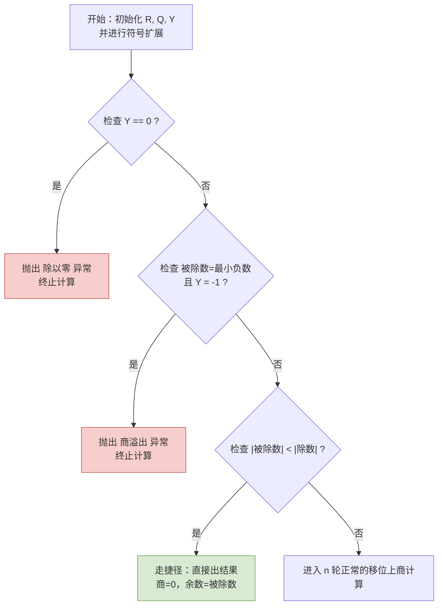

# 计算机组成原理：带符号整数（补码）的除法运算

> **导语**
> 本节课我们将探讨带符号整数（底层表现为补码）的除法运算原理。
> 由于补码除法的底层逐位运算细节极其复杂，且考试性价比不高，我们不建议在第一轮复习中死磕中间的迭代过程。我们将**聚焦于考点**：除法电路的初始状态、结束状态、特殊情况的提前结束，以及两类核心异常（除以 0、商溢出）的硬件判断逻辑。

---

## 一、 补码除法电路的基本结构与特点

补码除法电路的整体结构与无符号整数除法电路非常相似，同样由 **寄存器 R、寄存器 Q、寄存器 Y、ALU 以及控制逻辑（包含计数器 CN）** 组成。

- **硬件分工**：
  - **寄存器 Y ($n$位)**：存放除数。
  - **寄存器 R ($n$位) + 寄存器 Q ($n$位)**：拼接使用，初始存被除数，结束时分别存余数和商。
  - **控制逻辑**：根据符号位的比较决定 ALU 是做加法还是减法。
- **运算支持**：支持 $2n$ 比特的被除数除以 $n$ 比特的除数，最终得到 $n$ 比特的商和余数。
- **核心差异**：控制逻辑在发出加/减控制信号时，依赖的是**余数与除数符号位的比较**（同号相减，异号相加），这比无符号除法复杂得多。

---

## 二、 除法电路的工作流 (以常规例子：$-7 \div 3$ 为例)

假设字长 $n = 4$。$-7$ 的四位补码是 `1001`，$3$ 的四位补码是 `0011`。我们期待的商是 $-2$ (`1110`)，余数是 $-1$ (`1111`)。

### 1. 初始化阶段 (数据装载)

- **除数装载**：将除数 `0011` 放入寄存器 **Y**。
- **被除数装载与符号扩展**：将 $-7$ (`1001`) 放入寄存器 **Q**。因为被除数只有 $n$ 位，必须扩展为 $2n$ 位放到 **R** 和 **Q** 中。
  - **⚠️ 补码扩展规则**：进行**符号扩展**。因为 $-7$ 符号位是 `1`，所以更高位的寄存器 R 全部用 `1` 填满（即 R 初始化为 `1111`，Q 初始化为 `1001`）。
- **计数器初始化**：将 **CN** 置为 $n$（这里是 $4$）。

### 2. 中间迭代阶段 (了解即可)

循环 $n$ 次，每次执行：

1.  **左移**：R 和 Q 整体左移 1 位，最高位丢弃，空出最低位准备上商。
2.  **符号位判断与 ALU 运算**：控制逻辑检查当前余数 R 和除数 Y 的符号位：
    - **符号异号**：执行 **加法** (`R + Y`)。
    - **符号同号**：执行 **减法** (`R - Y`)。
3.  **上商与恢复余数**：根据新老余数符号位是否变化决定上商 0 还是 1，并在符号改变时执行“恢复余数”操作（此处细节极其复杂，考试较少涉及推演）。
4.  **计数器衰减**：CN 减 1。

### 3. 结束阶段 (符号处理)

当 `CN = 0` 时，迭代结束。
此时 R 中保存的是余数（`1111`，即 $-1$）。
**额外处理（极其重要）**：
如果被除数和除数初始是**异号**的，当前 Q 中得到的初步商往往是不对的，硬件控制逻辑会进行最后一步补偿操作——**“取补”**（即全部位按位取反，末位加 1）。最终 Q 才会停留在这个正确的商（`1110`，即 $-2$）上。

---

## 三、 三种特殊情况与异常处理 (高频考点)

在初始化完成之后、正式进入 $n$ 轮循环之前，控制逻辑会做一次全面的“体检”。一旦触发以下三种情况，电路将**跳过全部中间运算**，直接出结果或报错。

### 1. 捷径：被除数绝对值 $<$ 除数绝对值

- **情境**：例如 $3 \div -7$。
- **硬件处理**：控制逻辑一比较，发现被除数太小了，根本不够除。**直接结束运算**。
- **结果**：商直接置为 `0`，余数直接置为**被除数自身**（在这个例子中余数为 3）。这是一种为了提高效率的前置优化。

### 2. 异常 1：除数为零异常 (Divide-by-Zero)

- **情境**：例如 $3 \div 0$。
- **硬件处理**：初始化后，检测到寄存器 Y 全为 `0`。
- **结果**：**立即停止除法运算，抛出除数为零异常**，触发操作系统的异常处理程序。

### 3. 异常 2：商溢出异常 (Overflow)

- **情境**：由于结果只保留 $n$ 比特的商，如果除法算出的商超出了 $n$ 比特补码能表示的范围（对于 4 位，范围是 $-8 \sim +7$），就会发生溢出。
- **补码除法唯一的溢出触发条件**：
  用**绝对值最大的负数**除以 **$-1$**。
  _(例如 4 位补码的 $-8 \div -1$。理论上商应该是 $+8$，但 4 位补码最大只能表示到 $+7$)_。
- **硬件处理**：硬件在初始化时，一旦检测出刚好是被除数为最小负数、除数为全 1（$-1$）的组合，就会**直接抛出商溢出异常，停止计算**。

_(注：在一些架构体系中，除以零和商溢出通常被统称为**“除法错异常”**)_

---

## 四、 本节复习指南

面对带符号数的除法，请牢记以下几点应试策略：

1.  **扩展方式必考**：一定是**符号扩展**，用符号位填满高位寄存器 R。
2.  **溢出条件极简**：补码除法**只有一种**情况会商溢出，那就是 `绝对值最大负数 / -1`。
3.  **异号求商特例**：异号相除时，最后留在 Q 里的那个临时商还要经历最后一次“按位取反加一”的**取补**操作才是最终结果。
