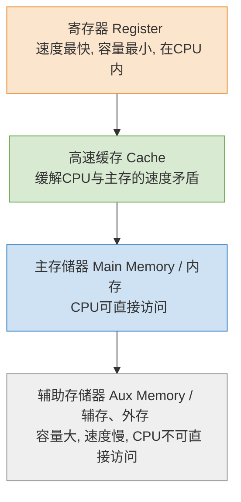

# 计算机组成原理：存储系统基本概念

> **导语**
> 各位同学大家好，从本节开始，我们将进入一个新的章节——**存储系统**。我们将探讨数据在计算机内部是如何存储的，为什么会有内存和硬盘的区别，以及存储器的各种分类方法和衡量性能的核心指标。

---

## 一、 存储器的层次结构

在计算机系统中，存储器被划分为多个层次。总的规律是：**越靠近 CPU 的存储器，速度越快、容量越小、造价越高；越远离 CPU 的存储器，速度越慢、容量越大、造价越低**。

### 1. 核心存储层次解析

- **寄存器 (Register)**：位于 CPU 内部，数量极少（几十个），读写速度极快，用于暂存参与运算的数据。
- **高速缓存 (Cache)**：
  - **作用**：主存的读写速度远跟不上 CPU 的运算速度。为了缓解这种“速度矛盾”，硬件会将频繁访问的代码/数据从主存复制到 Cache 中，供 CPU 快速读取。
  - **透明性**：主存与 Cache 之间的数据交换完全由**硬件自动完成**，对所有软件程序员透明。
- **主存储器 (主存/内存)**：
  - 存放当前正在运行的程序和数据，**CPU 可以直接向主存读写数据**。
- **辅助存储器 (辅存/外存)**：
  - 如磁盘、固态硬盘 (SSD)、U盘等。
  - **重要特性**：**CPU 不能直接与辅存进行数据交互**。辅存中的数据必须先调入主存，才能被 CPU 访问。

### 2. 两个关键的系统机制

- **Cache - 主存层次**：由**硬件**自动实现。主要解决了 **主存与 CPU 速度不匹配** 的问题。
- **主存 - 辅存层次**：由**硬件 + 操作系统**共同实现。它构成了**虚拟存储系统**，在逻辑上扩展了内存的容量，主要解决了 **主存容量不够** 的问题。

---

## 二、 存储器的分类

存储器可以从不同的维度进行分类。

### 1. 按存储介质分类

- **半导体存储器**：使用半导体元器件（如主存、Cache、固态硬盘SSD）。读写速度较快。
- **磁表面存储器**：使用磁性材料（如机械磁盘、磁带、老式软盘）。
- **光存储器**：使用光介质（如 CD、DVD、蓝光光盘）。

### 2. 按存取方式分类 (非常重要)

- **随机存取存储器 (RAM - Random Access Memory)**：
  - 读写任何一个存储单元的时间都是**相同**的，与存储单元的物理位置无关（如内存条）。
- **顺序存取存储器 (SAM - Sequential Access Memory)**：
  - 读写时间取决于存储单元所在的**物理位置**，只能按顺序滑动读取（如磁带）。
- **直接存取存储器 (DAM - Direct Access Memory)**：
  - 介于随机与顺序之间。先随机移动到某个区域，然后在该区域内顺序读取（如机械磁盘，先移动磁头，再等盘片旋转）。
    > _注：SAM 和 DAM 读写时间都与物理位置有关，统称为**串行访问存储器**。_
- **相联存储器 (CAM - Content Addressable Memory)**：
  - **按内容访问**，而不是按地址访问。给出想要查找的内容，硬件自动检索位置（如快表 TLB）。

### 3. 按信息的可更改性分类

- **读写存储器 (RAM/磁盘等)**：可读可写。
- **只读存储器 (ROM - Read Only Memory)**：
  - 通常只能读不能写，存放不常更改的数据（如主板上的 BIOS 程序、发行的音乐 CD）。
  - _注：现代很多 ROM 借助特殊手段也可擦除重写。_

### 4. 按信息的可保存性分类

- **易失性存储器**：断电后，存储的信息会**消失**（如主存、Cache）。
- **非易失性存储器**：断电后，信息**依然保存**（如磁盘、固态硬盘、光盘）。
- **破坏性读出**：读出信息后，原数据被破坏，必须立刻进行重写（如 DRAM）。
- **非破坏性读出**：读出信息后，原数据不被破坏（如 SRAM、磁盘）。

---

## 三、 存储器的性能指标

衡量存储器性能好坏的三个核心指标：

### 1. 存储容量

- **公式**：`存储容量 = 存储字数 × 存储字长`
- 结合第一章知识：
  - MAR 的位数反映了存储字数。
  - MDR 的位数反映了存储字长。

### 2. 单位成本

- 即每一个比特 (bit) 位所需要付出的金钱成本。
- **公式**：`单位成本 = 总价格 / 总容量(比特数)`

### 3. 数据传输率 (存储速度 / 主存带宽)

表示每秒从主存进出信息的最大数量。单位常为 字/秒、字节/秒(B/s) 或 位/秒(b/s)。

- **公式**：`数据传输率 (主存带宽) = 存储数据的宽度(存储字长) / 存取周期`

> ⚠️ **核心易错点：存取时间 vs 存取周期**
>
> - **存取时间 ($T_A$)**：单独进行一次完整读或写操作所需要的时间。
> - **存取周期 ($T_M$)**：连续进行两次读/写操作之间，所必须要求的**最短时间间隔**。
>
> 在一次存取完成后，存储器需要一段**恢复时间**才能进行下一次操作。
> 因此：**`存取周期 = 存取时间 + 恢复时间`**。
> 计算数据传输率时，分母必须使用**存取周期**，而不是存取时间。

```mermaid
gantt
    title 存储周期 (TM) 的组成
    dateFormat  s
    axisFormat %S
    section 连续两次操作
    第 1 次存取时间 (TA)       :a1, 0, 3s
    恢复时间                   :a2, after a1, 2s
    第 2 次存取时间 (TA)       :a3, after a2, 3s

    %% 注：TA + 恢复时间 = 一个完整的 TM
```

