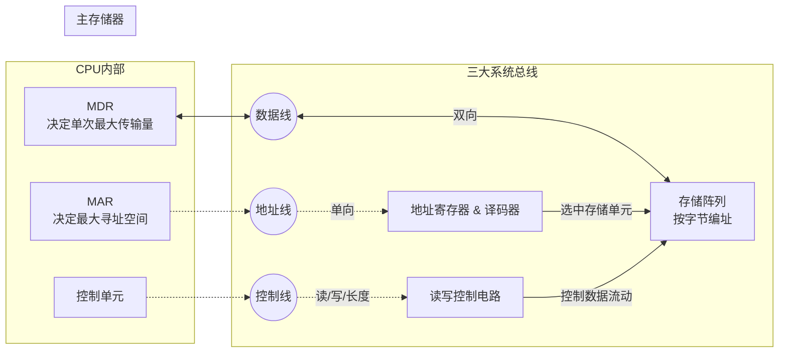

# 计算机组成原理：主存储器的基本组成与基本操作

> **导语**
> 本节课我们将探讨**主存储器（主存/内存）的基本组成结构**，以及 CPU 如何通过硬件线路对主存进行**读操作**和**写操作**。我们将深入解析地址线、数据线、控制线的分工，以及 CPU 内部的两个关键寄存器：MAR 和 MDR。

---

## 一、 主存储器的基本组成结构

主存与 CPU 之间主要通过**三组总线（线路）**进行连接和数据交互。

### 1. 核心硬件：三组连线

- **地址线 (Address Bus)**：**单向**（CPU $\rightarrow$ 主存）。用于传输 CPU 想要访问的主存单元地址。
- **数据线 (Data Bus)**：**双向**（CPU $\leftrightarrow$ 主存）。用于在 CPU 和主存之间传输实际的二进制数据。
- **控制线 (Control Bus)**：**单向**为主（CPU $\rightarrow$ 主存）。用于传输 CPU 发出的控制命令（如：读信号、写信号、指明本次传输的字节数等）。

### 2. 主存内部结构：存储阵列与地址编排

主存的内部核心是**存储矩阵（存储阵列/存储体）**，用于存放大量的二进制数据。

- **存储单元**：存储阵列被划分为许多个“存储单元”。
- **存储元 (记忆单元/位元)**：每个存储单元内部包含多个存储元，**每个存储元只能稳定存储 1 个比特（0 或 1）**。
- **编址单位 (按字节编址)**：为了让 CPU 能准确找到数据，每个存储单元都会分配一个独立的编号（即**地址**）。
  - 现代计算机普遍采用**按字节编址**。即 1 个地址对应 1 个字节（8 个比特 / 8 个存储元）。
  - _(注：部分特殊科学计算机会采用按字编址，如 1 个地址对应 64 比特。考试默认按字节编址。)_

### 3. CPU 端的核心接口：MAR 与 MDR

为了与主存配合完成读写，CPU 内部设置了两个至关重要的寄存器：

- **MAR (Memory Address Register) - 主存地址寄存器**：
  - **作用**：存放 CPU 接下来准备访问（读/写）的主存地址。
  - **宽度意义**：**MAR 的位数 = 地址线的位数**。它决定了 CPU **最大能支持的寻址范围（最大支持多大容量的内存）**。
  - _例如：若 MAR 为 36 位，则最大寻址范围是 $2^{36}$ 个字节，即最大支持 64GB 内存。想装 128GB 内存硬件也认不出来。_
- **MDR (Memory Data Register) - 主存数据寄存器**：
  - **作用**：作为数据交互的中转站。要写给主存的数据先放这，从主存读回的数据也先放这。
  - **宽度意义**：**MDR 的位数 = 数据线的位数**。它决定了 CPU 与主存**一次读写操作最大能传输的数据量**。
  - _例如：若数据线和 MDR 为 64 位，则一次最多传输 8 个字节（64 比特）。_

---

## 二、 访问主存的基本操作

无论是读主存还是写主存，CPU 操作的第一步永远是“送地址”。

### 1. 读主存操作 (取数)

假设指令要求从地址 `0001` 读取 8 个字节的数据：

1.  **送地址**：CPU 将地址 `0001` 写入 **MAR** 寄存器。该地址通过**地址线**传给主存的地址寄存器。
2.  **地址译码**：主存内部的“地址译码器”解析该地址，选中对应的行（存储单元）。
3.  **发控制信号**：CPU 通过**控制线**向主存的控制电路发出**“读 (Read)”**命令，并指明本次读取的数据长度（8 字节）。
4.  **数据传输**：主存读写控制电路开始工作，将选中的 8 字节数据通过 64 根**数据线**，传回 CPU 并存入 **MDR** 寄存器。读取完成。

### 2. 写主存操作 (存数)

假设指令要求往地址 `0001` 写入 1 个字节的数据 `11110000`：

1.  **送地址**：CPU 将地址 `0001` 写入 **MAR** 寄存器，通过**地址线**送往主存。地址译码器选中对应存储单元。
2.  **准备数据并发送**：CPU 将要写入的数据 `11110000` 先存入 **MDR** 寄存器。
3.  **发控制信号**：CPU 通过**控制线**发出**“写 (Write)”**命令，并指明本次只写入 1 个字节。
4.  **数据传输与写入**：MDR 中的那 1 个有效字节的数据通过**数据线**流向主存，并在控制电路的管理下，成功覆盖写入到刚才选中的地址单元中。写入完成。

---

## 三、 知识流向与核心考点总结

**🎯 核心考点速记：**

1.  **MAR 的位数** 决定了计算机**最大支持的物理内存容量**。
2.  **MDR 的位数** 决定了单次读写的**数据吞吐量上限**。
3.  **现代计算机默认“按字节编址”**，即 1 个地址门牌号，对应房间里有 8 个位元（1 字节）。
4.  操作顺序不可乱：无论是读还是写，**地址一定最先准备好并发送**，随后才是控制信号和数据传输。
