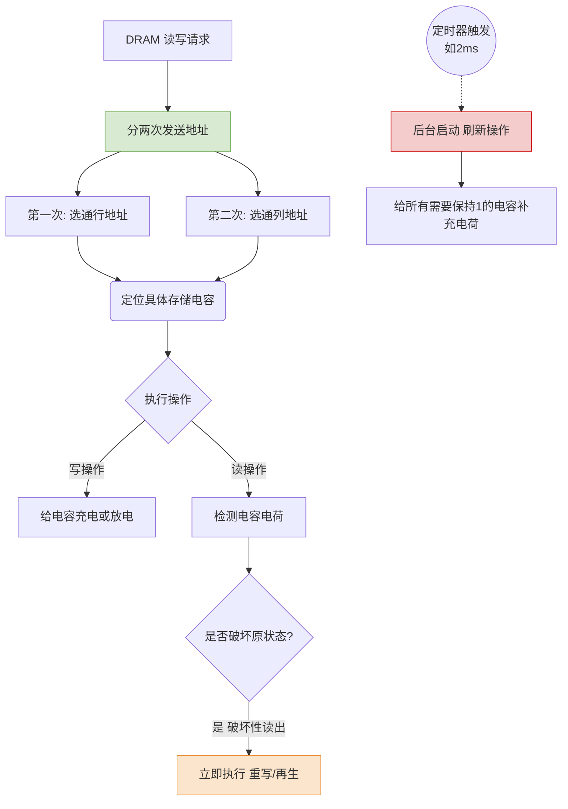

# 计算机组成原理：SRAM 与 DRAM 的区别详解

> **导语**
> 本节课我们要探讨 SRAM (静态 RAM) 和 DRAM (动态 RAM) 的核心区别。二者都属于随机访问存储器 (RAM)。我们将从它们的物理存储元件出发，理解它们在速度、容量、成本以及引脚设计（重点考点）上的巨大差异。

---

## 一、 SRAM 与 DRAM 核心特性对比速查表 (核心考点)

这是本节课最重要的总结，考试中常以概念选择题形式出现：

| 特性对比         | SRAM (静态 RAM)                   | DRAM (动态 RAM)                            |
| :--------------- | :-------------------------------- | :----------------------------------------- |
| **存储元件**     | **双稳态触发器** (通常6个MOS管)   | **栅极电容** (1个MOS管+1个电容)            |
| **读出方式**     | **非破坏性读出**                  | **破坏性读出** (读出后需“重写/再生”)       |
| **是否需要刷新** | **不需要** (持续供电即可维持稳态) | **需要动态刷新** (电容会漏电，如每2ms刷新) |
| **地址引脚**     | **不复用** (行列地址同时送入)     | **地址引脚复用** (行列地址分两次送入)      |
| **运行速度**     | 快                                | 慢                                         |
| **集成度**       | 低 (元件复杂，体积大)             | 高 (元件简单，单比特面积小)                |
| **发热/功耗**    | 高                                | 低                                         |
| **制造成本**     | 高                                | 低                                         |
| **主要用途**     | **高速缓存 (Cache, TLB)**         | **主存 (内存条)**                          |

---

## 二、 存储元件与读写原理解析

为什么会有上述表格中的差异？这要归结于它们存储 1 比特 ($0$ 或 $1$) 的底层物理器件不同。

### 1. DRAM：栅极电容

- **原理**：利用**电容**存储电荷来表示比特 `1`（有电荷）或 `0`（无电荷），加上 1 个 MOS 管作为控制开关。
- **破坏性读出与重写**：当读出 `1` 时，电容会放电。这意味着原本存的 `1` 读完后变成了 `0`（被破坏了）。因此，DRAM 每次读出 `1` 后，硬件必须立刻进行**重写 (再生)** 操作，把电充回去。
- **动态刷新**：电容即使不读写也会自然漏电。如果不加以干预，时间一长原本存的 `1` 就会因为电量流失变成 `0`。因此，必须**定时（如每 2ms）给电容充电**，这个过程称为**刷新**。

### 2. SRAM：双稳态触发器

- **原理**：由 6 个 MOS 管组成复杂的触发器电路，拥有 $A$ 高 $B$ 低 或 $A$ 低 $B$ 高 两个稳定的电压状态，分别代表 `1` 和 `0`。
- **非破坏性读出**：只要外部 $V_{dd}$ 持续供电，双稳态就能一直保持，读出数据只是检测电势差，不会破坏原有状态，**不需要重写**。
- **无需刷新**：因为没有电容漏电的问题，只要不断电，状态永不丢失，**不需要定时刷新**。

---

## 三、 地址引脚复用技术与容量计算 (必考题型)

在考试中，经常给出芯片容量（如 $4M \times 8$位），要求计算引脚数量。

### 1. 芯片容量表示法：$M \times N$

- **前面的数字（如 $4M$）**：表示存储单元的数量，决定了**地址线的位数**（$4M = 2^{22}$，需要 22 位逻辑地址）。
- **后面的数字（如 $\times 8$）**：表示每个地址对应多少个比特，决定了**数据引脚的数量**（需要 8 个数据引脚）。

### 2. SRAM 与 DRAM 的引脚设计差异

- **SRAM (追求极致速度)**：
  地址不复用。22 位的地址需要 **22 个独立的地址引脚**，一次性全部送入芯片。
- **DRAM (追求小体积、大容量)**：
  采用**地址引脚复用技术**。将 22 位地址平分为两半：11位行地址 + 11位列地址。通过同一个接口**分两次**送入。因此，只需要 **11 个地址引脚**。

### 3. 真题实战模拟 (2014年第15题改编)

> **题目**：假设有一块 $4M \times 8$ 位的芯片，请问如果是 DRAM 芯片，其数据和地址引脚总数是多少？如果是 SRAM 芯片呢？

**解析：**

- **共性分析**：$4M = 2^{22}$，逻辑地址位数为 22 位；数据位数为 8 位，所以数据引脚始终是 **8 个**。
- **DRAM 引脚计算**：
  - 采用地址复用，地址引脚数 = $22 / 2 = 11$ 个。
  - 引脚总数 = $11$ (地址) $+ 8$ (数据) = **19 个**。
- **SRAM 引脚计算**：
  - 不采用地址复用，地址引脚数 = 22 个。
  - 引脚总数 = $22$ (地址) $+ 8$ (数据) = **30 个**。

---

## 四、 核心流向图：DRAM 寻址与刷新机制

