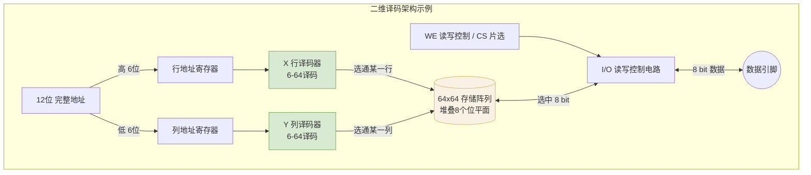

# 计算机组成原理：存储器芯片的组成结构

> **导语**
> 本节课探讨存储器芯片（SRAM/DRAM）的内部组成结构。我们将深入解析存储矩阵、行列地址译码器、读写与片选控制信号的工作原理，并对比一维译码与二维译码的优缺点，掌握芯片容量扩展的基本思路。

---

## 一、 存储矩阵与位平面原理

无论是 SRAM 还是 DRAM，其核心都是存储矩阵（存储体）。以一个 $4K \times 8$ 位的存储芯片为例（共 4096 个地址，每个地址存 8 比特）：

### 1. 位平面 (Bit Plane) 结构

- **矩阵排列**：4096 个存储元并非排成一条直线，而是通常排列成一个二维的规则矩形矩阵。例如，排成 **64 行 $\times$ 64 列**，这样就可以用 $(x, y)$ 坐标（行号和列号）精确定位到一个比特。
- **存储元件**：在这个 $64 \times 64$ 的小格子中，如果要造 SRAM，就塞入双稳态触发器；要造 DRAM，就塞入栅极电容。
- **灵活的矩阵规格**：只要总数等于 4096，位平面也可以设计成 $32 \times 128$ 等其他矩形规格，这会直接影响行列地址的分配比例。

### 2. 存储字长扩展 (多平面堆叠)

- **立体堆叠**：单个位平面一次只能读写 1 个比特。为了实现每次读写 8 个比特（字长为 8），芯片内部会在 Z 轴方向堆叠 **8 个规格完全相同**的位平面。
- **超元 (Super Cell)**：当给定一组 (行号, 列号) 时，8 个位平面在同一位置的 8 个“位元”被同时选中，这就形成了一个 8 比特的“超元”，实现了对应一个地址的 8 比特数据读写。

---

## 二、 地址译码机制

当 CPU 给出 12 比特的地址（能寻址 $2^{12} = 4096$ 个单元）时，芯片内部如何找到对应的存储单元？

### 1. 行列地址拆分 (二维译码)

为了匹配 $64 \times 64$ 的存储矩阵，12 比特的完整地址会被拆分为两半：

- **行地址 (高 6 位)**：如 $A_6 \sim A_{11}$，送到**行地址译码器 (X 译码器)**。
- **列地址 (低 6 位)**：如 $A_0 \sim A_5$，送到**列地址译码器 (Y 译码器)**。
  _(注：将高位分配给行、低位分配给列，更符合 DRAM 芯片的惯例)_

### 2. 译码与驱动过程

- **译码输出**：6 比特的输入可以对应 $2^6 = 64$ 种状态。译码器会有 64 根输出线。根据输入的 6 位二进制数（如 `000001`），只有编号为 1 的那一根输出线会产生**有效高电平**，其余 63 根均为低电平。
- **驱动放大**：有效信号经过“驱动器”放大电流后，即可激活对应的那一整行（或一整列）的存储元。
- **行列交汇**：被激活的行与被激活的列在矩阵中的**交汇点**，就是本次要读写的存储单元（如果是 8 层堆叠，则交汇出 8 个比特）。

---

## 三、 核心控制信号：读写与片选

芯片的引脚除了地址线和数据线，还有重要的控制线。信号名称上方若带有横线（如 $\overline{WE}$），代表**低电平有效 (Active Low)**。

### 1. 读写控制信号 (WE / Write Enable)

决定当前进行的是读操作还是写操作，控制数据流经 I/O 电路的方向。

- **$\overline{WE} = 0$ (低电平)**：允许写入 (Write)。数据引脚输入的二进制电信号被写入到选中的存储单元。
- **$\overline{WE} = 1$ (高电平)**：允许读取 (Read)。选中存储单元的数据经过输出驱动电路放大后，从数据引脚送出。

### 2. 片选信号 (CS / Chip Select)

用于控制当前芯片是否被“激活”。只有当片选信号有效时，该芯片才能被读写。常用于**字向扩展（扩展存储容量）**。

**【案例】利用 CS 信号将 4 块 $4K \times 8$位 芯片组成 $16K \times 8$位 存储器：**

- **总地址线需求**：$16K = 2^{14}$，共需 14 位地址线。
- **片内地址**：低 12 位直接连到 4 块芯片的地址引脚，用于在每个芯片内部寻址（$4K$）。
- **片选逻辑**：最高 2 位地址连接一个 **2-4 译码器**。
  - `00`：选中第 1 块芯片（激活其 CS 引脚）
  - `01`：选中第 2 块芯片
  - `10`：选中第 3 块芯片
  - `11`：选中第 4 块芯片
- **结果**：通过不同的高 2 位地址，完美错开了 4 块芯片的工作区间，实现了容量翻倍。

---

## 四、 译码方式分类：一维译码 vs 二维译码

| 译码方式                   | 核心原理                                                                       | 译码器输出线数量 ($4K$ 地址为例)                                 | 优缺点分析                                                                                                      | 主要适用场景       |
| :------------------------- | :----------------------------------------------------------------------------- | :--------------------------------------------------------------- | :-------------------------------------------------------------------------------------------------------------- | :----------------- |
| **一维译码 (单译码法)** | 将整个地址 (如 12位) 只作为一个维度。存储阵列排成 4096 行 $\times$ 1 列。      | 仅需 1 个译码器：输入 12 位，输出 **4096 根线**。                | **缺点**：译码器输出线路极多，布线困难，芯片形状细长不合理。 **优点**：逻辑简单。                            | 小容量的 SRAM 芯片 |
| **二维译码 (双译码法)** | 将地址拆分为行地址与列地址 (如 6位 + 6位)。存储阵列排成 64 行 $\times$ 64 列。 | 需 2 个译码器：分别输入 6 位，各自输出 **64 根线** (共 128 根)。 | **优点**：大幅减少译码线数量 (从 4096 降至 128)，利于高集成度，矩阵通常呈方形。 **缺点**：需要双路译码配合。 | 大容量的 DRAM/SRAM |

