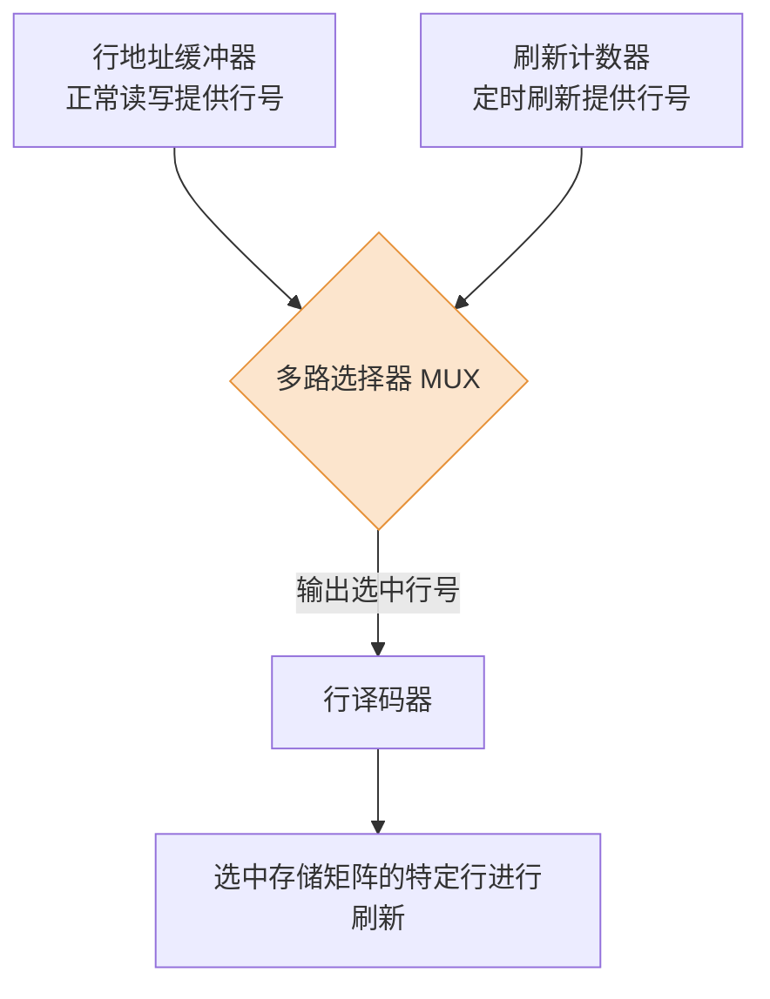
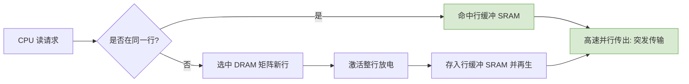

# 计算机组成原理：DRAM 芯片的关键技术

> **导语**
> 本节课深入探讨 DRAM（动态随机存取存储器）芯片的三大核心关键技术：地址引脚复用技术、刷新与再生机制、行缓冲机制。这些技术旨在解决 DRAM 体积控制、电容漏电以及连续读写速度慢等物理特性带来的问题，是考研中的高频考点。

---

## 一、 地址引脚复用技术

DRAM 芯片通常拥有较大的存储容量，如果采用传统的地址引脚设计，会导致芯片引脚数量过多、体积庞大。为了控制芯片体积，DRAM 引入了**地址引脚复用技术**。

### 1. 技术原理

将完整的 $N$ 比特内部地址，拆分为**行地址**和**列地址**两部分，通过同一组地址引脚**分两次先后送入**芯片内部。

- **行地址选通信号 ($\overline{RAS}$)**：Row Address Strobe。低电平有效时，表示当前地址引脚上传输的是行地址，存入行地址缓冲器。
- **列地址选通信号 ($\overline{CAS}$)**：Column Address Strobe。低电平有效时，表示当前地址引脚上传输的是列地址，存入列地址缓冲器。

### 2. DRAM 与 SRAM 的引脚数量对比

以容量为 $4M \times 4$ 位 的芯片为例（共 $2^{22}$ 个存储单元，需 $22$ 位地址线，数据线 $4$ 位）：

| 芯片类型 | 地址输入方式          | 地址引脚数             | 数据引脚数 |
| :------- | :-------------------- | :--------------------- | :--------- |
| **DRAM** | 行列复用 (分两批送入) | **$11$ 根** ($22 / 2$) | $4$ 根     |
| **SRAM** | 同时送入 (不复用)     | **$22$ 根**            | $4$ 根     |

> **⚠️ 考点提示**：在真题中，只要看到“DRAM 芯片”，必须**默认其采用了地址引脚复用技术**。计算引脚总数时，地址引脚数通常为总地址位数的一半（向上取整）。

---

## 二、 刷新机制与再生 (重写)

DRAM 的存储元基于**栅极电容**，电荷会随时间自然泄漏。若不干预，代表 `1` 的电荷漏光后会被误判为 `0`。

### 1. 定时刷新 (Refresh)

- **刷新周期**：电容信息不失真的最长时间上限（例如 $64ms$）。必须在此周期内对所有电容“补电”。
- **刷新单位**：**按行进行**。每次刷新操作会选中一整行，将其所有存储元的电荷恢复。
- **硬件支持**：DRAM 内部配有**刷新计数器**和**多路选择器 (MUX)**。
  - **刷新计数器**：定时自动加一，提供当前需要刷新的行号。
  - **MUX 作用**：在正常读写时，MUX 选通行地址缓冲器传来的行号；在刷新时，MUX 切换并选通刷新计数器传来的行号。

### 2. 破坏性读出与再生 (重写)

- **原理**：读取某个存储元时，MOS 管导通，电容放电以产生检测电流，这会**破坏**原本存储的电荷（读完 `1` 就变成了 `0`）。
- **再生动作**：读操作完成后，硬件必须立即将读出的数据**重写**回电容中。
- **联动效应**：读取给定行列坐标的单元时，该行所有存储元的 MOS 管都会被同时导通。因此，**再生操作必须是以“一整行”为单位进行的**。这也导致了 DRAM 的存取周期明显长于 SRAM。

### 3. 存储矩阵行列规格的权衡 (真题核心考点)

设计 DRAM 矩阵时，行数和列数的分配需要综合考虑两个因素：

1.  **地址引脚数最少**：行、列位数应尽可能接近（甚至相等）。
2.  **刷新开销最低**：每刷新一行需消耗一个存取周期。**行数越少，刷新开销越低**。

_(例如，在 $2K \times 2K$ 与 $4K \times 1K$ 的规格中，$2K \times 2K$ 既保证了地址引脚数最少（11根），又使得行数相对较少，平衡了引脚与刷新开销。)_

---

## 三、 行缓冲机制 (Row Buffer) 与突发传输

程序运行具有**空间局部性**（如遍历数组、顺序执行指令），CPU 极大概率会连续访问物理地址相邻的存储单元。

### 1. 机制原理

既然 DRAM 每次读操作都会激活并破坏**一整行**的数据，并触发整行再生，硬件干脆在再生的同时，将这一整行的数据（例如 $64 \times 8$ bit）缓存到一个内部的 **SRAM 行缓冲器** 中。

### 2. 核心优势：支持突发传输 (Burst Transfer)

- **速度差异**：SRAM 的读写速度远超 DRAM 矩阵本身。
- **突发传输**：如果 CPU 接下来要读取的地址刚好在同一行内（命中行缓冲），数据就可以直接从高速的 SRAM 行缓冲器中通过数据线快速传出。
- **应用场景**：这使得 DRAM 能够以每个总线时钟周期读出一个数据的极快速度连续工作，这也是现代 Cache 与主存（DRAM）之间进行“数据块交换”的核心底层支撑技术。

