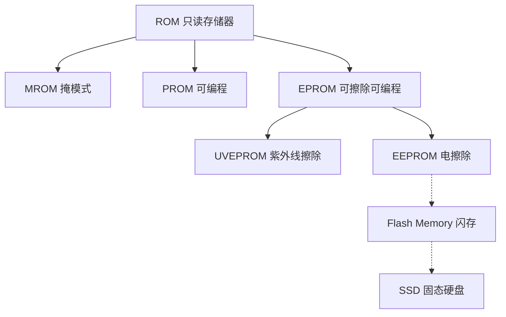
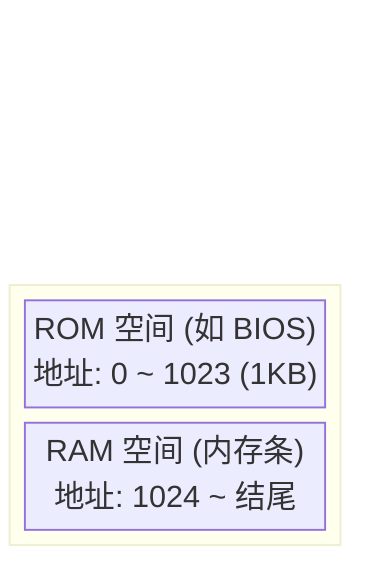

# 计算机组成原理：只读存储器 (ROM) 的特性与分类

> **导语**
> 前面我们学习了 RAM（随机存取存储器），它速度快但属于**易失性存储器**（断电数据丢失）。但在实际应用中，许多数据在断电后仍需保存。本节课我们将探讨几种非易失性的 **ROM（只读存储器）** 芯片，了解它们的发展历程、特性，以及主板 BIOS 与主存的逻辑关系。

---

## 一、 ROM 芯片的演进与分类

所有的 ROM 芯片都有一个共同的底层特性：**非易失性（断电后数据不丢失）**。
随着技术的发展，ROM 的灵活性不断提高。

### 1. MROM (Mask Read-Only Memory) - 掩模式只读存储器

- **写入方式**：由**厂家**在生产芯片时，使用掩膜技术直接将数据写入。
- **特性**：任何人以后都无法重写，是纯粹意义上的“只读”存储器。
- **优缺点**：可靠性极高，但灵活性极差，生产周期长。
- **适用场景**：仅适合大批量定制生产。

### 2. PROM (Programmable ROM) - 可编程只读存储器

- **写入方式**：用户购买空白芯片后，可以使用专门的 PROM 写入器自行写入数据。
- **特性**：**只能写入一次**，写入后不可更改，成为纯粹的只读存储器。
- **优点**：相比 MROM，大大增加了灵活性，支持用户个性化定制。

### 3. EPROM (Erasable Programmable ROM) - 可擦除可编程只读存储器

用户不仅可以写入数据，还可以通过特殊手段**擦除数据并重复写入**。根据擦除手段的不同，分为两类：

- **UVEPROM (Ultraviolet EPROM)**：
  - **擦除方法**：使用紫外线照射芯片上的石英窗口 8~20 分钟进行擦除。
  - **缺点**：只能**全盘擦除**（擦除所有信息），无法选择性擦除部分数据，灵活性仍有不足。
- **EEPROM / $E^2PROM$ (Electrically EPROM)**：
  - **擦除方法**：使用**电擦除**。
  - **优点**：支持**擦除特定的字**，修改数据更加精细和方便。

---

## 二、 Flash Memory (闪存) 与 固态硬盘 (SSD)

### 1. 闪速存储器 (Flash Memory)

Flash Memory 是在 EEPROM 基础上发展而来的技术，如常见的 U盘、SD 卡。

- **核心特性**：
  - 保留了 EEPROM 断电不丢失的优点，且支持多次、快速的擦除和重写。
  - **写入机制（重点）**：写入数据前**必须先进行电擦除**。
  - **读写速度差异**：由于写前必擦除，通常**写速度比读速度慢**。
- **高集成度优势**：Flash 的每个存储元仅需**单个 MOS 管**，体积远小于 RAM 的存储元。因此其**位密度极高**（同等体积下能保存更多的二进制位），集成度高，很容易实现大容量（如 64GB, 128GB）。
- _(拓展)_ 手机中的“ROM”通常指的就是高集成度、低功耗的 Flash 芯片（作为辅存）。手机参数中的 `8GB RAM + 256GB ROM`，RAM 指内存，ROM 指辅存。

### 2. 固态硬盘 (SSD - Solid State Drive)

- **组成**：**Flash 存储芯片** (作为存储介质) + **专门的控制单元** (控制多块芯片的读写)。
- **特性**：读写速度快，功耗低，支持多次快速擦除重写。
- **应用局限**：因造价高于传统机械硬盘，目前在对成本极其敏感的云存储数据中心（如百度云）仍大量使用机械硬盘。

---

## 三、 主存的逻辑组成与统一编址

### 1. 为什么需要 BIOS ROM？

RAM 是易失性的，计算机断电关机后，主存（RAM）中的数据全部清空。
当计算机重新开机时，CPU 内部没有指令，无法运行。此时，CPU 必须从主板上的一块特殊的 ROM 芯片——**BIOS 芯片 (Basic Input/Output System)** 中读取指令。

- **自举装入程序 (Bootstrap Program)**：BIOS 中存放的程序。
- **作用**：指引 CPU 控制 I/O 系统，将辅存（硬盘）中的操作系统相关数据调入主存（RAM）中，完成系统的启动。

### 2. 主存的逻辑组成 (统一编址)

在计算机组成原理的逻辑概念中，**完整的主存 = RAM (内存条) + ROM (BIOS 芯片)**。

CPU 通常会对 RAM 和 ROM 进行**统一编址**，将它们划入同一个地址空间。

_如上图示例：假设 BIOS 容量为 1KB，CPU 会将地址 `0 ~ 1023` 分配给 ROM 芯片；而 RAM 芯片（内存条）的物理地址则从 `1024` 开始往后编号。_

---

## 四、 本节核心总结与易错点

1.  **名称的迷惑性**：
    虽然 ROM 的全称是 Read-Only Memory（只读存储器），但随着技术演进，后期的 ROM（如 EPROM、Flash 闪存、SSD）**实际上都是可读可写的**。
2.  **读写速度的非对称性**：
    对于 Flash 等可重写 ROM，由于写入前需要先擦除原有数据，因此其**写速度通常慢于读速度**。
3.  **ROM 的存取方式（易错考点）**：
    **ROM 同样具有“随机存取”的特性**！
    给出一个目标地址，ROM 访问该存储单元的速度与该地址的物理位置无关。因此，**ROM 和 RAM 在“支持随机存取”这一点上是相同的**，不要因为名称对立就误以为 ROM 不是随机存取的。
