# 计算机组成原理：主存的优化技术（双端口RAM与多模块存储器）

> **导语**
> 本节课我们要探讨如何优化主存的读写速度。DRAM 芯片在每次存取后都需要一段较长的“恢复时间”（如 $T = 4r$），这严重制约了高速 CPU 的发挥。我们将学习两种核心优化技术：用于解决多核 CPU 访问冲突的**双端口 RAM**，以及利用流水线思想大幅提升带宽的**多模块存储器（多体交叉编址）**。

---

## 一、 存取周期与速度瓶颈

在探讨优化之前，先复习一个核心概念：**存取周期 ($T$)** 与 **存取时间 ($r$)**。

- **存取时间 ($r$)**：CPU 从内存中读出一个字实际花费的时间。
- **存取周期 ($T$)**：连续两次独立读写操作之间所需的最短时间间隔。
  由于 DRAM 是破坏性读出，读后必须重写（再生），因此需要较长的恢复时间。通常 **存取周期 = 存取时间 + 恢复时间**。
  例如：假设 $T = 4r$，意味着 CPU 花 $r$ 时间读完数据后，必须“干等” $3r$ 的时间让主存恢复，才能进行下一次读取。这就导致了严重的性能瓶颈。

---

## 二、 双端口 RAM (Dual-Port RAM)

**应用场景**：多核 CPU 同时访问同一根内存条。

### 1. 硬件结构

双端口 RAM 拥有两套完全独立的**数据总线、地址总线和控制总线**，允许两个 CPU 核心通过两个不同的端口并行地访问内存。

### 2. 读写冲突与控制逻辑 (类似操作系统“读者-写者”问题)

当两个 CPU 核心并行访问时，控制逻辑必须进行安全审查：

- ✅ **允许并行**：
  1.  同时访问**不同**的地址单元（无论读写）。
  2.  同时对**同一个**地址单元进行**读**操作（读不改变数据，安全）。
- ❌ **禁止并行（硬件会发送 Busy 信号，阻塞其中一个端口）**：
  1.  同时对**同一个**地址单元进行**写**操作（会导致数据相互覆盖）。
  2.  同时对**同一个**地址单元，一个执行**读**，另一个执行**写**（会导致读出错误或过期的数据）。

---

## 三、 多模块存储器 (Multi-Module Memory)

**应用场景**：解决单个 CPU 连续访存时需要等待恢复时间的问题，大幅提升主存吞吐量（带宽）。
可以简单理解为在主板上插了多根相同规格的内存条，并将它们“拼”在一起使用。

### 1. 高位交叉编址 (顺序方式)

- **原理**：使用主存地址的**高位比特**来区分不同的存储体 (模块)。
- **编址特点**：模块内部地址连续。即先存满第 1 块内存条，再存第 2 块。
- **性能分析**：如果 CPU 连续访问相邻的地址（如数组），这些地址大概率都落在同一个存储体中。CPU 读完一个数据后，仍需等待该存储体恢复 ($3r$ 时间)，**无法实现流水线加速**。
- **结论**：高位交叉编址仅仅是单纯地**扩充了容量**，对连续访存速度没有实质性提升。

### 2. 低位交叉编址 (交叉方式) —— 核心考点

- **原理**：使用主存地址的**低位比特**来区分不同的存储体。
- **编址特点**：连续的地址**交错分布**在不同的存储体中（如地址 0 在体0，地址 1 在体1...）。
- **性能分析 (流水线存取)**：
  当 CPU 连续访问相邻地址时，由于地址分布在不同的存储体，CPU 可以在体0 恢复期间，无缝衔接去读体1，接着读体2... 完美利用了恢复时间的空当，形成了**存取流水线**。
- **时间计算公式**：
  假设有 $m$ 个存储体，存取时间为 $r$，存取周期为 $T$。
  连续读取 $n$ 个字的总耗时 = **$T + (n - 1) 	imes r$**
  _(第一字耗时 $T$，后续每个字由于流水线只需 $r$)_。
  在宏观上（$n$ 趋于无穷大），每读取一个字的平均时间几乎就是 $r$。带宽提升了近 $m$ 倍！

```mermaid
gantt
    title 低位交叉编址 (4体) 连续读取流水线示例
    dateFormat  s
    axisFormat %S

    section 存储体 M0 (地址0,4,8...)
    读字1 (r)       :a1, 0, 1s
    恢复时间 (3r)   :a2, after a1, 3s
    读字5 (r)       :a3, after a2, 1s

    section 存储体 M1 (地址1,5,9...)
    读字2 (r)       :b1, 1, 1s
    恢复时间 (3r)   :b2, after b1, 3s
    读字6 (r)       :b3, after b2, 1s

    section 存储体 M2 (地址2,6,10...)
    读字3 (r)       :c1, 2, 1s
    恢复时间 (3r)   :c2, after c1, 3s

    section 存储体 M3 (地址3,7,11...)
    读字4 (r)       :d1, 3, 1s
    恢复时间 (3r)   :d2, after d1, 3s

    %% 注：横轴代表时间(r)，可见CPU每隔1个r就能取到一个字，无需等待3r。
```

### 3. 合理的存储体数量 ($m$)

为了保证流水线“不断流”且不造成硬件闲置浪费，存储体数量 $m$ 应该满足：
**$m \ge T / r$**
_(最佳取值即为 $m = T / r$)_。

### 4. 单体多字存储器

- **原理**：只有一个存储体，但总线宽度加倍，一次读出一整行（多个字）。
- **优缺点**：同样能提升带宽，但灵活性差。如果只需要读其中 1 个字，也必须把同行的其他字一并读出，可能产生冗余。不及多体并行存储器灵活。

---

## 四、 实用拓展：电脑“双通道内存”的奥秘

我们常听说的“组建双通道内存能大幅提升游戏帧数”，其底层原理正是**低位交叉的多体并行存储器**！

1.  **如何插内存条？**
    主板上的内存卡槽通常有不同颜色（如黄、绿交替）。必须将两根内存条插在**相同颜色**的卡槽中，主板底层硬件才会识别并启用**低位交叉编址**。若插在不同颜色卡槽，则退化为高位交叉编址（仅扩容，不提速）。
2.  **为什么要求主频相同？**
    主频反映了存取周期 $T$。如果两根内存条主频不同，主板为了兼容，会强制让性能好的内存条**降频**去匹配慢的那个，导致性能浪费（使得流水线中的 $r$ 强行保持一致）。
3.  **为什么要求容量相同？**
    如果一根 8GB，一根 16GB。前 16GB 的地址空间可以完美实现低位交叉编址（双通道提速）。而多出来的 8GB 高地址空间，只能单根运行，退化为单通道。这会导致电脑性能“不稳定”（游戏装在低地址区帧数高，装在高地址区帧数低）。
