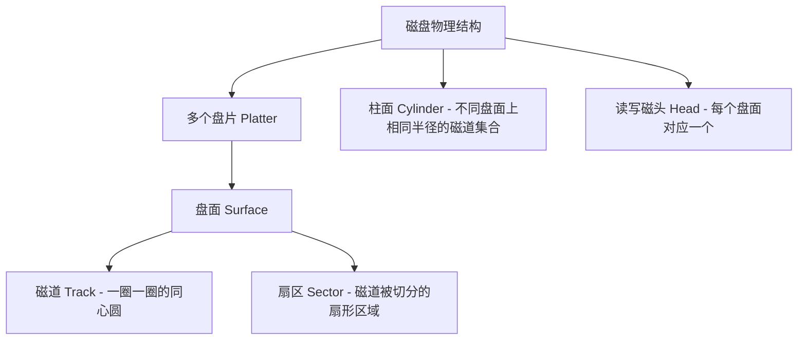

# 计算机组成原理：外存储器（磁盘存储器与 RAID）

> **导语**
> 本节课我们将重点学习计算机的外存储器，特别是**磁盘存储器**。这一部分在《计算机组成原理》（侧重硬件特性）和《操作系统》（侧重调度算法）中均有涉及。我们将从磁盘底层的读写物理原理出发，逐步深入到其硬件组成、核心性能指标计算、磁盘地址编排，最后探讨如何利用廉价磁盘冗余阵列（RAID）来提升存储系统的性能与可靠性。

---

## 一、 磁表面存储器的读写原理

我们常见的机械硬盘、老式录音机磁带等，都属于**磁表面存储器**。

### 1. 存储原理（高中物理复习）

- **介质**：在盘片或磁带的表面涂有一层磁性材质（如磁粉）。
- **写数据**：利用读写磁头（一个微小的电磁铁）。当给写线圈通入不同方向的电流时，铁芯会产生不同方向的磁场，从而将下方磁涂层磁化为“左南右北”（表示 `0`）或“左北右南”（表示 `1`）。
- **读数据**：当磁头在磁性涂层上方划过时，由于切割磁感线，不同极性的磁化区域会在读线圈中感应出不同方向的高低电平信号，从而识别出 `0` 和 `1`。

### 2. 核心特性

- **串行读写**：每次只能读取或写入 **一比特 (1 bit)**。因此，磁盘控制器内部必须包含**串并转换电路**（将主机的并行数据转换为串行比特流写入，或将串行比特流转换为并行数据发给主机）。
- **半双工**：读和写这两个动作**不可同时进行**。
- **优缺点**：
  - **优点**：存储容量大、单位价格低；记录介质可重复使用；断电后信息可长期保存（非易失性）、非破坏性读出。
  - **缺点**：存取速度极慢（受限于机械运动）；机械结构复杂；对工作环境要求高（易受强磁场、剧烈震动损坏）。

---

## 二、 磁盘设备的物理组成结构

### 1. 盘面、磁道与扇区（存储区域划分）

- **盘片与盘面**：一个磁盘驱动器内通常有多个堆叠的盘片。除了最顶层和最底层的表面外，每个盘片的正反两面通常都涂有磁性材料（即有多个**记录面**）。
- **读写磁头**：每个记录面都对应一个专用的读写磁头，所有磁头固定在同一个磁头臂上，只能同进同出。
- **磁道 (Track)**：盘面上的磁性材质是一圈一圈同心圆状涂敷的，每一圈就是一个**磁道**。
- **柱面 (Cylinder)**：所有盘面上，**相对位置相同（半径相同）**的磁道，在空间上垂直叠加起来形成一个圆柱面，称为**柱面**。
- **扇区 (Sector)**：每一条磁道被进一步等分为若干个扇形区域，称为**扇区**。**扇区是主机读写磁盘的最小单位**。

### 2. 硬件部件划分

- **磁盘驱动器（机械部分）**：包含马达（带动盘片旋转）、磁头臂（移动磁头寻道）等。
- **磁盘控制器（电子部件）**：磁盘背面的电路板，作为 I/O 接口，负责与主机交互，接收指令并控制驱动器执行（常见的接口标准有 IDE/ATA、SATA 等）。

---

## 三、 磁盘的性能指标（计算重点）

### 1. 磁盘容量

- **非格式化容量**：物理上总共能存储的二进制比特总数上限。
- **格式化容量**：经过系统格式化后，去除了引导区、备用扇区（用于替换损坏扇区）等开销后，用户**实际可用的容量**。格式化容量 $<$ 非格式化容量。

### 2. 记录密度

- **道密度**：沿盘片**半径方向**上，单位长度内的磁道数（如 60道/厘米）。
- **位密度**：在**一条磁道**上，单位长度内能记录的二进制位数。
  > **⚠️ 重要考点**：最内圈磁道和最外圈磁道，被划分的扇区数相同，每个扇区存储的字节数也相同。因此，**越靠近内侧的磁道，位密度越大！** 磁盘的整体存储性能往往受限于最内侧磁道的工艺极限。
- **面密度**：位密度 $\times$ 道密度。

### 3. 平均存取时间（核心必考计算题）

从主机发出读写命令，到数据传输完毕，通常需要经历以下四个阶段：

$$
\text{存取时间} = \text{控制器延迟时间} + \text{寻道时间} + \text{旋转延迟时间} + \text{传输时间}
$$

1.  **寻道时间 (Seek Time)**：磁头臂移动到目标磁道（柱面）所需的时间。（最耗时，因为是机械移动。题目通常直接给出平均寻道时间）。
2.  **旋转延迟时间 (Rotational Latency)**：目标扇区旋转到磁头下方所需的时间。
    > **计算技巧**：若题目未明确，通常取磁盘**旋转半圈 (0.5 转)** 的时间作为平均旋转延迟。
3.  **传输时间 (Transfer Time)**：目标扇区划过磁头下方，完成数据读写的时间。（取决于扇区占一圈的比例及转速）。
4.  **控制器延迟**：电子部件处理命令的延迟（部分题目可能忽略，按题意而定）。

### 4. 数据传输率

磁盘在单位时间内向主机传送的字节数。

- **理论最大值计算**：假设转速为 $r$ 转/秒，每条磁道容量为 $N$ 字节。因为转一圈就能读完一条磁道，所以最大传输率 = $r \times N$ (B/s)。

---

## 四、 磁盘地址结构

主机要向磁盘指明操作哪个扇区，需要一个明确的磁盘地址。由于多级物理结构，磁盘地址通常包含以下几部分：

|     驱动器号     |      柱面号 (磁道号)       |  盘面号 (磁头号)   |        扇区号        |
| :--------------: | :------------------------: | :----------------: | :------------------: |
| 选定哪个物理硬盘 | 磁头臂应伸入哪个同心圆位置 | 激活哪一个读写磁头 | 确定读取哪一小块数据 |

> **计算示例**：某系统有 4 个驱动器，每盘 256 个磁道，16 个盘面，每道 16 个扇区。
>
> - 驱动器号：需 2 bit ($2^2=4$)
> - 柱面号：需 8 bit ($2^8=256$)
> - 盘面号：需 4 bit ($2^4=16$)
> - 扇区号：需 4 bit ($2^4=16$)
> - 总磁盘地址长度 = $2+8+4+4 = 18$ 位二进制代码。

---

## 五、 RAID：廉价冗余磁盘阵列

**RAID (Redundant Array of Inexpensive Disks)** 的核心目的是：利用多个磁盘并行工作提升读写速度，并通过加入冗余信息提升数据安全性。

### 1. RAID 0 (条带化 / 无冗余)

- **原理**：将逻辑上连续的数据块（条带）分散打散存储到不同的物理磁盘上（类似于多体交叉存储器）。
- **优点**：支持并行并发访问，读写**速度极快**。
- **缺点**：**没有任何冗余与容错能力**。一旦某个磁盘损坏，相关数据将永久丢失。

### 2. RAID 1 (镜像磁盘)

- **原理**：100% 数据备份。将数据完全一模一样地写入两个（或多组）磁盘中互为镜像。
- **优点**：支持并行读取；**容错安全性极高**，一个盘坏了可以直接用另一个盘恢复并校验错误。
- **缺点**：**成本极高**，存储空间利用率只有 50%。

### 3. RAID 2 (海明码纠错)

- **原理**：不在宏观数据块上打散，而是在**比特位 (bit)** 级别上打散。同时增加若干个独立的磁盘用于存储 **海明校验码**。
  _(例如：4 个磁盘存数据位，3 个磁盘存校验位，共 7 个盘)_
- **优点**：具备“纠正 1 位错，发现 2 位错”的极强纠错能力；相比 RAID 1，其冗余存储空间的比例有所降低。

### 4. RAID 3 ~ RAID 5 (简要了解)

从 RAID 2 往后，阵列的等级越高（如应用广泛的 RAID 5），其**冗余信息占用的比例就越少，空间利用率越高，成本越廉价**；同时通过奇偶校验等更加精妙的分布式算法，依然能保证极高的数据安全性与并行读写能力。

---

## 六、 本节总结

1.  **物理读写瓶颈**：磁表面存储器本质是**串行**读写设备，控制器内必有串并转换电路。
2.  **存取时间计算 (必考)**：牢记 `存取时间 = 寻道 + 旋转半圈 + 传输`，重点掌握如何根据转速 ($r/min$) 换算出旋转延迟和传输时间。
3.  **RAID 对比**：
    - `RAID 0`：唯快不破，但毫无保护（无容错）。
    - `RAID 1`：绝对安全，但空间腰斩（50% 利用率）。
    - `RAID 2+`：利用校验算法，在安全与成本之间取得优良平衡。
