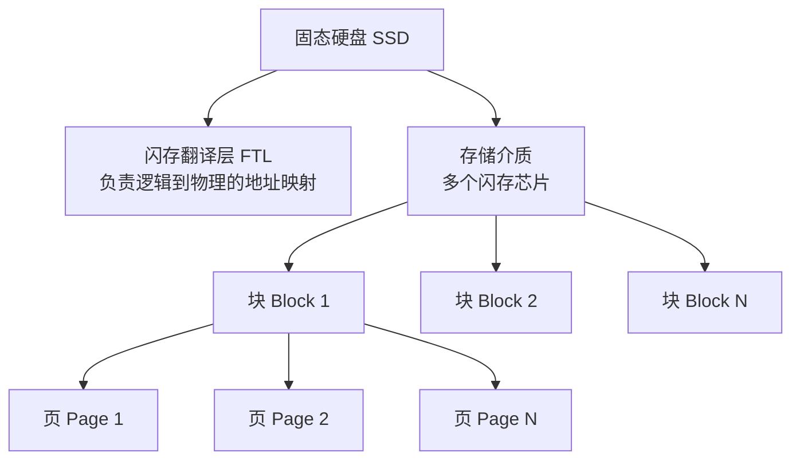

# 操作系统与计算机组成原理：固态硬盘 (SSD)

> **导语**
> 本节课我们将学习近年来考研大纲在《操作系统》与《计算机组成原理》中双重增加的核心考点：**固态硬盘 (SSD - Solid State Drive)**。我们将从 SSD 的底层物理结构出发，剖析其独特的读写与擦除机制，对比其与传统机械硬盘的优劣，并重点掌握其延长寿命的核心科技——**磨损均衡技术**。

---

## 一、 固态硬盘的物理组成与映射机制

固态硬盘采用**闪存 (Flash Memory)** 技术存储数据，本质上是一种电可擦除的 ROM (EEPROM)。它没有机械硬盘的磁头和旋转盘片，而是由纯电子元器件构成。

### 1. 核心部件结构

一个 SSD 主要由以下两部分组成：

1.  **闪存翻译层 (FTL - Flash Translation Layer)**：
    - **作用**：负责**地址变换**。操作系统通过 I/O 总线向 SSD 发送要读写的**逻辑块号**，闪存翻译层负责将该逻辑地址映射到 SSD 内部具体的**物理地址**。
2.  **存储介质 (闪存芯片阵列)**：
    - **作用**：实际存储数据的黑色小芯片群。

### 2. 存储单元的层级划分 (块与页)

SSD 内部的存储层级有着严格的划分，这与其读写机制息息相关：

- **块 (Block)**：一个闪存芯片由多个“块”组成。每个块的大小通常在 16KB 到 512KB 之间。（逻辑上可以类比为机械硬盘的一个**磁道**）。
- **页 (Page)**：一个“块”又被进一步拆分为多个“页”。每个页的大小通常在 512B 到 4KB 之间。（逻辑上可以类比为机械硬盘的一个**扇区**）。

> **⚠️ 核心考点：逻辑块与页的对应关系**
> 操作系统发来的“一个逻辑块”，在机械硬盘中对应“一个扇区”，而在固态硬盘中则对应**“一个页 (Page)”**。

---

## 二、 SSD 的读写特性与“擦除”机制 (高频考点)

SSD 的读写机制与机械硬盘完全不同，有着极其苛刻的物理限制。

### 1. 读写与擦除的基本单位

- **读 / 写**：以**页 (Page)** 为单位。
- **擦除 (Erase)**：必须以**块 (Block)** 为单位。

### 2. 严苛的写入规则：“擦除后才能写入”

一个块被完全擦干净后：

- 其中的**每一页可以被写入 1 次**。
- **读操作可以进行无数次**。
- **核心限制**：如果某页已经有数据，**绝对不允许直接覆盖写入新数据**！若要更新该页，必须先把整个块擦干净再写。

### 3. “写放大”与数据迁移机制

**问题**：如果我想更新块 A 中的“页 1”，但块 A 里的“页 2、页 3”存着有用的老数据。因为擦除只能以“块”为单位，一擦就会把整个块 A 的数据清空，这怎么保全老数据呢？
**解决策略 (数据迁移)**：

1.  SSD 会在内部找到一个全新的、已经被擦干净的**空闲块 B**。
2.  将块 A 中的有用数据（如页 2、页 3）**复制**到块 B 中对应的位置。
3.  将我们要更新的“页 1”的新数据写入到块 B 中。
4.  **将旧的块 A 整体擦除**，将其变为空闲块备用。
5.  **更新映射表**：闪存翻译层 (FTL) 会修改映射关系，将原本指向块 A 的逻辑地址重新映射到新块 B 上。

> **结论**：由于为了修改一小页内容，可能会牵扯到整个块的数据搬运和整块擦除，这就导致 **SSD 的写入速度通常比读取速度慢得多**。

---

## 三、 固态硬盘 vs 机械硬盘 (特性对比)

| 特性维度         | 固态硬盘 (SSD)                    | 机械硬盘 (HDD)                   |
| :--------------- | :-------------------------------- | :------------------------------- |
| **底层技术**     | 闪存芯片 (EEPROM)                 | 磁表面材质 + 机械手臂            |
| **读写速度**     | **极快** (纯电路寻址)             | 较慢 (受限于机械运动)            |
| **随机访问能力** | **强** (访问任何地址耗时相同)     | 弱 (需考虑寻道时间和旋转延迟)    |
| **噪音与功耗**   | 安静无噪音、能耗低                | 有电机旋转与磁臂移动噪音、能耗高 |
| **抗震防摔**     | **强** (无机械可动部件)           | 弱 (剧烈震动易划伤盘片)          |
| **价格成本**     | 较高                              | 较低 (大容量存储首选)            |
| **使用寿命瓶颈** | **有寿命上限** (块的擦除次数有限) | 理论上无明显读写次数限制         |

---

## 四、 延长寿命的核心科技：磨损均衡技术 (Wear Leveling)

### 1. 寿命瓶颈的来源

由于闪存的物理特性，**一个块如果被擦除的次数过多（例如一万次），这个块就会损坏变成坏块**。如果系统总是盯着某几个固定的逻辑地址反复写入，就会导致对应的那几个物理块被反复擦除，像“薅羊毛总盯着一只羊薅”，迅速报废。

### 2. 磨损均衡的核心思想

SSD 闪存翻译层 (FTL) 的地址映射是动态可变的。利用这一特性，系统可以将数据的擦写操作**平均地分配到 SSD 的每一个块上**，从而延长整体的使用寿命。

### 3. 两种磨损均衡策略

#### A. 动态磨损均衡 (Dynamic Wear Leveling)

- **触发时机**：在**发生写入操作**时。
- **策略**：当有新数据要写入时，闪存翻译层会故意挑选**累计擦除次数较少（更年轻）的新空闲块**来存放数据。

#### B. 静态磨损均衡 (Static Wear Leveling)

- **触发时机**：在系统**后台空闲**时悄悄进行。
- **策略**：
  - 系统会监控数据块的读写频率。
  - 对于存放操作系统底层文件、电影等**“读多写少”**的冷数据，系统会悄悄把它们从年轻的块中搬出来，**迁移到那些被擦除次数已经很多（寿命较短的老块）**里存放。
  - 因为冷数据极少被修改，放到老块里刚好能保护老块不再被频繁擦除。从而把年轻的新块腾出来，留给那些读写频繁的“热数据”去折腾。
  - **一句话概括**：让年轻的块去抗重活（频繁写），让老弱的块去养老（只读不写）。

> **💡 趣味计算：SSD 真有那么容易坏吗？**
> 假设一块 1TB 的 SSD，每个块寿命为 1000 次擦除，采用理想的磨损均衡。
> 某人每天疯狂写入 128GB 数据。
> 1TB / 128GB = 8 天。即每 8 天整个硬盘才会被完整重写并擦除 1 次。
> 1000 次 $ imes$ 8 天 = 8000 天 $\approx$ **22 年**！
> _结论：在日常甚至高强度使用下，得益于成熟的磨损均衡算法，普通用户完全不用操心 SSD 的擦写寿命耗尽问题。_
