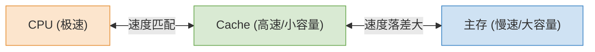
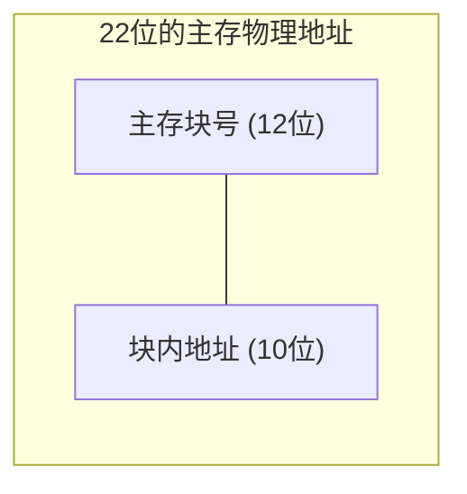

# 计算机组成原理：Cache的基本概念和原理

> **导语**
> 各位同学大家好，从这一小节开始，我们要进入计算机组成原理这门课的重中之重、大题和小题的高频考点——**Cache (高速缓冲存储器)**。
> CPU 的运行速度极快，而主存的读写速度相对较慢。为了缓和这两者之间的速度矛盾，我们在 CPU 和主存之间引入了小容量、高速度的 Cache。本节课我们将探讨 Cache 的工作原理、局部性原理以及 Cache 性能指标的计算。

---

## 一、 Cache 的工作原理

### 1. CPU 与主存的速度矛盾

- **现象**：CPU 执行指令的速度非常快，而每次去主存（内存）中取指令或取数据时，都要花费大量时间等待主存响应。这就导致高速的 CPU 被慢速的内存所拖累。
- **解决思路**：如果直接把主存芯片全换成速度更快的 SRAM 芯片，成本会极其高昂且容量极小。因此，我们采用折中方案：在 CPU 和主存之间增加一层由 SRAM 构成的、容量小但速度极快的 Cache。

### 2. 引入 Cache 后的工作方式

- **工作机制**：将主存中**最频繁被访问的活跃数据和指令**，复制一份放到 Cache 中。
- **效果**：当 CPU 需要访问数据时，优先去 Cache 中寻找。如果找到了（Cache 命中），就可以以极高的速度（如 $1\text{ns}$）完成读写，大幅缓解了 CPU 等待数据的时间。
- **物理位置**：现代计算机中，Cache 通常被直接集成在 CPU 芯片内部。
- **容量限制**：由于采用 SRAM 且集成在 CPU 内部，受限于集成度、体积和成本，Cache 的存储容量不可能做得很大（通常在几MB到几十MB级别）。

---

## 二、 程序的局部性原理 (Cache 生效的灵魂)

为什么容量那么小的 Cache，却能极其有效地提升整体性能？这是因为程序在运行中表现出强烈的**局部性原理**。

### 1. 空间局部性 (Spatial Locality)

- **定义**：在最近的未来要用到的信息，很可能与现在正在使用的信息在**存储空间上是相邻的**。
- **产生原因**：
  - **指令**：程序的机器指令在内存中通常是顺序存放的，执行完一条指令后，很大概率接着执行下一条相邻的指令。
  - **数据**：程序中的数据（如一维/二维数组）在内存中通常也是连续存放的。当我们访问 `a[0][0]` 时，接下来很可能会访问相邻的 `a[0][1]`。

### 2. 时间局部性 (Temporal Locality)

- **定义**：在最近的未来要用到的信息，很可能是**现在正在使用的信息**。
- **产生原因**：程序中存在大量的**循环结构**。在循环体内的指令代码以及循环变量（如 `int i, j, sum;`），会在短时间内被 CPU 重复、频繁地访问。

**局部性原理的指导意义：**
基于局部性原理，当 CPU 访问内存的某个地址时，系统可以**不仅把该地址的数据，而且把该地址周围的一整块数据**都提前复制到 Cache 中。这样，在随后的操作中，CPU 极大概率能直接从 Cache 中找到所需的数据（命中），从而大幅提升运行速度。

---

## 三、 引入 Cache 后的系统性能计算 (重要考点)

引入 Cache 后，我们常常需要计算系统的**平均访问时间**和**性能提升倍数**。计算的核心在于弄清楚 CPU 的查找策略。

**已知条件设定：**

- Cache 访问时间：$t_c$
- 主存访问时间：$t_m$
- Cache 命中率：$H$ (Hit Rate)
- Cache 缺失率：$1 - H$ (Miss Rate)

### 方案 1：同时访问 Cache 和主存

CPU 发出地址后，**同时**向 Cache 和主存发起查找。

- **命中时**：经过 $t_c$ 时间，在 Cache 中找到了数据，于是**立即停止**对主存的访问。耗时为 $t_c$。
- **缺失时**：经过 $t_c$ 时间，发现 Cache 中没有；由于同时也在查主存，所以只需等主存的访问结束即可。由于它们是并行的，总耗时就是较长的那个，即 $t_m$。

$$
\text{平均访问时间} = H \times t_c + (1 - H) \times t_m
$$

### 方案 2：先访问 Cache，再访问主存 (未命中时)

CPU 先去 Cache 中找，如果找不到，再去主存中找。

- **命中时**：耗时为 $t_c$。
- **缺失时**：CPU 先花了 $t_c$ 时间在 Cache 找，没找到；接着又花了 $t_m$ 时间去主存找。总耗时为 $t_c + t_m$。

$$
\text{平均访问时间} = H \times t_c + (1 - H) \times (t_c + t_m)
$$

> **⚠️ 做题提醒**：
> 考试中一定要仔细审题，看题目描述的是“同时访问”还是“先访 Cache 后访主存”。如果采用“先访 Cache”的策略，缺失时的代价会比“同时访问”要高出一个 $t_c$。

---

## 四、 主存与 Cache 的“分块”管理机制

为了方便地在主存和 Cache 之间交换数据（搬运周围的数据），系统必须将主存和 Cache 进行**分块**管理。

### 1. 分块的核心原则

- **统一大小**：将主存的存储空间划分为大小相等的一个个区域，称为**主存块**（在操作系统中常称为“页”或“页面”）。
- **Cache 也分块**：Cache 的存储空间也被划分为与主存块**完全相同大小**的一个个区域，称为**Cache 块**（也常被称为 **Cache 行**）。
- **交换单位**：主存和 Cache 之间的数据交换，是**以块为单位**进行的。哪怕 CPU 只要 1 个字节，系统也会把那一整个主存块的数据全部复制到 Cache 的某一个块中。

### 2. 主存地址的逻辑拆分 (关键思维)

对主存进行分块后，主存的物理地址就可以在逻辑上被拆分为两部分：
$$ \text{主存地址} = \text{主存块号} + \text{块内地址} $$

- **块内地址的位数**：由**每个块的大小**决定。例如，如果每块大小为 $1\text{KB} (2^{10} \text{Bytes})$，由于按字节编址，块内地址就需要 $10$ 个比特位。
- **主存块号的位数**：由**主存能分出多少个块**决定。例如主存总容量为 $4\text{MB} (2^{22} \text{Bytes})$，每块 $1\text{KB} (2^{10} \text{Bytes})$，则共有 $2^{12}$ 个块，主存块号就需要 $12$ 个比特位。

---

## 五、 后续问题预告 (Cache 的三大核心机制)

在本节课建立了 Cache 分块和复制数据的全局观后，自然会引出三个必须解决的复杂问题，这也正是我们后续小节将要详细探讨的考点：

1.  **Cache 映射方式**：一个主存块被调入 Cache 时，它到底该放在 Cache 的哪个（或哪些）块里？CPU 怎么知道 Cache 里的这个块对应的是主存里的哪个块？
2.  **Cache 替换算法**：Cache 的容量远小于主存。当 Cache 的块全被装满了，此时又必须从主存调入一个新的块，我们该把 Cache 里的哪个旧块给“踢出去”？
3.  **Cache 写策略**：Cache 里的数据只是主存的副本。如果 CPU 修改了 Cache 里的数据（如 P 了一张图），怎么保证 Cache 数据和主存数据的一致性？

_(以上三个问题，我们将在接下来的课程中逐一攻克！)_
