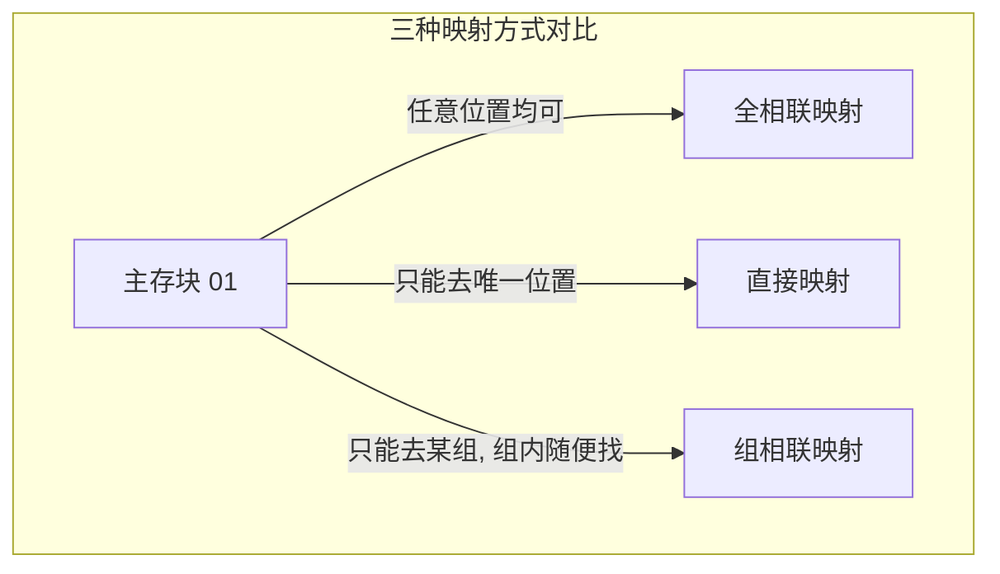

# 计算机组成原理：Cache 和主存的三种映射方式

> **导语**
> 本节课我们将探讨 Cache 的核心机制之一：**Cache 和主存的映射方式**。由于 Cache 只是主存中部分数据块的副本，当 CPU 访问 Cache 时，必须有一种机制来明确 Cache 里的这个数据块到底对应的是主存的哪个块。我们将详细讲解三种映射策略：**全相联映射**、**直接映射**和**组相联映射**，并重点分析它们的主存地址拆分方法与底层逻辑。

---

## 一、 为什么需要映射机制？（核心问题引入）

主存和 Cache 都是被划分成一个个大小相等的**块**。
假设我们将某几个主存块调入了 Cache 中，但由于 Cache 就像一个盲盒格子，CPU 下次来找数据时，**怎么知道某个 Cache 块里存放的到底是不是它想要的主存块呢？**

**解决思路：增加“标记”与“有效位”**

- **标记 (Tag)**：在每个 Cache 行的前面增加一个标记字段，用于记录这个 Cache 块里面存的到底是**主存中的哪一个块**。
- **有效位 (Valid Bit)**：由于计算机硬件上电后标记字段的初始默认值全是 `0`，如果不加区分，CPU 可能会误以为里面存的是主存的第 `0` 块。因此，必须增加 1 个比特的有效位。
  - `1`：表示该 Cache 行内的数据有效。
  - `0`：表示该 Cache 行内的数据无效（哪怕 Tag 匹配上了也是无效的废数据）。

---

## 二、 三种映射方式详解

为了讲清后续的地址划分，我们先统一**全局背景参数**：

- **主存总容量**：256MB ($2^{28}$ 字节) $\rightarrow$ **主存地址共 28 位**。
- **块大小**：64B ($2^6$ 字节) $\rightarrow$ **块内地址占 6 位**。
- **主存块数**：$2^{28} / 2^6 = 2^{22}$ 块 $\rightarrow$ **主存块号共 22 位**。
- **Cache 容量**：共 **8 个** Cache 块 (行)。

---

### 1. 全相联映射 (Fully Associative Mapping) —— “随意放”

**规则**：主存块可以存放在 Cache 里的**任意一个空闲位置**。

- **标记 (Tag) 的设计**：因为主存块可以放在任何地方，CPU 在找数据时，必须知道它原本完整的“身份”。所以，Tag 必须记录**完整的 22 位主存块号**。
- **主存地址的逻辑拆分**：
  | 主存块号 / Tag 标记 (22位) | 块内地址 (6位) |
  | :---: | :---: |
- **访存过程**：
  CPU 取出地址的前 22 位作为 Tag，**同时向 Cache 中的所有 8 个行**进行对比（并发比较）。如果有哪一行的 Tag 匹配且有效位为 1，则命中；接着根据后 6 位的块内地址去取数。
- **优缺点**：
  - **优点**：命中率极高，空间利用率最高（只要有空位就能放）。
  - **缺点**：查找最慢（需要与所有行的 Tag 对比），实现这种并发对比的硬件电路极其昂贵和复杂。

---

### 2. 直接映射 (Direct Mapping) —— “对号入座”

**规则**：某个主存块只能放到 Cache 中**唯一的一个固定位置**。

- **存放位置算法**：`Cache 块号 = 主存块号 % Cache 的总块数`
- 由于 Cache 有 8 个块 ($2^3$)，对 8 取余的数学本质，就是**截取主存块号的末尾 3 位二进制数！**

- **标记 (Tag) 的优化设计**：
  既然存放在第 `010` 号 Cache 块里的主存数据，其主存块号的末尾 3 位一定也是 `010`。那么，这末尾的 3 位就**不需要再保存在 Tag 里了**（因为 Cache 块的物理位置已经隐式包含了这 3 位信息）。我们只需要保留前 19 位作为 Tag 即可。
- **主存地址的逻辑拆分**：
  | 标记 Tag (19位) | Cache 行号 / 块号 (3位) | 块内地址 (6位) |
  | :---: | :---: | :---: |
- **访存过程**：
  CPU 取出地址中间的 3 位“Cache 行号”，直接定位到那唯一的 1 个 Cache 块。然后对比该块的 Tag 是否与地址前 19 位匹配。
- **优缺点**：
  - **优点**：查找极快，只需对比 1 次 Tag，硬件电路简单。
  - **缺点**：命中率极低。如果频繁交替访问末 3 位相同的主存块，它们会互相挤占这唯一的位置（这种现象称为**冲突不命中**），导致空间严重浪费。

---

### 3. 组相联映射 (Set-Associative Mapping) —— “中庸之道”

**规则**：将 Cache 分成若干组，主存块只能放到**特定分组**的任意一个位置。（全相联与直接映射的折中）。
**常见题眼**：“**$n$ 路组相联映射**” 表示每 $n$ 个 Cache 行组成一个分组。

- **存放位置算法**：`所属组号 = 主存块号 % 分组总数`
- 在本例中，8 个 Cache 行，采用 **2 路组相联**，即分为 **4 个组 ($2^2$)**。
- 对 4 取余的数学本质，就是**截取主存块号的末尾 2 位二进制数！**

- **标记 (Tag) 的优化设计**：
  同理，这末尾的 2 位决定了主存块一定会进入这个分组，所以这 2 位信息不需要记录在 Tag 中。我们只需保留主存块号的前 20 位作为 Tag。
- **主存地址的逻辑拆分**：
  | 标记 Tag (20位) | 组号 (2位) | 块内地址 (6位) |
  | :---: | :---: | :---: |
- **访存过程**：
  CPU 取出地址中间的 2 位“组号”，定位到对应的那个分组。由于该组内有 2 个行，因此将地址的前 20 位 Tag 与**组内的这 2 个行**同时进行对比。
- **优缺点**：
  综合了前两者的优点。既保留了一定的灵活性（组内全相联，提高了命中率），又限制了比较的范围（只需与组内几个 Tag 比较，速度快，硬件成本适中）。这是现代计算机最常用的方式。

---

## 三、 本节高频考点速记总结

在做题时，快速拆分主存地址是解题的第一步。请牢记以下地址拆分的固定公式：

| 映射方式       | 主存地址结构的逻辑拆分                                                                             |
| :------------- | :------------------------------------------------------------------------------------------------- |
| **全相联映射** | `[主存块号 Tag] + [块内地址]`                                                                      |
| **直接映射**   | `[标记 Tag] + [Cache 行号] + [块内地址]`   _(Cache 行号位数 = $\log_2(\text{Cache 总行数})$)_   |
| **组相联映射** | `[标记 Tag] + [Cache 组号] + [块内地址]`   _(Cache 组号位数 = $\log_2(\text{Cache 分组总数})$)_ |

> **学习提醒**：
>
> 1. Cache 和主存交换数据的单位是**块**，因此**块内地址**的位数在三种方式中是永远不变的（由块大小决定）。
> 2. `有效位 (Valid Bit)` 必定存在且占 1 位。不要忘了在计算 Cache 总容量或 Cache 行实际大小时把它加上去！
