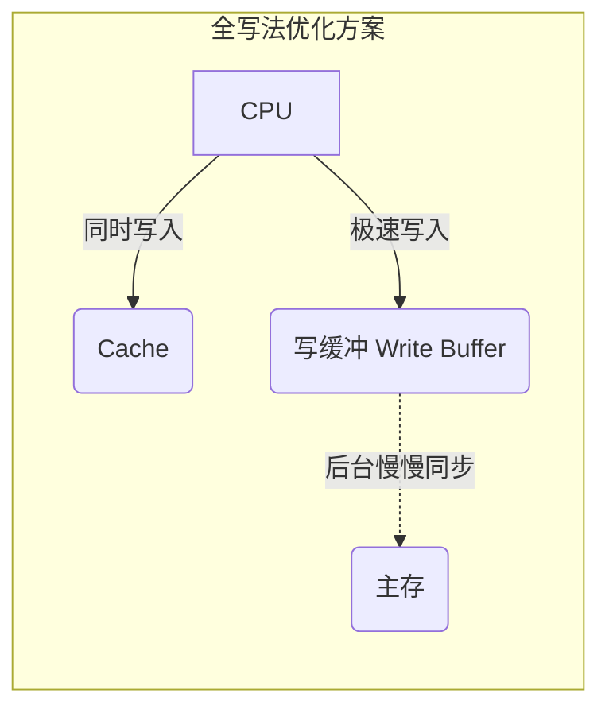

# 计算机组成原理：Cache的写策略

> **导语**
> 各位同学大家好，本小节我们将解决 Cache 模块的最后一个核心问题：**Cache 的写策略**。
> Cache 中保存的只是主存数据的副本。当 CPU 执行写操作，修改了 Cache 中的数据后，Cache 和主存的数据就变得不一致了。那么，如何保持数据的一致性呢？针对“写命中”和“写不命中”两种情况，我们将探讨相应的应对策略。

---

## 一、 “写命中” (Write Hit) 时的两种处理策略

当 CPU 想要写的地址**已经在 Cache 中（命中）**时，我们可以采用以下两种策略之一来保持或恢复数据一致性。

### 1. 写回法 (Write-Back)

- **核心思想**：当 CPU 对 Cache 写命中时，**只修改 Cache 中的数据副本**，而不立即将修改同步到主存中。只有当该 Cache 块**被替换算法淘汰出 Cache 时**，才将这一整块的数据统一写回主存。
- **辅助硬件支持 (脏位 Dirty Bit)**：
  为了让硬件知道淘汰某个 Cache 块时需不需要把它写回主存，我们需要给每个 Cache 行增加一个**脏位 (Dirty Bit)**。
  - `1`：表示该 Cache 块被修改过（脏了），淘汰时**必须写回**主存。
  - `0`：表示该 Cache 块未被修改过，淘汰时**直接丢弃**即可，无需写回。
- **优缺点**：
  - **优点**：大幅减少了访存次数，写操作的速度极快。
  - **缺点**：在被替换写回之前，主存中的数据母本是过期的，存在数据不一致的隐患（在多核 CPU 系统中需要复杂的缓存一致性协议来解决）。

### 2. 全写法 / 写直通法 (Write-Through)

- **核心思想**：当 CPU 对 Cache 写命中时，必须**同时把数据写入 Cache 和主存中**。淘汰 Cache 块时，因为主存数据时刻保持最新，所以**无需写回**。
- **优缺点**：
  - **优点**：实现简单，Cache 与主存的数据始终保持强一致性。
  - **缺点**：每次写操作都要访问慢速的主存，严重拖慢了 CPU 的写操作速度。
- **硬件优化 (写缓冲 Write Buffer)**：
  为了缓解全写法每次都要等主存的痛点，我们在 CPU 和主存之间增加一个小容量、高速度的 SRAM 队列——**写缓冲**。
  - CPU 发出写操作后，将数据丢给 Cache 和**写缓冲**，然后立刻回去干别的事（认为写操作已完成）。
  - 系统后台有一个专门的控制电路，负责把写缓冲队列里的数据慢条斯理地同步到主存中。
  - _注意：如果 CPU 写操作过于密集导致写缓冲满了，CPU 仍会被迫阻塞等待。_

---

## 二、 “写不命中” (Write Miss) 时的两种处理策略

当 CPU 想要写的地址**不在 Cache 中（未命中）**时，面临的问题是：要不要把包含这个地址的主存块调入 Cache？

### 1. 写分配法 (Write-Allocate)

- **核心思想**：先将 CPU 要写的主存块**调入 Cache**，然后 CPU 再对 Cache 中新调入的块进行写操作（从而制造一次“人为的写命中”）。
- **黄金搭档**：**通常与「写回法」搭配使用。**因为一旦调入 Cache 并修改后，利用写回法可以把这块留在 Cache 里很久，直到被淘汰才写回。

### 2. 非写分配法 (Not-Write-Allocate)

- **核心思想**：只把数据**直接写回主存对应的单元中**，**不把**该块调入 Cache。
  _(只有 CPU 进行“读操作”未命中时，才会把主存块调入 Cache)。_
- **黄金搭档**：**通常与「全写法」搭配使用。**因为全写法本来就要求主存必须时刻最新，既然不在 Cache 里，那就直接写主存，没必要多此一举把它搬进 Cache。

---

## 三、 多级 Cache 结构与写策略的综合应用

现代计算机的 CPU 内部通常集成了多级 Cache（如 L1, L2, L3 Cache）。

- **层级特性**：越靠近 CPU 的 Cache 速度越快、容量越小；越远离 CPU 的 Cache 速度相对越慢、容量越大。L1 Cache 中的数据是 L2 Cache 中一部分数据的副本。
- **主流搭配策略**：
  为了在“数据一致性”和“性能”之间取得最佳平衡，系统通常采用分级策略：
  - **各级 Cache 之间 (如 L1 与 L2 之间)**：通常采用 **全写法 + 非写分配法**。（因为同在 CPU 内部，相互间通信速度极快，全写法代价可接受，保证了各级 Cache 数据的高度一致）。
  - **最底层 Cache 与主存之间 (如 L3 与内存之间)**：通常采用 **写回法 + 写分配法**。（因为访存代价极大，必须尽全力拦截写操作，只在最后关头批量写回）。

---

## 四、 Cache 三大核心机制总结回顾

至此，我们在前几个小节留下的三个关于 Cache 的核心问题全部解答完毕。这也是历年考研综合大题最喜欢融合考察的三个知识板块：

| 待解决的问题                                | 核心机制名称 | 核心知识点摘要                                                                                 |
| :------------------------------------------ | :----------- | :--------------------------------------------------------------------------------------------- |
| **如何区分 Cache 里存的是主存的哪一块？**   | **映射方式** | 全相联映射、直接映射、组相联映射（重点掌握主存地址的逻辑拆分与 Tag 匹配）。                    |
| **Cache 存满了该怎么办？**                  | **替换算法** | RAND、FIFO、LRU (近期最少使用，笔算重点)、LFU。主要用于全相联和组相联。                        |
| **修改了 Cache 里的数据，主存没改怎么办？** | **写策略**   | 命中时：**写回法** (配脏位) / **全写法** (配写缓冲) 未命中时：**写分配法** / **非写分配法** |

> **学习建议**：
> 掌握本节内容的关键在于理清**两大组合**的固定搭配规律（写回法搭配写分配法；全写法搭配非写分配法）。此外，“脏位 (Dirty Bit)”的引入会直接影响整个 Cache 存储容量的计算（计算 Cache 行总大小时，记得加上 1 位脏位和 1 位有效位！），这是大题中最容易踩坑的失分点。
