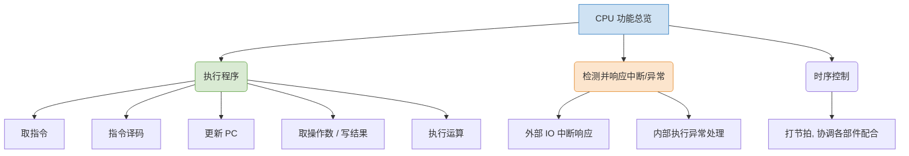
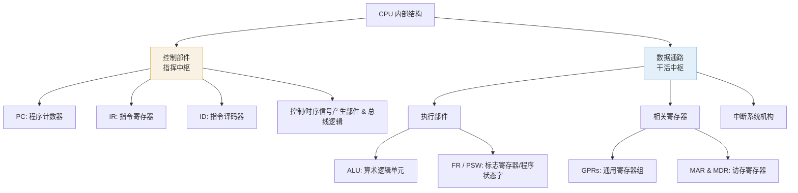

# 计算机组成原理：CPU 的功能与基本结构

> **导语**
> 本节课我们将进入《计算机组成原理》第五章的核心——**中央处理器 (CPU)** 的学习。
> 初学本章时，可能会被硬件电路图中繁杂的寄存器缩写（如 PC, IR, MAR, MDR, ALU, GPRs 等）劝退。本节课的目标是不深究底层电路细节，而是**建立宏观框架**：了解 CPU 的核心功能，认识各大关键部件与寄存器的英文缩写及其背后的作用，为后续理解复杂指令流转打下坚实基础。

---

## 一、 CPU 的核心功能

CPU 的功能概括起来主要是三大块：**执行程序**、**检测并响应中断/异常**、**时序控制**。

### 1. 执行程序 (常规任务)

程序由机器指令组成，存放在内存中。CPU 执行程序的过程，就是不断地“取指令 $\rightarrow$ 执行指令”。具体可细分为以下动作：

- **取指令**：访问主存，将指令取到 CPU 内部。
- **指令译码**：分析指令的操作码，确定指令的功能，并生成相应的控制信号（如控制 ALU 工作、控制内存读写）。
- **更新程序计数器 (PC)**：PC 总是指向下一条即将执行的指令。非转移类指令执行时 PC 自动加一；转移类指令（如 `if-else` 生成的跳转指令）则可能改变 PC 的值。
- **取操作数 / 写结果**：根据指令需求，从内存中获取运算所需的数据，或将运算结果写回内存。
- **执行运算**：对操作数进行具体的算术或逻辑运算（如加减乘除、与或非）。

### 2. 检测并响应中断与异常 (突发任务)

在逐条执行程序的过程中，CPU 必须能够处理各种突发和例外情况，暂停当前程序，转而执行系统预设的中断/异常处理程序：

- **外部 I/O 中断**：如打游戏时点击鼠标，I/O 设备会向 CPU 发出中断信号。
- **内部执行异常**：如某条指令引发了算术溢出，或尝试访问非法的内存区域。

### 3. 时序控制 (统筹节奏)

上述所有动作的落地，都需要时序控制功能的支持。系统通过**时钟信号**打节拍，按节奏指挥 CPU 内部各个功能部件和寄存器相互配合、有条不紊地工作。

---

## 二、 CPU 的基本结构

不同教材（如唐朔飞版与袁春风版）对 CPU 结构的划分略有不同。结合 408 考研趋势，我们以袁春风老师的框架为主：将 CPU 划分为**控制部件**和**数据通路**两大块。
简单来说：**控制部件是负责“指挥”的，数据通路是负责“干活”的。**

### 1. 控制部件 (指挥中枢)

控制部件负责取指令、分析指令，并发出控制信号。包含以下关键部件：

- **程序计数器 (PC - Program Counter)**：总是存放下一条即将执行的指令地址。
- **指令寄存器 (IR - Instruction Register)**：暂存当前正在执行的指令代码。
- **指令译码器 (ID - Instruction Decoder)**：分析 IR 中的指令操作码，识别指令类型。
- **时序/控制信号产生部件**：结合指令类型、时钟节奏以及状态标志（如用于条件跳转 `jz` 的 ZF 标志位），生成具体的微操作控制信号。
- **总线控制逻辑**：控制 CPU 与主存、I/O 设备之间通过总线进行数据交换。

### 2. 数据通路 (执行单元)

在控制部件的指挥下，数据通路负责完成实质性的数据处理工作：

- **执行部件**：
  - **ALU (算术逻辑单元)**：实现加减乘除、与或非等核心运算。
  - **标志寄存器 (FR - Flag Register / PSW - Program Status Word)**：保存 ALU 运算产生的状态标志（如溢出 OF、零标志 ZF、进位 CF、符号 SF）。这些标志是后续条件转移指令的判断依据。
- **各类寄存器**：
  - **GPRs (通用寄存器组)**：供汇编程序员使用，暂存操作数、中间结果或地址指针。
  - **MAR (存储器地址寄存器)** & **MDR (存储器数据寄存器)**：控制主存读写的关键门户。
- **中断系统/机构**：负责实现对异常和外部中断的捕获与初步处理。

---

## 三、 高频考点：参数计算与寄存器位宽规则

在 408 统考的大题或小题中，经常需要我们根据已知条件推断内存容量或寄存器的位宽，以下是核心铁律：

### 1. CPU 支持的最大内存容量计算

最大内存容量由 **MAR 的位数** 与 **CPU 的编址单位** 共同决定。

- **寻址范围** = $2^{\text{MAR位数}}$
- **容量** = 寻址范围 $\times$ 编址单位大小

> **【实战举例】**
> 已知 MAR 为 20 位，MDR 为 32 位（即存储字长 32 bit = 4 Byte）。
>
> - **情况 A (按字编址)**：每个地址对应一个 32 位的字。最大容量 = $2^{20} \times 32\text{ bit} = 4\text{ MB}$。
> - **情况 B (按字节编址)** _(若无特殊说明，默认按字节编址)_：每个地址对应 8 位(1字节)。最大容量 = $2^{20} \times 1\text{ Byte} = 1\text{ MB}$。

### 2. 各类寄存器的位宽 (位数) 对应法则

| 寄存器名称             | 位数决定因素 / 对应关系           | 备注说明                                                       |
| :--------------------- | :-------------------------------- | :------------------------------------------------------------- |
| **MAR (地址寄存器)**   | $\approx$ **地址总线宽度**        | 决定了寻址空间大小。                                           |
| **MDR (数据寄存器)**   | $\approx$ **数据总线宽度**        | 通常与存储字长一致。                                           |
| **ALU (算术逻辑单元)** | $=$ **机器字长**                  | ALU 的位宽体现了计算机的机器字长（如 32位机器，ALU 即 32位）。 |
| **GPRs (通用寄存器)**  | $=$ **机器字长 (ALU 位宽)**       | 操作数通常来自通用寄存器，位宽必须对齐。                       |
| **IR (指令寄存器)**    | $=$ **指令字长**                  | 用于暂存当前指令，必须装得下最长的指令。                       |
| **PC (程序计数器)**    | 一般情况下 $\approx$ **MAR 位数** | 因为 PC 指向内存地址，所以射程需与 MAR 一致。                  |

> **⚠️ 特殊考法预警：定长指令字 + 边界对齐**
> 在极少数情况下，PC 的位数可以比 MAR 少。
>
> - **条件**：系统按字节编址（MAR=22位，内存=4MB），采用**定长指令字结构**（如每条指令固定 4 字节），且指令**严格按边界对齐**存放（即指令只能存放在地址 0, 4, 8... 处）。
> - **分析**：因为指令起始地址的末 2 位永远是 `00`，所以系统只需在 PC 中保存地址的高 20 位即可准确定位。
> - **结论**：此时 PC 位数 = 20 位（比 MAR 少 2 位）。
