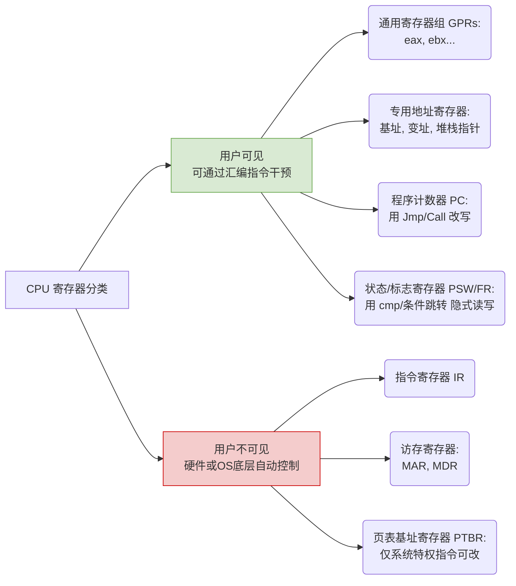

# 计算机组成原理：CPU 寄存器的用户可见性

> **导语**
> 本节课我们将探讨一个常考要点：**CPU 当中的哪些寄存器对用户是可见的？哪些是不可见的？**
> 理解这些寄存器的分类，不仅有助于应对选择题考点，更能帮助我们从汇编程序员的视角深入理解 CPU 的工作原理。

---

## 一、 什么是“用户可见”与“用户不可见”？

- **判定标准**：取决于**汇编语言程序员能否使用汇编指令去直接地读或写该寄存器**。
- **用户可见**：如果可以通过汇编指令直接读写操作，就是可见的。
- **用户不可见**：如果不能用汇编语言直接操作，完全由 CPU 硬件或操作系统底层自动控制，就是不可见的。

---

## 二、 用户可见的寄存器

只要程序员能通过代码干预其内容的寄存器，统统属于用户可见寄存器。主要包含以下四类：

### 1. 通用寄存器组 (GPRs)

- **说明**：程序员最常打交道的寄存器，可用于暂存数据或地址。
- **实例 (以 x86 架构为例)**：`eax`, `ebx`, `esi`, `ebp` 等 8 个寄存器。
- **操作方式**：可以直接使用 `mov` 等数据传送指令进行读写。
  - _写操作_：`mov eax, 5` （把立即数 5 写入寄存器）
  - _读操作_：`mov [Mem], ebx` （读取寄存器值写入主存）

### 2. 专用的地址寄存器

- **说明**：包括**基址寄存器**、**变址寄存器**以及**堆栈指针寄存器**。
- **实例 (以 x86 架构为例)**：
  - 基址寄存器：`ebx` 兼职
  - 变址寄存器：`esi`, `edi` 兼职
  - 堆栈指针寄存器：`ebp`, `esp` 兼职
- **操作方式**：由于在 x86 中它们由通用寄存器兼任，自然也可以用汇编语言直接读写。

### 3. 程序计数器 (PC)

- **说明**：存放下一条将要执行指令的地址。
- **操作方式**：虽然没有专门的 `mov` 指令直接给 PC 赋值，但我们可以通过**转移类指令**（Jump）或**函数调用类指令**（Call / Return）来**直接改写 PC 的值**。因此，PC 是用户可见的。

### 4. 标志寄存器 (FR / PSW - 程序状态字)

- **说明**：保存 ALU 运算后产生的状态标志（如 OF溢出、CF进位、ZF零标志、SF符号标志等）。
- **操作方式**：
  - _写操作_：无法用 `mov` 直接修改，但可以通过算术指令（如 `cmp` 比较减法）的运算结果**间接改写**它。
  - _读操作_：通过**条件转移类指令**（如 `jz`，当 ZF=1 时跳转）**间接读取**其标志位信息。
- **结论**：由于程序员可以明确地利用和影响它，教材一般将 PSW/FR 归类为**用户可见寄存器**。

---

## 三、 用户不可见的寄存器

这些寄存器属于 CPU 内部的“黑盒”结构，由硬件自动配合运转，对程序员完全透明。

### 1. 指令寄存器 (IR)

- **说明**：存放当前正在执行的指令。
- **原因**：CPU 硬件根据 PC 的指向自动从内存取出指令并放入 IR。虽然程序员可以通过改变 PC 间接影响 IR 的内容，但**绝无任何一条汇编指令能直接读写 IR**，故几乎所有教材都规定 IR 为**用户不可见**。

### 2. 访存寄存器 (MAR 和 MDR)

- **说明**：
  - **MAR**（存储器地址寄存器）：存放要访问的内存地址。
  - **MDR**（存储器数据寄存器）：存放写入内存或从内存读出的数据。
- **原因**：它们的值只能由 CPU 在访存过程中自动读写使用，没有类似 `mov` 的指令能直接设置它们。

### 3. 页表基址寄存器 (PTBR)

- **说明**：在多进程并发的操作系统中，指向当前正在执行进程的页表起始地址。
- **原因**：作为普通用户程序无法读写。它只能由操作系统在切换进程时，使用**特权指令**去设置。因此对普通用户**不可见**。

---

## 四、 核心知识点速记总结

我们可以用一张图表或分类树来快速梳理记忆这些寄存器的归属：

| 寄存器名称          |   英文简称    |  用户可见性   | 读写操作手段/原因说明                            |
| :------------------ | :-----------: | :-----------: | :----------------------------------------------- |
| **通用寄存器**      |     GPRs      |  **✅ 可见**  | 使用数据传送指令（如 `mov`）直接读写。           |
| **程序计数器**      |      PC       |  **✅ 可见**  | 使用转移/调用指令（如 `jmp`, `call`）直接改写。  |
| **程序状态字**      |   PSW / FR    |  **✅ 可见**  | 运算指令（如 `cmp`）影响其位，条件转移读取其位。 |
| **专用地址寄存器**  | Base/Index/SP |  **✅ 可见**  | 在 x86 中由通用寄存器兼任，可直接操作。          |
| **指令寄存器**      |      IR       | **❌ 不可见** | CPU 取指自动存入，无对应汇编指令。               |
| **地址/数据寄存器** |   MAR / MDR   | **❌ 不可见** | CPU 硬件访存时自动控制，对程序员透明。           |
| **页表基址寄存器**  |     PTBR      | **❌ 不可见** | 操作系统底层维护，需使用特权指令。               |
