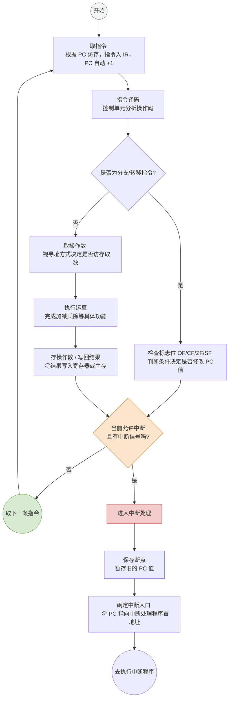

# 计算机组成原理：指令执行的一般过程

> **导语**
> 在 408 考研中，经常会要求我们结合给定的硬件电路图，去分析指令的功能是如何在硬件中实现的。在深入钻研底层硬件细节之前，我们必须先理清**一条指令在其完整生命周期内到底经历了哪些阶段**。本节课我们将梳理指令执行的一般过程，为大家建立起分析这类题目的宏观思维框架。

---

## 一、 取指与译码阶段 (Fetch & Decode)

每条指令的生命周期，都是从 CPU 去主存中“拿货”开始的。

### 1. 取指令 (Instruction Fetch)

- **动作**：CPU 根据程序计数器（**PC**）的值，去主存中取出接下来要执行的指令。
- **存放**：取出的指令通常会被放入指令寄存器（**IR**）中暂存。
- **PC 更新**：与此同时，PC 的值会自动加 1（**PC+1**），使其自动指向下一条将要执行的指令地址。

### 2. 指令译码 (Instruction Decode)

- **动作**：CPU 内部的控制单元（**CU**）会分析 IR 中指令的**操作码**。
- **目的**：确定当前这条指令具体是什么类型（如加法、乘法、跳转等），从而指导后续硬件该如何配合工作。

---

## 二、 执行指令阶段 (Execute)

译码完成后，CPU 清楚了指令的功能，接下来正式进入执行阶段。在做题分析硬件电路时，我们必须**具体问题具体分析**，首要关注的是该指令是否为“分支指令”。

### 1. 分支指令 (转移指令)

如果在程序中遇到类似 `if-else` 的逻辑，生成的往往是分支指令。

- **执行逻辑**：CPU 去检查相关的**状态标志位**（如 `OF`, `CF`, `ZF`, `SF` 等），以此判断跳转条件是否满足。
- **核心影响**：如果条件满足，分支指令的执行**会直接修改 PC 的值**，从而改变程序的默认顺序执行流。

### 2. 其他常规指令 (数据处理类)

如果不是分支指令，而是普通的运算或数据搬运指令，通常会经历以下几个细分步骤：

1.  **取操作数**：
    - 运算对象可能来自主存，此时需要访存将数据取到寄存器中。
    - **注意**：如果指令使用的是“寄存器寻址”，说明数据已经在寄存器里了，这一步就**不需要**再去主存取数。此步骤并非每条指令必须。
2.  **执行运算**：
    - 根据具体的指令类型，利用 ALU 完成加、减、乘、除等各种数据处理工作。
3.  **存操作数 (写回结果)**：
    - 运算得出的结果可能需要写回主存，也可能只写回内部寄存器。
    - **注意**：写回主存这个动作同样**并非**每条指令都必须。

---

## 三、 中断处理阶段 (Interrupt)

一条指令执行完毕后，并不能立刻毫无顾忌地去取下一条指令，而是要例行进入**中断检查阶段**。

### 1. 例行检查

- 除非 CPU 当前处于**关中断**状态，否则每条指令执行结束后，CPU 都要例行检查是否接收到了外部的中断信号（如：鼠标点击、键盘敲击等）。

### 2. 响应并处理中断

如果检测到了中断事件，CPU 需要暂停原程序的执行，转去处理突发情况：

1.  **保存断点**：为了处理完中断后能顺利回到原程序，必须把当前的断点保存下来，即**保存旧的 PC 值**（它指向原程序的下一条指令）。
2.  **确定入口**：根据中断信号的具体类型（如键盘中断还是鼠标中断），确定对应中断处理程序的入口地址。
3.  **修改 PC 值**：把 PC 指向该中断处理程序的第一条指令，随后就像执行普通程序一样，开始逐条执行中断处理程序。

_(注：如果没有发生中断，CPU 就顺理成章地根据当前的 PC 值，去取下一条指令，开始新的循环。)_

---

## 四、 本节知识脉络速记导图

这个流程图无需死记硬背，而是用来建立分析硬件题目的思维框架，做题时按此图顺藤摸瓜即可。

