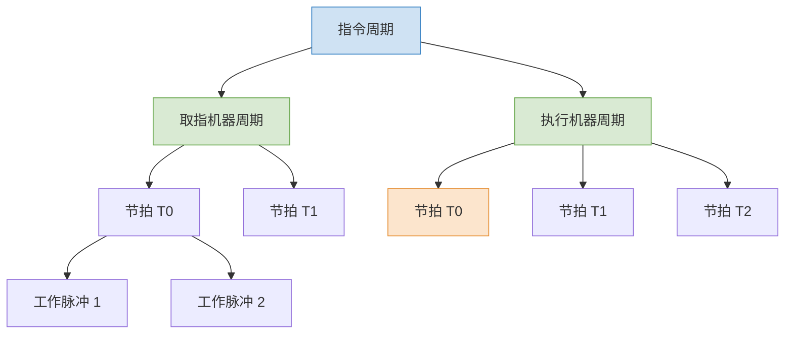
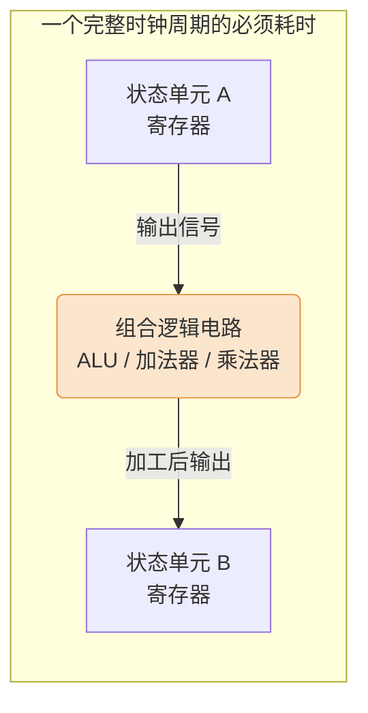

# 计算机组成原理：CPU 的时序控制与指令周期

> **导语**
> 本节课我们将探讨 CPU 内部如何通过时序信号来指挥各个部件协同工作，并深入理解“指令周期”的基本概念，重点剖析决定 CPU 时钟频率（主频）上限的底层硬件瓶颈。

---

## 一、 控制部件与数据通路：乐团的指挥与乐手

CPU 内部主要分为两大核心部分，我们可以将其形象地比作交响乐团：

- **控制部件 (指挥)**：根据当前执行的“乐谱”（指令，如加法指令或乘法指令），按照精确的节奏发出控制信号（手势）。
- **数据通路 (乐手)**：专门负责“干活”。听从控制部件发出的时序信号，完成具体的数据运算和处理动作。

**时序控制的定义**：CPU 必须按照**精确的时序**去产生控制信号，以协调指令执行过程中各种操作的先后顺序，适应不同指令在操作步骤和执行时间上的差异。

---

## 二、 时序系统的演进：从三级时序到单级时序

### 1. 早期计算机：三级时序系统

早期计算机会对指令执行过程进行细致的层级拆分，采用“指令周期 $\rightarrow$ 机器周期 $\rightarrow$ 节拍 $\rightarrow$ 脉冲”的层级结构：

- **机器周期**：例如“取指机器周期”、“执行机器周期”。不同指令的机器周期数可以不等（如空指令仅需取指，无需执行）。
- **节拍 (时钟信号)**：每个机器周期包含若干节拍，不同机器周期的节拍数也可以不等（如乘法执行周期比加法执行周期的节拍数多）。
- **工作脉冲**：一个节拍内可以进一步拆分出多个工作脉冲。

### 2. 现代计算机：单级时序系统

在现代计算机（以及 408 考研大纲）中，**“机器周期”的概念已被逐渐淡化并取消**。
整个数据通路直接在**时钟信号（节拍）**的统一指挥下工作。探讨指令时，我们只关注这条指令需要消耗多少个**时钟周期（节拍）**。

---

## 三、 CPU 时钟周期与主频的限制 (核心考点)

CPU 的时钟周期长度与 CPU 的主频互为倒数（例如，主频为 $1\text{GHz} (10^9 \text{Hz})$ 的 CPU，其时钟周期为 $1\text{ns} (10^{-9}\text{s})$）。
要想提升指令执行速度，最直接的想法是缩短时钟周期（提高主频）。但**主频不能无限提升**。

**核心铁律**：**CPU 时钟周期的长度 $\ge$ 相邻状态单元间组合逻辑的最大延迟**

### 延迟计算微观剖析

- **状态单元**：指用于存储二进制比特的元件（如**寄存器**）。
- **组合逻辑**：指用于加工处理数据的电路（如**加法器**、**乘法器阵列**）。

假设信号在一个节拍内从寄存器 A 流向寄存器 B：

1.  **寄存器自身读写延迟**：假设需 $0.1\text{ns}$。
2.  **组合逻辑电路延迟**：
    - 加法器电路处理速度快，可能仅需 $0.4\text{ns}$。
    - 乘法器电路更复杂，处理需要 $0.9\text{ns}$。

在一个统一的节拍内，CPU 必须确保最复杂的单步操作（如乘法）也能稳定输出结果。因此，时钟周期必须迁就延迟最大的电路：
**最小可用时钟周期** = 乘法器延迟 ($0.9\text{ns}$) + 寄存器延迟 ($0.1\text{ns}$) = **$1.0\text{ns}$**。
_(如果将时钟周期强行缩短到 $0.5\text{ns}$，加法能算完，但乘法电路的电信号还没稳定，就会存入错误的数据！)_

---

## 四、 指令周期的基本概念

**指令周期**：指一条指令从取出到执行完成所经历的全部时间。

### 1. 指令周期的阶段划分

不同的计算机系统对指令周期的逻辑拆分不同，我们不再强调机器周期，而是强调**功能阶段**：

- **极简划分**：取指阶段 $\rightarrow$ 执行阶段。
- **经典五段式划分（408常考）**：
  1.  **取指 (IF - Instruction Fetch)**
  2.  **译码 (ID - Instruction Decode)**
  3.  **执行 (EX - Execute)**
  4.  **访存 (MEM - Memory Access)**
  5.  **写回 (WB - Write Back)**
      _(这五个阶段将在后续的“指令流水线”章节中详细展开探讨)_

### 2. 指令系统的分类 (按周期长度)

根据计算机系统内各类指令的指令周期长度是否固定，可分为：

- **定长指令周期**：系统内所有指令（无论简单加法还是复杂乘法）消耗的总体时钟周期数完全相同。
- **变长指令周期**：复杂的指令消耗的时钟周期数多，简单的指令消耗的时钟周期数少。
