# 计算机组成原理：CPU 的三种指令执行模型

> **导语**
> 本节课我们将认识 CPU 的三种指令执行模型：**单周期处理器**、**多周期处理器**和**流水线处理器**。这三个概念经常在考研题目中作为重要条件出现，理解它们背后的运行机制，对于后续做题和系统设计分析至关重要。

---

## 一、 单周期处理器 (Single-Cycle Processor)

### 1. 核心特点

- **执行方式**：各条指令**串行**执行。
- **周期分配**：每一条指令的执行都消耗**一个固定长度**的时钟周期。
- **CPI 指标**：**CPI = 1** (Clock Cycles Per Instruction，每条指令消耗 1 个时钟周期)。

### 2. 机制与缺陷

在单周期处理器中，因为每条指令都固定消耗一个时钟周期，所以**时钟周期的长度必须受限于执行最慢的那条指令**（通常是访存指令如 `Load`）。

- **缺陷**：如果遇到执行极快的指令（如简单的加法或分支指令），指令很快就执行完了，但仍然需要强行等待这一个长时钟周期走完，导致时钟周期内存在大量**时间浪费**。
- **主频限制**：由于木桶效应，时钟周期被拉得很长，因此 **CPU 的主频通常比较低**。

```mermaid
gantt
    title 单周期处理器执行示意图 (固定周期长度)
    dateFormat  X
    axisFormat  %s

    section 指令流
    指令 1 (较简单 - 有空闲) :a1, 0, 4s
    指令 2 (Load - 耗满周期)   :a2, after a1, 4s
    指令 3 (Branch - 有空闲) :a3, after a2, 4s
```

_(注：指令 1 和 指令 3 在周期后段实际上是在空转等待时钟周期结束)_

---

## 二、 多周期处理器 (Multi-Cycle Processor)

### 1. 核心特点

- **执行方式**：各条指令依然是**串行**执行。
- **周期分配**：一条指令的执行会被划分为**多个时钟周期**，CPU 会给各类指令**按需分配**时钟周期数。
  - 例如：`Add` 指令分配 4 个周期，`Load` 指令分配 5 个周期，`Branch` 指令分配 3 个周期。
- **CPI 指标**：平均 **CPI > 1**。

### 2. 优势分析

将庞大的单周期拆分成更细颗粒度的小周期，意味着我们可以大幅缩短基础时钟周期的长度。

- **优势**：消除了简单指令等待复杂指令造成的周期内时间浪费，颗粒度更细，因此**更容易提升 CPU 的主频**。

```mermaid
gantt
    title 多周期处理器执行示意图 (按需分配周期数)
    dateFormat  X
    axisFormat  %s

    section 指令流
    Add 指令 (耗 4 个周期)    :a1, 0, 4s
    Load 指令 (耗 5 个周期)   :a2, after a1, 5s
    Branch 指令 (耗 3 个周期) :a3, after a2, 3s
```

---

## 三、 流水线处理器 (Pipelined Processor)

### 1. 核心特点

- **执行方式**：多条指令**分阶段、重叠**执行。
- **理想 CPI**：**CPI $\approx$ 1**。虽然单条指令的完整执行仍需要多个时钟周期，但平均下来，每一个时钟周期就会有一条指令执行完毕。

### 2. 运行机制 (以经典五段流水线为例)

流水线处理器将指令执行拆分为五个独立的阶段，且每个阶段使用**互相独立的硬件资源**：

1. **取指 (IF)**
2. **译码 (ID)**
3. **执行 (EX)**
4. **访存 (MEM)**
5. **写回 (WB)**

**生活化类比（后厨做菜流水线）**：
做一道菜分为：摘菜 $\rightarrow$ 洗菜 $\rightarrow$ 煮菜 $\rightarrow$ 炒菜 $\rightarrow$ 上菜（分别交给 5 个不同员工独立负责）。
当摘菜员工摘完第一道菜并交给洗菜员工后，他**不需要等待**第一道菜完全上桌，而是可以**立刻开始**摘第二道菜。让所有环节重叠运作，整体产出效率极高。

```mermaid
gantt
    title 流水线处理器执行示意图 (重叠执行)
    dateFormat  X
    axisFormat  %s

    section 指令 1
    取指 (IF)   :a1, 0, 1
    译码 (ID)   :a2, after a1, 1
    执行 (EX)   :a3, after a2, 1
    访存 (MEM)  :a4, after a3, 1
    写回 (WB)   :a5, after a4, 1

    section 指令 2
    取指 (IF)   :b1, 1, 2
    译码 (ID)   :b2, after b1, 1
    执行 (EX)   :b3, after b2, 1
    访存 (MEM)  :b4, after b3, 1
    写回 (WB)   :b5, after b4, 1

    section 指令 3
    取指 (IF)   :c1, 2, 3
    译码 (ID)   :c2, after c1, 1
    执行 (EX)   :c3, after c2, 1
    访存 (MEM)  :c4, after c3, 1
    写回 (WB)   :c5, after c4, 1
```

_(注：如上图所示，在第 3 个时钟周期时，指令1在执行，指令2在译码，指令3在取指，硬件资源被完美错开并充分利用。)_

---

## 四、 本节知识脉络速记对比

| 模型类型   | 执行方式     | CPI 指标              | 时钟周期长度     | 主频特性 | 核心说明                                     |
| :--------- | :----------- | :-------------------- | :--------------- | :------- | :------------------------------------------- |
| **单周期** | 串行         | **= 1**               | 取决于最慢的指令 | 较低     | 每条指令强行占满一个长周期，存在时间浪费。   |
| **多周期** | 串行         | **> 1**               | 细粒度、较短     | 较高     | 指令按需分配多个时钟周期，不浪费时间。       |
| **流水线** | **重叠执行** | **理想下 $ pprox$ 1** | 细粒度、较短     | 较高     | 硬件分阶段独立，多条指令在不同阶段同时推进。 |

> **学习提醒**：在题目中遇到“某系统采用单周期/多周期/流水线处理器”时，立刻联想到其对 **CPI** 和 **时钟周期长度** 的设定限制。特别是“流水线处理器”，在后续章节会有重点的详细计算考点。
