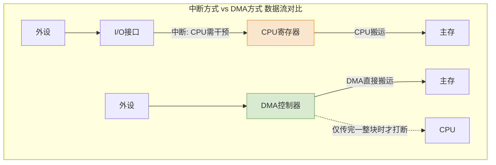

# 计算机组成原理：输入/输出系统基本概念与控制方式

> **导语**
> 本节课我们将进入《计算机组成原理》的最后一个大章——**输入/输出系统 (I/O System)**。
> 与《操作系统》侧重于软件调度不同，本章更侧重于硬件层面的实现机制。我们将认识什么是 I/O 接口（控制器），并重点介绍主机控制外部设备的四种发展演进的 **I/O 控制方式**，它们是本章的核心考点。

---

## 一、 I/O 系统与 I/O 接口的基本概念

在单总线结构的现代计算机中，CPU 和主存位于主机内部，而所有的外部设备（键盘、鼠标、显示器、硬盘等）都挂载在系统总线或 I/O 总线上。

### 1. I/O 接口 (I/O 控制器 / 设备控制器)
*   **角色定位**：主机与外部设备之间的“中介”与“桥梁”。
*   **为什么需要 I/O 接口？**
    外设种类繁多，工作原理和速度千差万别（如机械硬盘的转动、键盘的敲击）。CPU 不可能直接去了解和控制每一个底层物理设备。因此，各个厂家会设计符合工业标准的芯片（如 USB 控制器），这些芯片插在主板上，负责具体控制设备并与 CPU 统一通信。
*   **内部核心结构**（通常包含三个寄存器）：
    1.  **数据寄存器 (Data Register)**：暂存 CPU 与外设之间要传输的数据。
    2.  **控制寄存器 (Control Register)**：接收 CPU 发来的命令，指导外设执行具体动作（如让键盘灯亮起）。
    3.  **状态寄存器 (Status Register)**：反映外设当前的状态（如设备忙碌、数据已准备好、缺纸等），供 CPU 查询。

### 2. I/O 指令 vs 通道指令 (极易混淆考点)
在 I/O 系统的软件层面，需要通过特定的指令来完成硬件交互：

*   **I/O 指令 (由 CPU 执行)**：
    *   **执行者**：CPU。
    *   **作用**：CPU 用来给 I/O 接口（或通道）发送控制命令。
    *   **指令结构**：通常包含 `操作码` (表明是 I/O 指令)、`命令码` (指示 I/O 接口对设备做什么动作)、`设备码` (指明操作哪个具体设备)。这与普通运算指令的结构（操作码 + 地址码）有明显区别。
*   **通道指令 (由通道执行)**：
    *   **执行者**：**通道**（一种弱化的专用处理器）。
    *   **作用**：专门用于控制 I/O 设备进行复杂数据传输的指令序列（通道程序），存放在主存中。

---

## 二、 I/O 控制方式的演进 (核心重点)

主机控制 I/O 设备的效率，经历了从“低效盲等”到“高度自治”的四个发展阶段。

### 1. 程序查询方式 (忙等模式)
*   **工作原理**：CPU 发出 I/O 读写命令后，就不停地在循环中读取 I/O 接口的**状态寄存器**，检查数据是否准备好。
*   **数据流向**：外设 $\rightarrow$ I/O 接口数据寄存器 $\rightarrow$ **CPU 内部寄存器** $\rightarrow$ 主存。
*   **致命缺点**：**CPU 陷入“盲等” (Busy Waiting)**。在漫长的 I/O 等待期间，极高速的 CPU 只能原地打转，无法执行任何其他程序，严重浪费 CPU 资源。

### 2. 程序中断方式 (解放等待时间)
*   **工作原理**：
    1. CPU 发出 I/O 命令后，**立刻转去执行其他有用的程序**。
    2. 当 I/O 设备把数据准备好（放入 I/O 接口）后，I/O 接口会向 CPU 发送一个**中断请求**电信号。
    3. CPU 收到信号后，暂停当前程序，执行**中断处理程序**，将数据从 I/O 接口读入内存。
*   **数据流向**：外设 $\rightarrow$ I/O 接口数据寄存器 $\rightarrow$ **CPU 内部寄存器** $\rightarrow$ 主存。
*   **优点**：消除了盲等现象，提高了 CPU 的利用率。
*   **缺点**：如果连接的是高速设备（如磁盘），会以极高的频率向 CPU 发送中断请求，导致 CPU 频繁被打断去执行中断服务程序，依然会耗费大量 CPU 算力。且每次**只能传输一个字**，依然需要 CPU 充当数据搬运工。

### 3. DMA 控制方式 (Direct Memory Access / 直接内存访问)
为了应对高速 I/O 设备的大批量数据传输，引入了 **DMA 控制器**（一种特殊的 I/O 接口）。

*   **工作原理**：
    1. CPU 向 DMA 发出 I/O 指令，指明：读/写操作、内存起始地址、磁盘起始位置、要传输的总数据量。
    2. 随后 CPU 继续执行其他程序。
    3. **核心突破**：DMA 接口接管总线控制权，直接在**外设与主存之间建立数据通路**。每准备好一个字，DMA 就“偷取”一个主存存取周期将数据写入内存，**全程无需 CPU 介入搬运数据**。
    4. 只有当**一整块数据全部传输完毕后**，DMA 才会向 CPU 发送**一次**中断请求。
*   **数据流向**：外设 $\rightarrow$ DMA 接口 $\rightarrow$ **主存** (完全绕开 CPU 寄存器)。
*   **优点**：以“块”为单位传输数据，彻底解放了 CPU 作为数据“搬运工”的角色，大幅减少了中断次数。

### 4. 通道控制方式 (大型机级别的终极解放)
在商用大型机中，可能挂载着成百上千个硬盘。如果用 DMA 方式，每传输完一个数据块依然需要向 CPU 发一次中断，这在海量设备面前依然会让 CPU 疲于奔命。

*   **通道 (Channel)**：可以理解为**“弱化版的 CPU”**。它拥有自己的指令系统（通道指令），专门用来掌管系统中所有的 I/O 操作。
*   **工作原理**：
    1. CPU 通过执行一条 I/O 指令给通道派发任务，告知其要执行的**通道程序**在主存中的首地址。
    2. CPU 继续去忙别的复杂运算。
    3. 通道**独立**从主存中取出一条条通道指令去执行，控制成百上千的 I/O 设备进行错综复杂的数据输入输出。
    4. 只有当通道把所有清单上的 I/O 任务**全部做完后**，才会向 CPU 汇报（发一次中断）。
*   **优点**：CPU 获得了最大的解放。CPU 只需下达宏观命令，繁琐复杂的具体 I/O 调度全部由通道代劳。

---

## 三、 I/O 控制方式演进对比速记

| 控制方式 | CPU 是否盲等？ | 每次传输单位 | CPU 介入时机 | 数据通路 |
| :--- | :---: | :---: | :--- | :--- |
| **程序查询** | **是 (极低效)** | 字 | 持续轮询，从头盯到尾 | 外设 $\rightarrow$ CPU $\rightarrow$ 主存 |
| **程序中断** | 否 | 字 | 准备好一个**字**，打断一次 CPU | 外设 $\rightarrow$ CPU $\rightarrow$ 主存 |
| **DMA 方式** | 否 | **数据块** | 传完一整**块**，打断一次 CPU | 外设 $\rightarrow$ **主存** (绕过 CPU) |
| **通道方式** | 否 | **一组数据块** | 执行完整个**通道程序**，打断一次 CPU | 外设 $\rightarrow$ 主存 (通道统一指挥) |

> **学习提醒**：
> 从“程序查询”到“通道方式”，这是一部 **“CPU 不断从繁杂底层劳动中被解放出来”** 的进化史。考试中最常考的是**中断方式与 DMA 方式的对比**，以及对 I/O 指令和通道指令的辨析。请务必牢记上述表格中的核心特征！